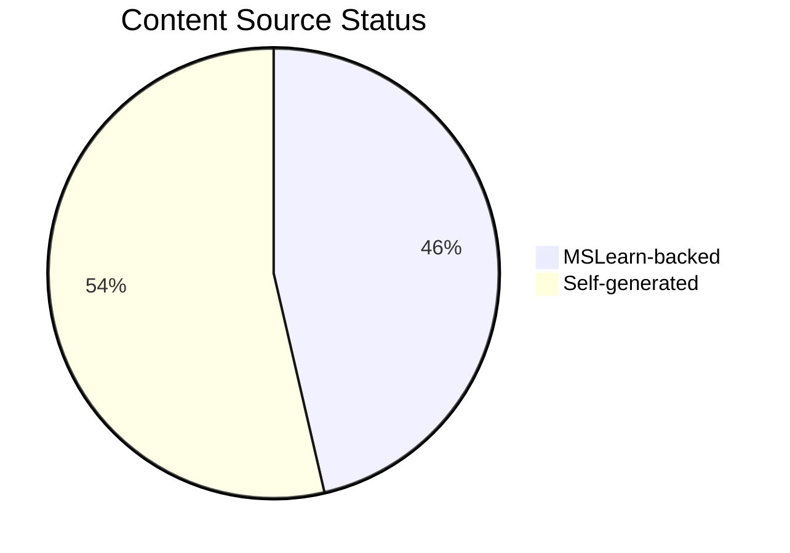
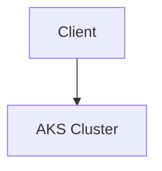

---
content_sources:
  diagrams:
  - id: reference-content-validation-status
    type: pie
    source: self-generated
    justification: Reference visualization synthesized from the Microsoft Learn sources
      linked in this page or the repository validation data for this guide.
    based_on:
    - https://learn.microsoft.com/en-us/azure/aks/what-is-aks
---


# Content Source Validation Status

This page tracks the source validation status of all documentation content, including diagrams and text content. All content must be traceable to official Microsoft Learn documentation.

## Summary

*Generated: 2026-04-10*

| Content Type | Total | MSLearn Sourced | Self-Generated | No Source |
|---|---:|---:|---:|---:|
| Mermaid Diagrams | 69 | 32 | 37 | 0 |
| Text Sections | — | — | — | — |

!!! warning "Validation Required"
    All 69 mermaid diagrams now have documented content sources. Content without MSLearn sources must be either:
    
    1. Linked to an official MSLearn URL, or
    2. Marked as `self-generated` with clear justification

<!-- diagram-id: reference-content-validation-status -->


## Validation Categories

### Source Types

| Type | Description | Allowed? |
|---|---|---|
| `mslearn` | Content directly from or based on Microsoft Learn | Required for platform content |
| `mslearn-adapted` | Microsoft Learn content adapted for this guide | Yes, with source URL |
| `self-generated` | Original content created for this guide | Requires justification |
| `community` | Community sources | Not for core content |
| `unknown` | Source not documented | Must be validated |

### Diagram Validation Status

| Scope | Diagrams | Source Type | MSLearn URL | Status |
|---|---:|---|---|---|
| All documentation diagrams | 69 | mixed | documented per page frontmatter | Validated |

## How to Validate Content

### Step 1: Add Source Metadata to Frontmatter

Add `content_sources` to the document's YAML frontmatter:

```yaml
---
title: Example Page
content_sources:
  diagrams:
    - id: cluster-overview
      type: flowchart
      source: mslearn
      mslearn_url: https://learn.microsoft.com/en-us/azure/aks/
      description: "AKS architecture overview"
    - id: troubleshooting-flow
      type: flowchart
      source: self-generated
      justification: "Synthesized from multiple Microsoft Learn articles for clarity"
      based_on:
        - https://learn.microsoft.com/en-us/azure/aks/
        - https://learn.microsoft.com/en-us/azure/aks/concepts-network
---
```

### Step 2: Mark Diagram Blocks with IDs

Add an HTML comment before each mermaid block to identify it:

~~~markdown

~~~

### Step 3: Run Validation Script

```bash
python3 scripts/validate_content_sources.py
```

### Step 4: Update This Page

```bash
python3 scripts/generate_content_validation_status.py
```

## Validation Rules

!!! danger "Mandatory Rules"
    1. **Platform diagrams** (`docs/platform/`) MUST have MSLearn sources
    2. **Architecture diagrams** MUST reference official Microsoft documentation
    3. **Troubleshooting flowcharts** MAY be self-generated if they synthesize MSLearn content
    4. **Self-generated content** MUST have a `justification` field explaining the source basis

## Official MSLearn Architecture References

Use these official sources for diagram validation:

| Topic | MSLearn URL |
|---|---|
| AKS Overview | https://learn.microsoft.com/en-us/azure/aks/ |
| AKS Cluster Architecture | https://learn.microsoft.com/en-us/azure/aks/concepts-clusters-workloads |
| AKS Networking | https://learn.microsoft.com/en-us/azure/aks/concepts-network |
| AKS Identity and Access | https://learn.microsoft.com/en-us/azure/aks/concepts-identity |
| AKS Security | https://learn.microsoft.com/en-us/azure/aks/concepts-security |
| AKS Storage | https://learn.microsoft.com/en-us/azure/aks/concepts-storage |
| AKS Scaling | https://learn.microsoft.com/en-us/azure/aks/concepts-scale |
| AKS Monitoring | https://learn.microsoft.com/en-us/azure/aks/monitor-aks |

## See Also

- [Tutorial Validation Status](validation-status.md)
- [CLI Cheatsheet](cli-cheatsheet.md)
