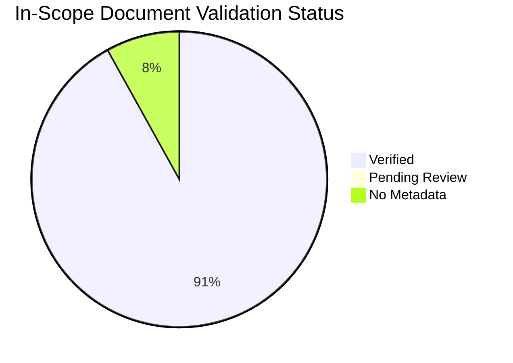

---
content_sources:
  references:
    - type: self-generated
      justification: Auto-generated dashboard tracking content validation status
---

# Content Validation Status

This page tracks `content_validation` metadata for **in-scope factual-claim documents** under `docs/best-practices/`, `docs/operations/`, `docs/platform/`, `docs/troubleshooting/`. Pages outside this scope — navigation indexes (`docs/best-practices/index.md`, `docs/operations/index.md`, `docs/platform/index.md`, `docs/troubleshooting/first-10-minutes/index.md`, `docs/troubleshooting/index.md`, `docs/troubleshooting/playbooks/index.md`), reference-lookup KQL packs and lab guides (`docs/troubleshooting/kql/`, `docs/troubleshooting/lab-guides/`), tutorials, language guides, and start-here landing pages — are not counted here, even when legacy `content_validation` blocks exist on them (the cleanup tool only removes tautological placeholder claims). See `scripts/lib/content_scope.py` for the executable scope definition.

## Summary

*Generated: 2026-09-06*

| Content Type | Total | Verified | Pending | Unverified | No Metadata |
|---|---:|---:|---:|---:|---:|
| Mermaid Diagrams | 169 | 169 | 0 | 0 | 0 |
| In-Scope Factual-Claim Documents | 125 | 114 | 1 | 0 | 10 |

!!! warning "Validation In Progress"
    10 in-scope document(s) need `content_validation` metadata added.

<!-- diagram-id: content-validation-status-pie -->

```mermaid
pie title In-Scope Document Validation Status
    "Verified" : 114
    "Pending Review" : 1
    "No Metadata" : 10
```

## By Section

### Platform

| Document | Has Sources | Status | Claims | Last Reviewed |
|---|---|---|---|---|
| [Application Gateway For Containers](../platform/application-gateway-for-containers.md) | ✅ | ✅ Verified | 5/5 | 2026-07-18 |
| [Azure Blob Csi Driver](../platform/azure-blob-csi-driver.md) | ✅ | ✅ Verified | 4/4 | 2026-07-18 |
| [Azure Cni Powered By Cilium](../platform/azure-cni-powered-by-cilium.md) | ✅ | ✅ Verified | 5/5 | 2026-07-18 |
| [Azure Disk Csi Driver](../platform/azure-disk-csi-driver.md) | ✅ | ✅ Verified | 4/4 | 2026-07-18 |
| [Azure Files Csi Driver](../platform/azure-files-csi-driver.md) | ✅ | ✅ Verified | 4/4 | 2026-07-18 |
| [Azure Policy Addon](../platform/azure-policy-addon.md) | ✅ | ✅ Verified | 5/5 | 2026-07-18 |
| [Cluster Architecture](../platform/cluster-architecture.md) | ✅ | ✅ Verified | 3/3 | 2026-07-18 |
| [Coredns On Aks](../platform/coredns-on-aks.md) | ✅ | ✅ Verified | 5/5 | 2026-07-18 |
| [Custom Metrics Scaling](../platform/custom-metrics-scaling.md) | ✅ | ✅ Verified | 5/5 | 2026-07-18 |
| [Dapr Extension](../platform/dapr-extension.md) | ✅ | ✅ Verified | 4/4 | 2026-07-18 |
| [Defender For Containers](../platform/defender-for-containers.md) | ✅ | ✅ Verified | 5/5 | 2026-07-18 |
| [Flux Gitops Extension](../platform/flux-gitops-extension.md) | ✅ | ✅ Verified | 4/4 | 2026-07-18 |
| [Identity And Secrets](../platform/identity-and-secrets.md) | ✅ | ✅ Verified | 3/3 | 2026-07-18 |
| [Identity Model Comparison](../platform/identity-model-comparison.md) | ✅ | ✅ Verified | 3/3 | 2026-07-18 |
| [Ingress Load Balancing](../platform/ingress-load-balancing.md) | ✅ | ✅ Verified | 4/4 | 2026-07-18 |
| [Istio Managed Addon](../platform/istio-managed-addon.md) | ✅ | ✅ Verified | 4/4 | 2026-07-18 |
| [Keda On Aks](../platform/keda-on-aks.md) | ✅ | ✅ Verified | 5/5 | 2026-07-18 |
| [Key Vault Csi](../platform/key-vault-csi.md) | ✅ | ✅ Verified | 3/3 | 2026-07-18 |
| [Networking Models](../platform/networking-models.md) | ✅ | ✅ Verified | 5/5 | 2026-07-18 |
| [Nfs On Aks](../platform/nfs-on-aks.md) | ✅ | ✅ Verified | 4/4 | 2026-07-18 |
| [Node Autoprovisioning](../platform/node-autoprovisioning.md) | ✅ | ✅ Verified | 5/5 | 2026-07-18 |
| [Node Local Dns Cache](../platform/node-local-dns-cache.md) | ✅ | ✅ Verified | 5/5 | 2026-07-18 |
| [Node Pools](../platform/node-pools.md) | ✅ | ✅ Verified | 3/3 | 2026-07-18 |
| [Outbound Networking](../platform/outbound-networking.md) | ✅ | ✅ Verified | 5/5 | 2026-07-18 |
| [Pod Security Standards](../platform/pod-security-standards.md) | ✅ | ✅ Verified | 5/5 | 2026-07-18 |
| [Scaling](../platform/scaling.md) | ✅ | ✅ Verified | 5/5 | 2026-07-18 |
| [Storage Options](../platform/storage-options.md) | ✅ | ✅ Verified | 4/4 | 2026-07-18 |
| [Version Lifecycle](../platform/version-lifecycle.md) | ✅ | ✅ Verified | 4/4 | 2026-07-18 |
| [Workload Identity](../platform/workload-identity.md) | ✅ | ✅ Verified | 4/4 | 2026-07-18 |

### Best Practices

| Document | Has Sources | Status | Claims | Last Reviewed |
|---|---|---|---|---|
| [Autoscaling](../best-practices/autoscaling.md) | ✅ | ✅ Verified | 4/4 | 2026-07-18 |
| [Common Anti Patterns](../best-practices/common-anti-patterns.md) | ✅ | ✅ Verified | 4/4 | 2026-07-18 |
| [Cost Optimization](../best-practices/cost-optimization.md) | ✅ | ✅ Verified | 4/4 | 2026-07-18 |
| [Deployment Strategies](../best-practices/deployment-strategies.md) | ✅ | ⚠️ Pending Review | 0/3 | 2026-07-16 |
| [Explicit Placement Disruption Control](../best-practices/explicit-placement-disruption-control.md) | ✅ | ✅ Verified | 5/5 | 2026-07-18 |
| [Governance](../best-practices/governance.md) | ✅ | ✅ Verified | 5/5 | 2026-07-18 |
| [Networking](../best-practices/networking.md) | ✅ | ✅ Verified | 4/4 | 2026-07-18 |
| [Platform Extensions](../best-practices/platform-extensions.md) | ✅ | ✅ Verified | 4/4 | 2026-07-18 |
| [Private Cluster Api Connectivity](../best-practices/private-cluster-api-connectivity.md) | ✅ | ✅ Verified | 5/5 | 2026-07-18 |
| [Production Baseline](../best-practices/production-baseline.md) | ✅ | ✅ Verified | 4/4 | 2026-07-18 |
| [Reliability](../best-practices/reliability.md) | ✅ | ✅ Verified | 4/4 | 2026-07-18 |
| [Resource Governance](../best-practices/resource-governance.md) | ✅ | ✅ Verified | 4/4 | 2026-07-18 |
| [Security](../best-practices/security.md) | ✅ | ✅ Verified | 4/4 | 2026-07-18 |

### Operations

| Document | Has Sources | Status | Claims | Last Reviewed |
|---|---|---|---|---|
| [Auto Upgrade Channels](../operations/auto-upgrade-channels.md) | ✅ | ✅ Verified | 4/4 | 2026-07-18 |
| [Baseline Alerts](../operations/baseline-alerts.md) | ✅ | ✅ Verified | 4/4 | 2026-07-18 |
| [Blue Green Upgrades](../operations/blue-green-upgrades.md) | ✅ | ✅ Verified | 3/3 | 2026-07-18 |
| [Cluster Creation](../operations/cluster-creation.md) | ✅ | ✅ Verified | 4/4 | 2026-07-18 |
| [Cluster Resource Pv Backup](../operations/cluster-resource-pv-backup.md) | ✅ | ✅ Verified | 4/4 | 2026-07-18 |
| [Credential Rotation](../operations/credential-rotation.md) | ✅ | ✅ Verified | 6/6 | 2026-07-18 |
| [Diagnostic Settings](../operations/diagnostic-settings.md) | ✅ | ✅ Verified | 5/5 | 2026-07-18 |
| [Maintenance Windows](../operations/maintenance-windows.md) | ✅ | ✅ Verified | 4/4 | 2026-07-18 |
| [Managed Prometheus](../operations/managed-prometheus.md) | ✅ | ✅ Verified | 4/4 | 2026-07-18 |
| [Monitoring Logging](../operations/monitoring-logging.md) | ✅ | ✅ Verified | 4/4 | 2026-07-18 |
| [Node Os Upgrades](../operations/node-os-upgrades.md) | ✅ | ✅ Verified | 4/4 | 2026-07-18 |
| [Node Pool Operations](../operations/node-pool-operations.md) | ✅ | ✅ Verified | 4/4 | 2026-07-18 |
| [Restore Drills](../operations/restore-drills.md) | ✅ | ✅ Verified | 4/4 | 2026-07-18 |
| [Scaling Operations](../operations/scaling-operations.md) | ✅ | ✅ Verified | 5/5 | 2026-07-18 |
| [Snapshot Operations](../operations/snapshot-operations.md) | ✅ | ✅ Verified | 4/4 | 2026-07-18 |
| [Statefulset Day 2 Operations](../operations/statefulset-day-2-operations.md) | ✅ | ✅ Verified | 5/5 | 2026-07-18 |
| [Upgrades](../operations/upgrades.md) | ✅ | ✅ Verified | 4/4 | 2026-07-18 |

### Troubleshooting

| Document | Has Sources | Status | Claims | Last Reviewed |
|---|---|---|---|---|
| [Agc Traffic Not Flowing](../troubleshooting/playbooks/extensions/agc-traffic-not-flowing.md) | ✅ | ✅ Verified | 3/3 | 2026-07-18 |
| [Api Server Kubectl Unreachable](../troubleshooting/playbooks/networking/api-server-kubectl-unreachable.md) | ✅ | ✅ Verified | 4/4 | 2026-07-18 |
| [Architecture Overview](../troubleshooting/architecture-overview.md) | ✅ | ✅ Verified | 3/3 | 2026-07-18 |
| [Audience Mismatch](../troubleshooting/playbooks/identity/audience-mismatch.md) | ✅ | ✅ Verified | 2/2 | 2026-07-18 |
| [Az Imbalanced Node Pools Spread](../troubleshooting/playbooks/scheduling/az-imbalanced-node-pools-spread.md) | ✅ | ✅ Verified | 4/4 | 2026-07-18 |
| [Azure Policy Denies Workload](../troubleshooting/playbooks/security/azure-policy-denies-workload.md) | ✅ | ✅ Verified | 4/4 | 2026-07-18 |
| [Cilium Dataplane Migration Issues](../troubleshooting/playbooks/network-policy/cilium-dataplane-migration-issues.md) | ✅ | ✅ Verified | 5/5 | 2026-07-18 |
| [Cluster Autoscaler Issues](../troubleshooting/playbooks/cluster-autoscaler-issues.md) | ✅ | ✅ Verified | 5/5 | 2026-07-18 |
| [Cni Ip Exhaustion](../troubleshooting/playbooks/node-issues/cni-ip-exhaustion.md) | ✅ | ✅ Verified | 4/4 | 2026-07-18 |
| [Connectivity](../troubleshooting/first-10-minutes/connectivity.md) | ✅ | ❓ No Metadata | — | — |
| [Control Plane](../troubleshooting/first-10-minutes/control-plane.md) | ✅ | ❓ No Metadata | — | — |
| [Coredns Query Latency Drops](../troubleshooting/playbooks/dns/coredns-query-latency-drops.md) | ✅ | ✅ Verified | 3/3 | 2026-07-18 |
| [Crashloop](../troubleshooting/playbooks/pod-issues/crashloop.md) | ✅ | ✅ Verified | 3/3 | 2026-07-18 |
| [Dapr Sidecar Fails To Start](../troubleshooting/playbooks/extensions/dapr-sidecar-fails-to-start.md) | ✅ | ✅ Verified | 3/3 | 2026-07-18 |
| [Decision Tree](../troubleshooting/decision-tree.md) | ✅ | ❓ No Metadata | — | — |
| [Defender Alert False Positive](../troubleshooting/playbooks/security/defender-alert-false-positive.md) | ✅ | ✅ Verified | 4/4 | 2026-07-18 |
| [Evidence Map](../troubleshooting/evidence-map.md) | ✅ | ✅ Verified | 3/3 | 2026-07-18 |
| [External Hostname Resolution Failure](../troubleshooting/playbooks/dns/external-hostname-resolution-failure.md) | ✅ | ✅ Verified | 3/3 | 2026-07-18 |
| [Flux Reconciliation Stuck](../troubleshooting/playbooks/extensions/flux-reconciliation-stuck.md) | ✅ | ✅ Verified | 3/3 | 2026-07-18 |
| [Hpa Flapping](../troubleshooting/playbooks/scaling/hpa-flapping.md) | ✅ | ✅ Verified | 4/4 | 2026-07-18 |
| [Image Pull Failure](../troubleshooting/playbooks/pod-issues/image-pull-failure.md) | ✅ | ✅ Verified | 4/4 | 2026-07-18 |
| [Image Pull Restricted Egress](../troubleshooting/playbooks/networking/image-pull-restricted-egress.md) | ✅ | ✅ Verified | 2/2 | 2026-07-18 |
| [Image Signature Verification Failure](../troubleshooting/playbooks/security/image-signature-verification-failure.md) | ✅ | ✅ Verified | 4/4 | 2026-07-18 |
| [Index](../troubleshooting/evidence-packs/index.md) | ✅ | ✅ Verified | 4/4 | 2026-07-18 |
| [Index](../troubleshooting/methodology/index.md) | ❌ | ✅ Verified | 2/2 | 2026-07-17 |
| [Index](../troubleshooting/playbooks/scheduling/index.md) | ✅ | ❓ No Metadata | — | — |
| [Ingress Failure](../troubleshooting/playbooks/connectivity/ingress-failure.md) | ✅ | ✅ Verified | 3/3 | 2026-07-18 |
| [Ingress Not Working](../troubleshooting/playbooks/ingress-not-working.md) | ✅ | ✅ Verified | 3/3 | 2026-07-18 |
| [Istio Sidecar Injection Failure](../troubleshooting/playbooks/extensions/istio-sidecar-injection-failure.md) | ✅ | ✅ Verified | 3/3 | 2026-07-18 |
| [Keda Scaler Not Triggering](../troubleshooting/playbooks/scaling/keda-scaler-not-triggering.md) | ✅ | ✅ Verified | 4/4 | 2026-07-18 |
| [Mental Model](../troubleshooting/mental-model.md) | ✅ | ❓ No Metadata | — | — |
| [Nap Fails To Provision](../troubleshooting/playbooks/scaling/nap-fails-to-provision.md) | ✅ | ✅ Verified | 4/4 | 2026-07-18 |
| [Networkpolicy Denies Legitimate Traffic](../troubleshooting/playbooks/network-policy/networkpolicy-denies-legitimate-traffic.md) | ✅ | ✅ Verified | 3/3 | 2026-07-18 |
| [Networkpolicy Not Blocking Traffic](../troubleshooting/playbooks/network-policy/networkpolicy-not-blocking-traffic.md) | ✅ | ✅ Verified | 3/3 | 2026-07-18 |
| [Node Image Upgrade Stuck](../troubleshooting/playbooks/operations/node-image-upgrade-stuck.md) | ✅ | ✅ Verified | 2/2 | 2026-07-18 |
| [Node Not Ready](../troubleshooting/playbooks/node-not-ready.md) | ✅ | ✅ Verified | 4/4 | 2026-07-18 |
| [Node Not Ready](../troubleshooting/playbooks/node-issues/node-not-ready.md) | ✅ | ✅ Verified | 4/4 | 2026-07-18 |
| [Oidc Issuer Mismatch](../troubleshooting/playbooks/identity/oidc-issuer-mismatch.md) | ✅ | ✅ Verified | 2/2 | 2026-07-18 |
| [Pdb Drain Disruption Contract](../troubleshooting/playbooks/scheduling/pdb-drain-disruption-contract.md) | ✅ | ✅ Verified | 3/3 | 2026-07-18 |
| [Pending Pods](../troubleshooting/playbooks/pod-issues/pending-pods.md) | ✅ | ✅ Verified | 4/4 | 2026-07-18 |
| [Performance](../troubleshooting/first-10-minutes/performance.md) | ✅ | ❓ No Metadata | — | — |
| [Pod Crashloopbackoff](../troubleshooting/playbooks/pod-crashloopbackoff.md) | ✅ | ✅ Verified | 4/4 | 2026-07-18 |
| [Pod Failures](../troubleshooting/first-10-minutes/pod-failures.md) | ✅ | ❓ No Metadata | — | — |
| [Pss Enforcement Breaks Deployment](../troubleshooting/playbooks/security/pss-enforcement-breaks-deployment.md) | ✅ | ✅ Verified | 4/4 | 2026-07-18 |
| [Pvc Stuck Pending](../troubleshooting/playbooks/storage/pvc-stuck-pending.md) | ✅ | ✅ Verified | 2/2 | 2026-07-18 |
| [Quick Diagnosis Cards](../troubleshooting/quick-diagnosis-cards.md) | ✅ | ❓ No Metadata | — | — |
| [Rbac Success Key Vault Fail](../troubleshooting/playbooks/identity/rbac-success-key-vault-fail.md) | ✅ | ✅ Verified | 2/2 | 2026-07-18 |
| [Ready Capacity Drops Below Desired](../troubleshooting/playbooks/scheduling/ready-capacity-drops-below-desired.md) | ✅ | ✅ Verified | 4/4 | 2026-07-18 |
| [Scaling](../troubleshooting/first-10-minutes/scaling.md) | ✅ | ❓ No Metadata | — | — |
| [Scaling Failure](../troubleshooting/playbooks/operations/scaling-failure.md) | ✅ | ✅ Verified | 4/4 | 2026-07-18 |
| [Service Unreachable](../troubleshooting/playbooks/connectivity/service-unreachable.md) | ✅ | ✅ Verified | 4/4 | 2026-07-18 |
| [Snat Port Exhaustion](../troubleshooting/playbooks/networking/snat-port-exhaustion.md) | ✅ | ✅ Verified | 3/3 | 2026-07-18 |
| [Spot Eviction Storm](../troubleshooting/playbooks/scaling/spot-eviction-storm.md) | ✅ | ✅ Verified | 4/4 | 2026-07-18 |
| [Statefulset Stuck Rolling Update](../troubleshooting/playbooks/storage/statefulset-stuck-rolling-update.md) | ✅ | ✅ Verified | 2/2 | 2026-07-18 |
| [Surge Upgrade Ip Exhaustion](../troubleshooting/playbooks/operations/surge-upgrade-ip-exhaustion.md) | ✅ | ✅ Verified | 2/2 | 2026-07-18 |
| [Token Exchange Failure](../troubleshooting/playbooks/identity/token-exchange-failure.md) | ✅ | ✅ Verified | 2/2 | 2026-07-18 |
| [Topology Spread Skew Under Capacity](../troubleshooting/playbooks/scheduling/topology-spread-skew-under-capacity.md) | ✅ | ✅ Verified | 5/5 | 2026-07-18 |
| [Troubleshooting Method](../troubleshooting/methodology/troubleshooting-method.md) | ✅ | ✅ Verified | 3/3 | 2026-07-17 |
| [Upgrade](../troubleshooting/first-10-minutes/upgrade.md) | ✅ | ❓ No Metadata | — | — |
| [Upgrade Blocked Deprecated Api](../troubleshooting/playbooks/operations/upgrade-blocked-deprecated-api.md) | ✅ | ✅ Verified | 2/2 | 2026-07-18 |
| [Upgrade Blocked Pdb](../troubleshooting/playbooks/operations/upgrade-blocked-pdb.md) | ✅ | ✅ Verified | 2/2 | 2026-07-18 |
| [Upgrade Failure](../troubleshooting/playbooks/operations/upgrade-failure.md) | ✅ | ✅ Verified | 2/2 | 2026-07-18 |
| [Volume Attach Failure](../troubleshooting/playbooks/storage/volume-attach-failure.md) | ✅ | ✅ Verified | 2/2 | 2026-07-18 |
| [Volume Expansion Failure](../troubleshooting/playbooks/storage/volume-expansion-failure.md) | ✅ | ✅ Verified | 2/2 | 2026-07-18 |
| [Volume Mount Failure](../troubleshooting/playbooks/storage/volume-mount-failure.md) | ✅ | ✅ Verified | 2/2 | 2026-07-18 |
| [Webhook Control Plane Blocked](../troubleshooting/playbooks/networking/webhook-control-plane-blocked.md) | ✅ | ✅ Verified | 3/3 | 2026-07-18 |

## Validation Categories

### Source Types

| Type | Description | Allowed? |
|---|---|---|
| `mslearn` | Content directly from or based on Microsoft Learn | Yes |
| `mslearn-adapted` | Microsoft Learn content adapted for this guide | Yes, with source URL |
| `self-generated` | Original content created for this guide | Requires justification |
| `community` | From community sources | Not for core content |
| `unknown` | Source not documented | Must be validated |

### Validation Status

| Status | Description |
|---|---|
| `verified` | All core claims traced to Microsoft Learn sources |
| `pending_review` | Document exists but claims need source verification |
| `unverified` | New document, no validation performed |

## How to Add Validation

Before adding metadata, confirm the page is in scope. The block is required ONLY for factual-claim pages under `docs/platform/`, `docs/best-practices/`, `docs/operations/`, and `docs/troubleshooting/` (excluding `troubleshooting/kql/`, `troubleshooting/lab-guides/`, and navigation landing pages listed in `scripts/lib/content_scope.NAVIGATION_INDEXES`).

For an in-scope page, add a `content_validation` block to its frontmatter:

```yaml
---
content_sources:
  references:
    - type: mslearn-adapted
      url: https://learn.microsoft.com/en-us/azure/aks/...
content_validation:
  status: verified
  last_reviewed: 2026-04-12
  reviewer: ai-agent
  core_claims:
    - claim: "The AKS cluster autoscaler adjusts node count per node pool based on pending pod resource requests."
      source: https://learn.microsoft.com/en-us/azure/aks/cluster-autoscaler-overview
      verified: true
---
```

Each `core_claim` MUST be a verifiable factual assertion about Azure Kubernetes Service behavior (a documented limit, default, or feature). Meta-statements such as "this page uses Microsoft Learn as the primary source basis" are tautological and rejected — the marker text `primary source basis` triggers a fail-fast in this generator.

Then regenerate this page:

```bash
python3 scripts/generate_content_validation_status.py
```

## See Also

- [CLI Cheatsheet](cli-cheatsheet.md)
- [Limits and Quotas](limits-and-quotas.md)

