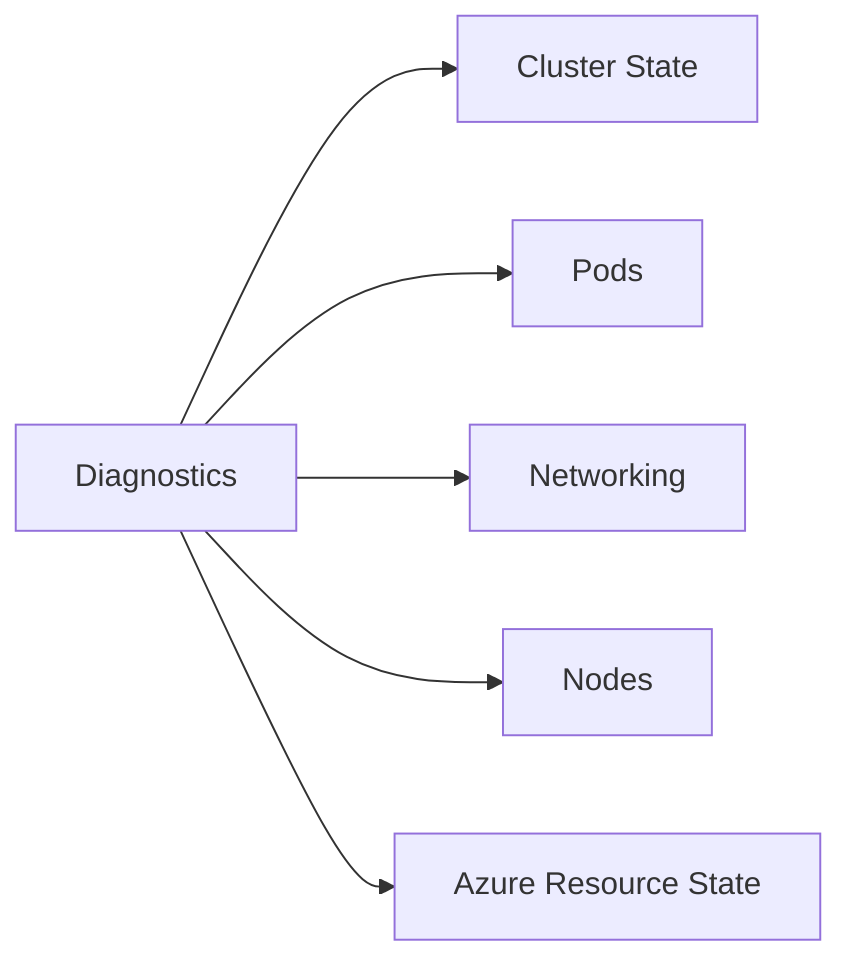

---
hide:
  - toc
content_sources:
  diagrams:
  - id: reference-diagnostic-commands
    type: flowchart
    source: self-generated
    justification: Reference visualization synthesized from the Microsoft Learn sources
      linked in this page or the repository validation data for this guide.
    based_on:
    - https://learn.microsoft.com/cli/azure/aks
    - https://learn.microsoft.com/en-us/troubleshoot/azure/azure-kubernetes/welcome-azure-kubernetes
    - https://learn.microsoft.com/en-us/troubleshoot/azure/azure-kubernetes/
---


# Diagnostic Commands

These commands are grouped by investigation goal so you can collect evidence quickly during AKS incidents.

## Topic/Command Groups

<!-- diagram-id: reference-diagnostic-commands -->



### Cluster and workload state

```bash
kubectl get nodes -o wide
kubectl get pods -A -o wide
kubectl get events -A --sort-by=.lastTimestamp
kubectl top nodes
kubectl top pods -A
```

### Pod-specific investigation

```bash
kubectl describe pod <pod-name> -n <namespace>
kubectl logs <pod-name> -n <namespace>
kubectl logs <pod-name> -n <namespace> --previous
kubectl get deployment <deployment-name> -n <namespace> -o yaml
```

### Networking and ingress

```bash
kubectl get svc -A
kubectl get endpoints -A
kubectl get ingress -A
kubectl describe ingress <ingress-name> -n <namespace>
kubectl exec -it <pod-name> -n <namespace> -- nslookup <service-name>
```

### Azure-side checks

```bash
az aks show --resource-group $RG --name $CLUSTER_NAME --output yaml
az aks nodepool list --resource-group $RG --cluster-name $CLUSTER_NAME --output table
az vm list-usage --location $LOCATION --output table
```

## Usage Notes

- Capture command output in incident notes before changing configuration.
- Prefer comparing one failing object with one healthy object in the same cluster.
- During severe incidents, start with read-only commands and widen only as evidence improves.

## See Also

- [CLI Cheatsheet](cli-cheatsheet.md)
- [Evidence Map](../troubleshooting/evidence-map.md)
- [Quick Diagnosis Cards](../troubleshooting/quick-diagnosis-cards.md)

## Sources

- [Azure CLI az aks reference](https://learn.microsoft.com/cli/azure/aks)
- [kubectl Quick Reference](https://kubernetes.io/docs/reference/kubectl/quick-reference/)
- [Troubleshoot AKS clusters](https://learn.microsoft.com/troubleshoot/azure/azure-kubernetes/welcome-azure-kubernetes)
- [AKS troubleshooting articles](https://learn.microsoft.com/troubleshoot/azure/azure-kubernetes/)
