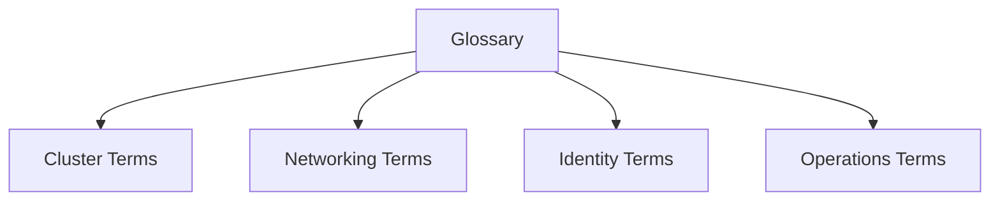

---
hide:
  - toc
content_sources:
  diagrams:
  - id: reference-glossary
    type: flowchart
    source: self-generated
    justification: Reference visualization synthesized from the Microsoft Learn sources
      linked in this page or the repository validation data for this guide.
    based_on:
    - https://learn.microsoft.com/en-us/azure/aks/
    - https://learn.microsoft.com/en-us/azure/aks/intro-kubernetes
---

# Glossary

This glossary defines recurring AKS and Kubernetes terms used across the guide.

## Topic/Command Groups

<!-- diagram-id: reference-glossary -->

| Term | Meaning |
|---|---|
| AKS | Azure Kubernetes Service, Azure-managed Kubernetes offering |
| Node Pool | Group of worker nodes with shared VM characteristics and lifecycle |
| System Node Pool | Pool intended for critical cluster add-ons |
| User Node Pool | Pool intended for application workloads |
| HPA | Horizontal Pod Autoscaler |
| VPA | Vertical Pod Autoscaler |
| CNI | Container Networking Interface model used for pod connectivity |
| Workload Identity | Federation model that lets pods access Azure resources without static secrets |
| PDB | PodDisruptionBudget, used to limit voluntary disruption |
| Node Resource Group | Azure-managed resource group containing infrastructure artifacts for an AKS cluster |

## Usage Notes

- Use these definitions consistently in runbooks and architecture reviews.
- If a team uses different internal names, map them back to these concepts explicitly.

## See Also

- [Platform](../platform/index.md)
- [Best Practices](../best-practices/index.md)
- [Reference](index.md)

## Sources

- [Azure Kubernetes Service (AKS) documentation](https://learn.microsoft.com/azure/aks/)
- [What is Azure Kubernetes Service (AKS)?](https://learn.microsoft.com/azure/aks/intro-kubernetes)
