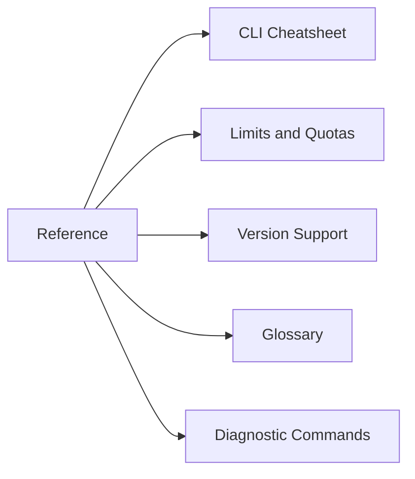

---
hide:
  - toc
content_sources:
  diagrams:
  - id: reference-index
    type: flowchart
    source: self-generated
    justification: Navigation flow synthesized from the linked AKS topics and workflows
      on this page.
    based_on:
    - https://learn.microsoft.com/cli/azure/aks
---

# Reference

Use this section for quick lookup of commands, support boundaries, terminology, and diagnostics.

## Main Content

<!-- diagram-id: reference-index -->

| Document | Description |
|---|---|
| [CLI Cheatsheet](cli-cheatsheet.md) | High-value `az aks` and `kubectl` commands |
| [Limits and Quotas](limits-and-quotas.md) | Capacity boundaries and planning considerations |
| [Version Support](version-support.md) | Kubernetes support policy and upgrade planning |
| [Glossary](glossary.md) | AKS and Kubernetes terms used across the guide |
| [Diagnostic Commands](diagnostic-commands.md) | Investigation commands grouped by symptom area |

## See Also

- [Operations](../operations/index.md)
- [Troubleshooting](../troubleshooting/index.md)
- [Start Here](../start-here/index.md)

## Sources

- [Azure CLI az aks reference](https://learn.microsoft.com/cli/azure/aks)
- [kubectl Quick Reference](https://kubernetes.io/docs/reference/kubectl/quick-reference/)
