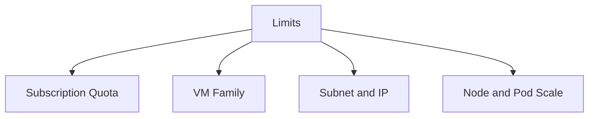

---
content_sources:
  diagrams:
  - id: reference-limits-and-quotas
    type: flowchart
    source: self-generated
    justification: Reference visualization synthesized from the Microsoft Learn sources
      linked in this page or the repository validation data for this guide.
    based_on:
    - https://learn.microsoft.com/en-us/azure/aks/quotas-skus-regions
    - https://learn.microsoft.com/en-us/azure/azure-resource-manager/management/azure-subscription-service-limits
---


# Limits and Quotas

AKS capacity planning fails when teams treat quotas as afterthoughts. Limits exist at the subscription, region, VM family, subnet, and Kubernetes design layers.

## Topic/Command Groups

<!-- diagram-id: reference-limits-and-quotas -->



### What to validate

- Subscription and regional core quota for the VM family you intend to use.
- Subnet size and IP headroom for your chosen AKS networking model.
- Service, load balancer, and public IP dependencies in the node resource group.
- Supported node and pod scale boundaries for your cluster design and CNI mode.

### Useful checks

```bash
az vm list-usage --location $LOCATION --output table
az aks show --resource-group $RG --name $CLUSTER_NAME --query networkProfile --output yaml
az network vnet subnet show --resource-group <network-rg> --vnet-name <vnet-name> --name <subnet-name> --output yaml
```

| Command | Purpose |
| --- | --- |
| `az vm list-usage` | Show regional vCPU quota usage. |
| `--location` | Azure region to query. |
| `--output` | Output format for the result. |
| `az aks show` | Show the cluster network profile. |
| `--resource-group` | Resource group that contains the AKS cluster. |
| `--name` | Name of the AKS cluster. |
| `--query` | Selects the network profile. |
| `--output` | Output format for the result. |
| `az network vnet subnet show` | Show the subnet address plan. |
| `--resource-group` | Resource group that contains the virtual network. |
| `--vnet-name` | Name of the virtual network. |
| `--name` | Name of the subnet. |
| `--output` | Output format for the result. |

## Usage Notes

- Treat official limits as moving targets; verify current Microsoft documentation before major expansion.
- The most common real-world blockers are quota exhaustion and subnet exhaustion, not theoretical Kubernetes maxima.

## See Also

- [Networking Models](../platform/networking-models.md)
- [Cost Optimization](../best-practices/cost-optimization.md)
- [CNI IP Exhaustion](../troubleshooting/playbooks/node-issues/cni-ip-exhaustion.md)

## Sources

- [AKS quotas, virtual machine sizes, and regional availability](https://learn.microsoft.com/azure/aks/quotas-skus-regions)
- [Azure subscription and service limits, quotas, and constraints](https://learn.microsoft.com/azure/azure-resource-manager/management/azure-subscription-service-limits)
