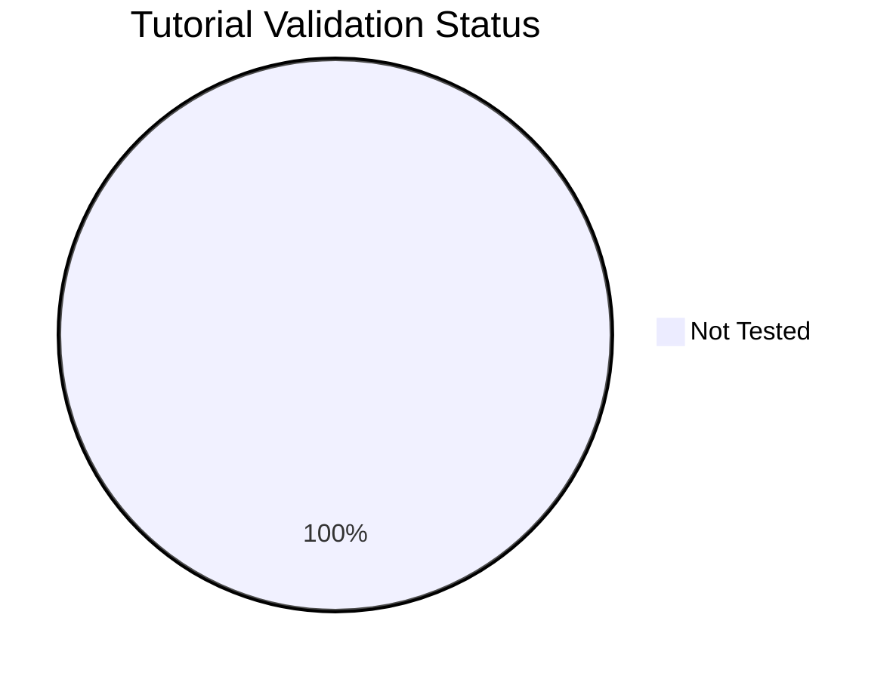

---
content_sources:
  diagrams:
  - id: reference-validation-status
    type: pie
    source: self-generated
    justification: Tutorial validation status chart generated from repository validation
      frontmatter.
    based_on:
    - docs/tutorials/lab-guides/
  - id: tutorial-validation-status-pie
    type: pie
    source: self-generated
    justification: Auto-generated dashboard chart from repository validation metadata.
    based_on:
    - https://learn.microsoft.com/en-us/azure/aks/what-is-aks
  sources:
  - type: mslearn-adapted
    url: https://learn.microsoft.com/en-us/azure/aks/what-is-aks
content_validation:
  status: verified
  last_reviewed: '2026-05-23'
  reviewer: agent
  core_claims:
  - claim: This generated dashboard summarizes repository validation metadata and
      links back to Microsoft Learn as the source basis for Azure content checks.
    source: https://learn.microsoft.com/en-us/azure/aks/what-is-aks
    verified: true
---
# Tutorial Validation Status

This page tracks which tutorials have been validated against real Azure deployments. Each tutorial can be tested via **az-cli** (manual CLI commands) or **Bicep** (infrastructure as code). Tutorials not tested within 90 days are marked as stale.

## Summary

*Generated: 2026-05-23*

| Metric | Count |
|---|---:|
| Total tutorials | 5 |
| ✅ Validated | 0 |
| ⚠️ Stale (>90 days) | 0 |
| ❌ Failed | 0 |
| ➖ Not tested | 5 |

<!-- diagram-id: reference-validation-status -->


## Validation Matrix

| Lab Guide | az-cli | Bicep | Last Tested | Status |
|---|---|---|---|---|
| [Lab 01 Aks Cluster Deployment](../tutorials/lab-guides/lab-01-aks-cluster-deployment.md) | ➖ Not Tested | ➖ Not Tested | — | ➖ Not Tested |
| [Lab 02 Application Gateway Ingress](../tutorials/lab-guides/lab-02-application-gateway-ingress.md) | ➖ Not Tested | ➖ Not Tested | — | ➖ Not Tested |
| [Lab 03 Azure Key Vault Csi Driver](../tutorials/lab-guides/lab-03-azure-key-vault-csi-driver.md) | ➖ Not Tested | ➖ Not Tested | — | ➖ Not Tested |
| [Lab 04 Azure Policy For Aks](../tutorials/lab-guides/lab-04-azure-policy-for-aks.md) | ➖ Not Tested | ➖ Not Tested | — | ➖ Not Tested |
| [Lab 05 Aks Disaster Recovery](../tutorials/lab-guides/lab-05-aks-disaster-recovery.md) | ➖ Not Tested | ➖ Not Tested | — | ➖ Not Tested |

## How to Update

To mark a tutorial as validated, add a `validation` block to its YAML frontmatter:

```yaml
---
hide:
  - toc
validation:
  az_cli:
    last_tested: 2026-04-09
    cli_version: "2.83.0"
    result: pass
  bicep:
    last_tested: null
    result: not_tested
---
```

Then regenerate this page:

```bash
python3 scripts/generate_validation_status.py
```

!!! info "Validation fields"
    - `result`: `pass`, `fail`, or `not_tested`
    - `last_tested`: ISO date (YYYY-MM-DD) or `null`
    - `cli_version`: Azure CLI version used
    - Tutorials older than 90 days are flagged as **stale**

## See Also

- [Tutorials](../tutorials/lab-guides/lab-01-aks-cluster-deployment.md)
- [CLI Cheatsheet](cli-cheatsheet.md)
- [Limits and Quotas](limits-and-quotas.md)
- [Diagnostic Commands](diagnostic-commands.md)

## Sources

- [Microsoft Learn overview](https://learn.microsoft.com/en-us/azure/aks/what-is-aks)
