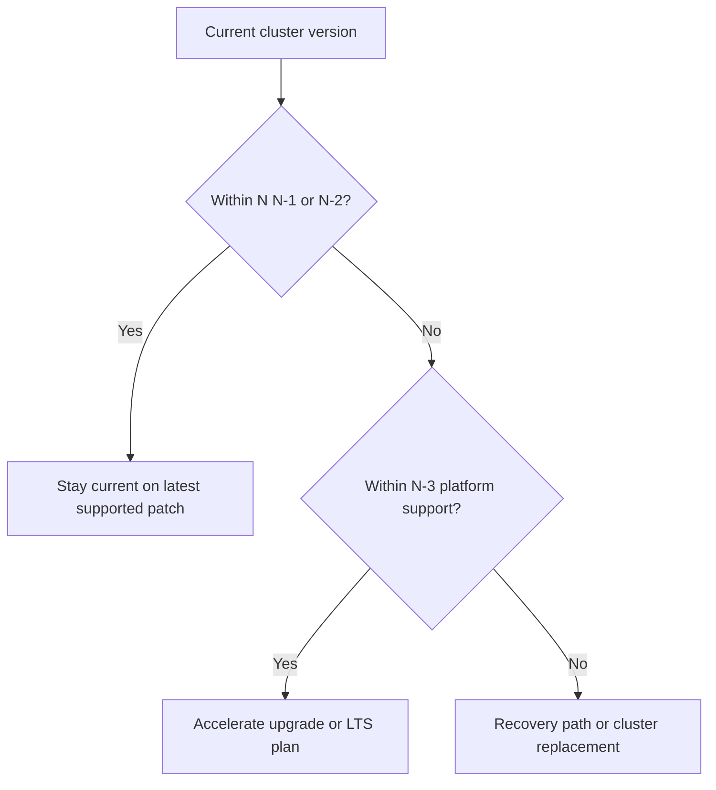

---
content_sources:
  diagrams:
    - id: reference-version-support-decision-flow
      type: flowchart
      source: self-generated
      justification: Version-support decision flow synthesized from Microsoft Learn support-policy, LTS, and release-tracker guidance.
      based_on:
        - https://learn.microsoft.com/en-us/azure/aks/supported-kubernetes-versions
        - https://learn.microsoft.com/en-us/azure/aks/long-term-support
        - https://learn.microsoft.com/en-us/azure/aks/release-tracker
---

# Version Support

AKS version support is an operational calendar you should query continuously, not a static table you read once per year.

## Topic/Command Groups

<!-- diagram-id: reference-version-support-decision-flow -->


### Support states to track

- **GA support window**: N, N-1, N-2.
- **Platform support only**: N-3.
- **Preview**: early validation only.
- **LTS**: explicit Premium-tier support plan for eligible versions.

### What to review every cycle

- Current cluster version and latest patch.
- Available upgrades in the cluster's region.
- Upcoming minor-version retirement dates.
- Whether the cluster should stay on community support or opt into LTS.
- Whether controllers, CRDs, and node image posture still match the target version.

### Useful checks

```bash
az aks show \
    --resource-group "$RG" \
    --name "$CLUSTER_NAME" \
    --query "{currentVersion:currentKubernetesVersion,supportPlan:supportPlan,autoUpgradeProfile:autoUpgradeProfile}" \
    --output yaml

az aks get-upgrades \
    --resource-group "$RG" \
    --name "$CLUSTER_NAME" \
    --output table

az aks get-versions \
    --location "$LOCATION" \
    --output table
```

## Usage Notes

- The operational target is not merely “supported”; it is “supported with enough runway left to schedule safely.”
- Use the [AKS Version Lifecycle](../platform/version-lifecycle.md) page for conceptual differences between preview, GA, platform support, and LTS.
- Use the [AKS release tracker](https://learn.microsoft.com/en-us/azure/aks/release-tracker) to verify whether a target patch or node image is available in your region before scheduling production work.
- If you opt into LTS, keep the patch auto-upgrade channel in scope so the cluster stays on a supported patch line.

## See Also

- [AKS Version Lifecycle](../platform/version-lifecycle.md)
- [Upgrades](../operations/upgrades.md)
- [Auto-Upgrade Channels](../operations/auto-upgrade-channels.md)
- [Maintenance Windows](../operations/maintenance-windows.md)
- [Blue-Green Upgrades](../operations/blue-green-upgrades.md)

## Sources

- [Supported Kubernetes versions in AKS](https://learn.microsoft.com/en-us/azure/aks/supported-kubernetes-versions)
- [Long-term support for AKS versions](https://learn.microsoft.com/en-us/azure/aks/long-term-support)
- [AKS release tracker](https://learn.microsoft.com/en-us/azure/aks/release-tracker)
