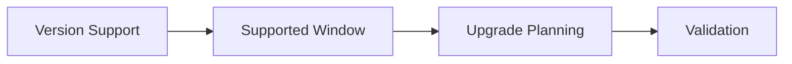

# Version Support

AKS is a managed service with a defined Kubernetes support policy. Treat version support as an ongoing operational responsibility, not an annual cleanup task.

## Topic/Command Groups




### What to track

- Current cluster Kubernetes version.
- Supported AKS minor versions and retirement timelines.
- API deprecations affecting manifests and controllers.
- Node image upgrade cadence and add-on compatibility.

### Useful checks

```bash
az aks show --resource-group $RG --name $CLUSTER_NAME --query kubernetesVersion --output tsv
az aks get-upgrades --resource-group $RG --name $CLUSTER_NAME --output table
kubectl api-resources
```

## Usage Notes

- Avoid staying on the oldest supported version.
- Upgrade non-production first and validate custom controllers, admission webhooks, and CRDs.
- Track version readiness in the same place you track security patching and maintenance windows.

## See Also

- [Upgrades](../operations/upgrades.md)
- [Maintenance Windows](../operations/maintenance-windows.md)
- [Upgrade Failure](../troubleshooting/playbooks/operations/upgrade-failure.md)

## Sources

- [Supported Kubernetes versions in AKS](https://learn.microsoft.com/azure/aks/supported-kubernetes-versions)
- [AKS release tracker](https://learn.microsoft.com/azure/aks/release-tracker)
