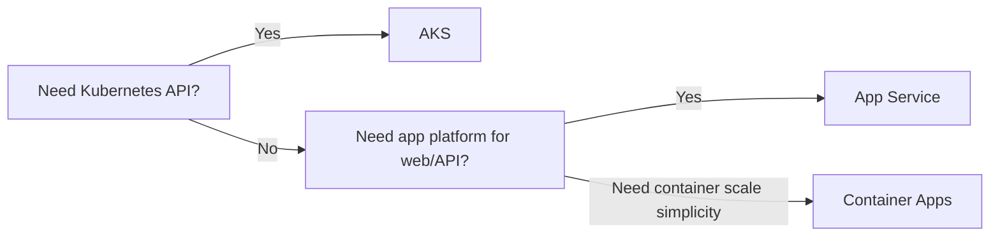

---
content_sources:
  diagrams:
  - id: start-here-aks-vs-other-compute
    type: flowchart
    source: mslearn-adapted
    mslearn_url: https://learn.microsoft.com/en-us/azure/aks/
    based_on:
    - https://learn.microsoft.com/en-us/azure/aks/
    - https://learn.microsoft.com/en-us/azure/aks/intro-kubernetes
    - https://learn.microsoft.com/en-us/azure/app-service/overview
    - https://learn.microsoft.com/en-us/azure/container-apps/overview
---

# AKS vs App Service vs Container Apps

Choose AKS only when you need Kubernetes-level control. Azure App Service and Azure Container Apps remove more operational burden for simpler workloads.

## Main Content

<!-- diagram-id: start-here-aks-vs-other-compute -->

### Service comparison

| Service | Best For | You Manage | Typical Trade-off |
|---|---|---|---|
| AKS | Multi-service platforms, Kubernetes-native apps, custom platform controls | Cluster configuration, node pools, upgrades, policy, networking | Highest flexibility and highest operational overhead |
| App Service | Traditional web apps and APIs | App configuration and deployment workflows | Fastest path for app hosting, least Kubernetes control |
| Container Apps | Microservices and event-driven containers without full Kubernetes ownership | Revision model, environment boundaries, app config | Simpler than AKS, fewer cluster-level controls |

### Use AKS when

- You need daemonsets, CRDs, operators, service meshes, or custom schedulers.
- You need mixed workload placement across multiple node pools.
- You need Kubernetes-native GitOps and policy enforcement patterns.

### Prefer App Service or Container Apps when

- You only need an HTTP app platform.
- You want scale-to-zero or revision-based release behavior without cluster management.
- Your team does not want to own Kubernetes upgrades and diagnostics.

## See Also

- [Overview](overview.md)
- [Learning Path](learning-path.md)
- [Platform](../platform/index.md)
- [Production Baseline](../best-practices/production-baseline.md)

## Sources

- [Azure Kubernetes Service (AKS) documentation](https://learn.microsoft.com/azure/aks/)
- [What is Azure Kubernetes Service (AKS)?](https://learn.microsoft.com/azure/aks/intro-kubernetes)
- [Azure App Service overview](https://learn.microsoft.com/azure/app-service/overview)
- [Azure Container Apps overview](https://learn.microsoft.com/azure/container-apps/overview)
