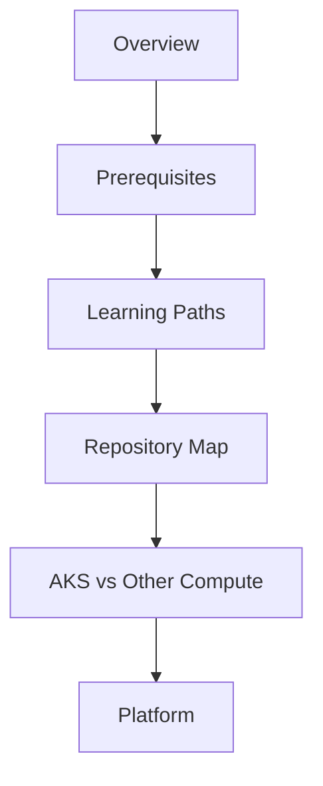

---
content_sources:
  diagrams:
  - id: start-here-index
    type: flowchart
    source: self-generated
    justification: Navigation flow synthesized from the linked AKS topics and workflows
      on this page.
    based_on:
    - https://learn.microsoft.com/en-us/azure/aks/
    - https://learn.microsoft.com/en-us/azure/aks/intro-kubernetes
---

# Start Here

Use this section to understand the guide scope, choose a learning path, and confirm that AKS is the right service for your workload.

<!-- diagram-id: start-here-index -->

## Main Content

| Document | Purpose |
|---|---|
| [Overview](overview.md) | Understand what AKS is, who this guide is for, and what is in scope. |
| [Learning Paths](learning-paths.md) | Follow a role-based sequence for architect, operator, or troubleshooter work. |
| [Repository Map](repository-map.md) | Map of major sections and when to use them. |
| [Prerequisites](prerequisites.md) | Confirm Azure, Kubernetes, networking, and tooling readiness. |
| [AKS vs Other Compute](aks-vs-other-compute.md) | Compare AKS with App Service and Azure Container Apps. |

## Recommended Reading Order

1. [Overview](overview.md)
2. [Prerequisites](prerequisites.md)
3. [Learning Paths](learning-paths.md)
4. [Repository Map](repository-map.md)
5. [AKS vs Other Compute](aks-vs-other-compute.md)
6. [Platform](../platform/index.md)

## See Also

- [Overview](overview.md)
- [Learning Paths](learning-paths.md)
- [Repository Map](repository-map.md)
- [Prerequisites](prerequisites.md)
- [AKS vs Other Compute](aks-vs-other-compute.md)
- [Platform](../platform/index.md)

## Sources

- [Azure Kubernetes Service (AKS) documentation](https://learn.microsoft.com/azure/aks/)
- [What is Azure Kubernetes Service (AKS)?](https://learn.microsoft.com/azure/aks/intro-kubernetes)
