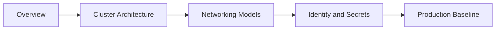
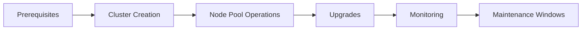
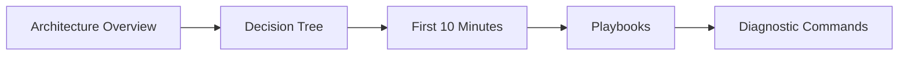

# Learning Path

Choose a path based on your role so you can move from AKS fundamentals to production execution without skipping key design decisions.

## Main Content

### Architect Path

1. [Overview](overview.md)
2. [AKS vs Other Compute](aks-vs-other-compute.md)
3. [Cluster Architecture](../platform/cluster-architecture.md)
4. [Networking Models](../platform/networking-models.md)
5. [Identity and Secrets](../platform/identity-and-secrets.md)
6. [Production Baseline](../best-practices/production-baseline.md)
7. [Resource Governance](../best-practices/resource-governance.md)

### Operator Path

1. [Prerequisites](prerequisites.md)
2. [Cluster Creation](../operations/cluster-creation.md)
3. [Node Pool Operations](../operations/node-pool-operations.md)
4. [Scaling](../platform/scaling.md)
5. [Upgrades](../operations/upgrades.md)
6. [Monitoring and Logging](../operations/monitoring-logging.md)
7. [Credential Rotation](../operations/credential-rotation.md)

### Troubleshooter Path

1. [Architecture Overview](../troubleshooting/architecture-overview.md)
2. [Decision Tree](../troubleshooting/decision-tree.md)
3. [First 10 Minutes](../troubleshooting/first-10-minutes/index.md)
4. [Playbooks](../troubleshooting/playbooks/index.md)
5. [Diagnostic Commands](../reference/diagnostic-commands.md)

## See Also

- [Overview](overview.md)
- [Prerequisites](prerequisites.md)
- [Platform](../platform/index.md)
- [Operations](../operations/index.md)
- [Troubleshooting](../troubleshooting/index.md)

## Sources

- [Azure Kubernetes Service (AKS) documentation](https://learn.microsoft.com/azure/aks/)
- [What is Azure Kubernetes Service (AKS)?](https://learn.microsoft.com/azure/aks/intro-kubernetes)
