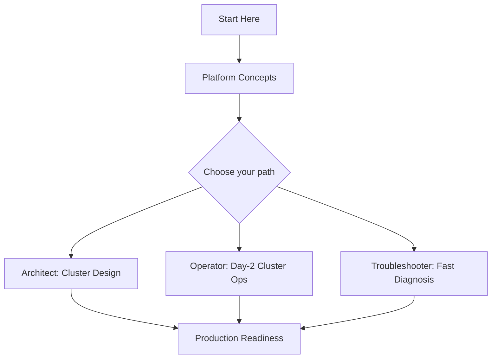
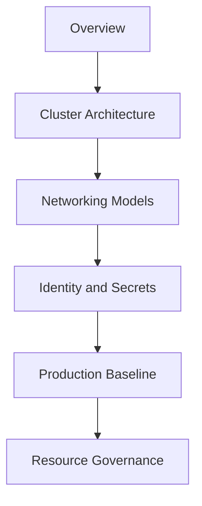
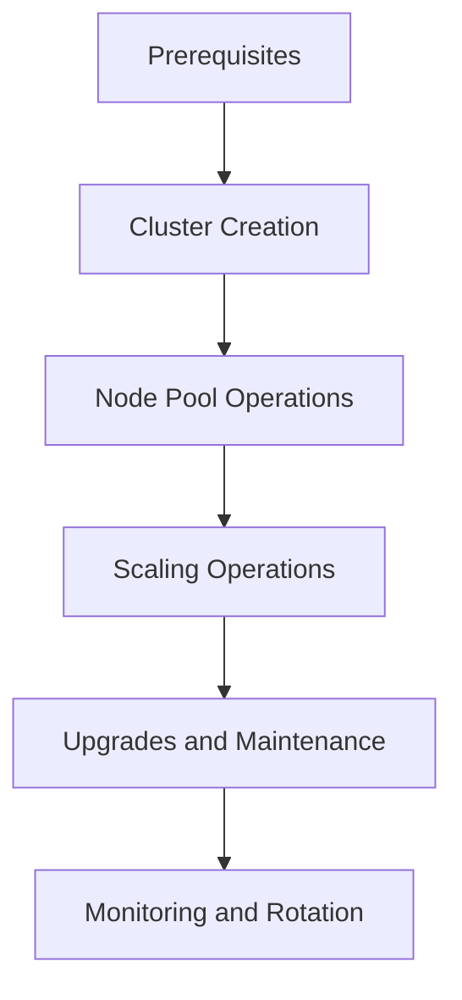
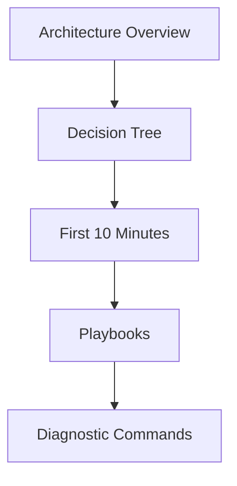

# Learning Paths

Use this page to choose a reading path based on your role and goal. Each path is numbered, so read the pages in order for the best result. Every path ends with a checklist of concrete outcomes you should be able to demonstrate.

!!! tip "Pick one primary path first"
    If you fit multiple roles, pick the one that matches your current goal, complete that path, then read a second path opportunistically. Trying to follow every path in parallel dilutes progress.

## Choose Your Path

| Role | Goal | Time Budget | Start With |
|---|---|---|---|
| **Architect** | Design cluster topology, networking, identity, and cost model | 4-6 hours | [Overview](overview.md), [Platform Hub](../platform/index.md) |
| **Operator** | Run AKS in production: cluster ops, upgrades, node pools, monitoring | 4-6 hours | [Prerequisites](prerequisites.md), [Operations Hub](../operations/index.md) |
| **Troubleshooter** | Diagnose node, pod, ingress, and autoscaler failures | 3-5 hours + on-call reference | [Troubleshooting Hub](../troubleshooting/index.md) |

## Recommended Sequence

<!-- diagram-id: aks-learning-paths-overview -->

## Architect Path

Design AKS cluster topology, networking model, identity and secrets flow, and production baseline. Focuses on decisions made once and carried for the life of the cluster.

**Time**: 4-6 hours

<!-- diagram-id: aks-learning-paths-architect -->

Read in order:

1. [Overview](overview.md)
2. [AKS vs Other Compute](aks-vs-other-compute.md)
3. Platform architecture sequence:
    - [Platform Hub](../platform/index.md)
    - [Cluster Architecture](../platform/cluster-architecture.md)
    - [Networking Models](../platform/networking-models.md)
    - [Ingress and Load Balancing](../platform/ingress-load-balancing.md)
    - [Identity and Secrets](../platform/identity-and-secrets.md)
    - [Node Pools](../platform/node-pools.md)
    - [Scaling](../platform/scaling.md)
    - [Storage Options](../platform/storage-options.md)
4. Best Practices sequence:
    - [Production Baseline](../best-practices/production-baseline.md)
    - [Resource Governance](../best-practices/resource-governance.md)
    - [Networking](../best-practices/networking.md)
    - [Security](../best-practices/security.md)
    - [Reliability](../best-practices/reliability.md)

### Outcomes

- You can pick between Azure CNI, kubenet, and Azure CNI Overlay for a workload profile.
- You can define a node-pool strategy (system vs user pools, spot vs on-demand) with cost targets.
- You can design an identity model with Workload Identity, Key Vault CSI, and Azure RBAC.
- You can produce a production-baseline checklist for a new cluster.

### Microsoft Learn anchors

- [Core concepts for Azure Kubernetes Service](https://learn.microsoft.com/en-us/azure/aks/concepts-clusters-workloads)
- [Network concepts for AKS](https://learn.microsoft.com/en-us/azure/aks/concepts-network)
- [Azure Kubernetes Service baseline architecture](https://learn.microsoft.com/en-us/azure/architecture/reference-architectures/containers/aks/baseline-aks)

## Operator Path

Run AKS in production: cluster creation, node pool operations, version upgrades, credential rotation, and monitoring.

**Time**: 4-6 hours

<!-- diagram-id: aks-learning-paths-operator -->

Read in order:

1. [Prerequisites](prerequisites.md)
2. Operations sequence:
    - [Operations Hub](../operations/index.md)
    - [Cluster Creation](../operations/cluster-creation.md)
    - [Node Pool Operations](../operations/node-pool-operations.md)
    - [Scaling Operations](../operations/scaling-operations.md)
    - [Upgrades](../operations/upgrades.md)
    - [Maintenance Windows](../operations/maintenance-windows.md)
    - [Monitoring and Logging](../operations/monitoring-logging.md)
    - [Credential Rotation](../operations/credential-rotation.md)
3. Best Practices sequence:
    - [Cost Optimization](../best-practices/cost-optimization.md)
    - [Common Anti-Patterns](../best-practices/common-anti-patterns.md)
4. Tutorials — hands-on tutorials:
    - [Tutorial 01: AKS Cluster Deployment](../tutorials/lab-guides/lab-01-aks-cluster-deployment.md)
    - [Tutorial 02: Application Gateway Ingress](../tutorials/lab-guides/lab-02-application-gateway-ingress.md)
    - [Tutorial 03: Azure Key Vault CSI Driver](../tutorials/lab-guides/lab-03-azure-key-vault-csi-driver.md)
    - [Tutorial 05: AKS Disaster Recovery](../tutorials/lab-guides/lab-05-aks-disaster-recovery.md)

### Outcomes

- You can create a production-grade AKS cluster with a validated node pool topology.
- You can run a version upgrade with a maintenance window and roll back if needed.
- You can rotate cluster credentials and validate zero-downtime for critical workloads.
- You can wire Container Insights and design an alert set for the top failure modes.

### Microsoft Learn anchors

- [Deploy an AKS cluster using Azure CLI](https://learn.microsoft.com/en-us/azure/aks/tutorial-kubernetes-deploy-cluster)
- [Upgrade an AKS cluster](https://learn.microsoft.com/en-us/azure/aks/upgrade-cluster)
- [Monitor AKS with Azure Monitor](https://learn.microsoft.com/en-us/azure/aks/monitor-aks)

## Troubleshooter Path

Diagnose fast during a live incident. Focuses on node and pod failure triage, ingress and connectivity issues, and autoscaler behavior.

**Time**: 3-5 hours + on-call reference

<!-- diagram-id: aks-learning-paths-troubleshooter -->

Read in order:

1. [Troubleshooting Hub](../troubleshooting/index.md)
2. [Architecture Overview](../troubleshooting/architecture-overview.md) and [Mental Model](../troubleshooting/mental-model.md)
3. [Decision Tree](../troubleshooting/decision-tree.md) and [Quick Diagnosis Cards](../troubleshooting/quick-diagnosis-cards.md)
4. First 10 Minutes runbooks:
    - [Pod Failures](../troubleshooting/first-10-minutes/pod-failures.md)
    - [Connectivity](../troubleshooting/first-10-minutes/connectivity.md)
    - [Performance](../troubleshooting/first-10-minutes/performance.md)
5. [Playbooks Hub](../troubleshooting/playbooks/index.md) — pod CrashLoopBackOff, node not ready, ingress, cluster autoscaler, and more
6. [Reference: Diagnostic Commands](../reference/diagnostic-commands.md)
7. [Reference: Limits and Quotas](../reference/limits-and-quotas.md)

### Outcomes

- You can run the First 10 Minutes runbook for a node, pod, or connectivity symptom.
- You can select the right playbook from a symptom description without guessing.
- You can collect the diagnostic bundle (`kubectl`, `az aks` commands) that a playbook expects.
- You can correlate cluster autoscaler decisions with pod scheduling failures.

### Microsoft Learn anchors

- [AKS diagnostics overview](https://learn.microsoft.com/en-us/azure/aks/aks-diagnostics)
- [Troubleshoot common AKS issues](https://learn.microsoft.com/en-us/azure/aks/troubleshooting)
- [Container Insights for AKS](https://learn.microsoft.com/en-us/azure/azure-monitor/containers/container-insights-overview)

## Track Selection Matrix

| Situation | Start with | Then continue to |
|---|---|---|
| Designing a new AKS platform | Architect Path | Operator Path |
| Onboarding to an existing cluster | Operator Path | Architect Path |
| Preparing for launch | Operator Path | Troubleshooter Path |
| Active incident | Troubleshooter Path | Operator Path (hardening) |

!!! tip "Live incident? Skip the path."
    If you are actively responding to a page, jump straight to [Troubleshooting Hub](../troubleshooting/index.md), the [Decision Tree](../troubleshooting/decision-tree.md), and the First 10 Minutes runbooks.

## See Also

- [Overview](overview.md)
- [Scenario Router](scenario-router.md) — situation-to-destination index when you already know what you need
- [Prerequisites](prerequisites.md)
- [AKS vs Other Compute](aks-vs-other-compute.md)
- [Repository Map](repository-map.md)
- [Platform Hub](../platform/index.md)
- [Best Practices Hub](../best-practices/index.md)
- [Operations Hub](../operations/index.md)
- [Troubleshooting Hub](../troubleshooting/index.md)

## Sources

- [What is Azure Kubernetes Service?](https://learn.microsoft.com/en-us/azure/aks/what-is-aks)
- [Introduction to Kubernetes on Azure](https://learn.microsoft.com/en-us/azure/aks/intro-kubernetes)
- [Core concepts for Azure Kubernetes Service](https://learn.microsoft.com/en-us/azure/aks/concepts-clusters-workloads)
- [Network concepts for AKS](https://learn.microsoft.com/en-us/azure/aks/concepts-network)
- [Azure Kubernetes Service baseline architecture](https://learn.microsoft.com/en-us/azure/architecture/reference-architectures/containers/aks/baseline-aks)
