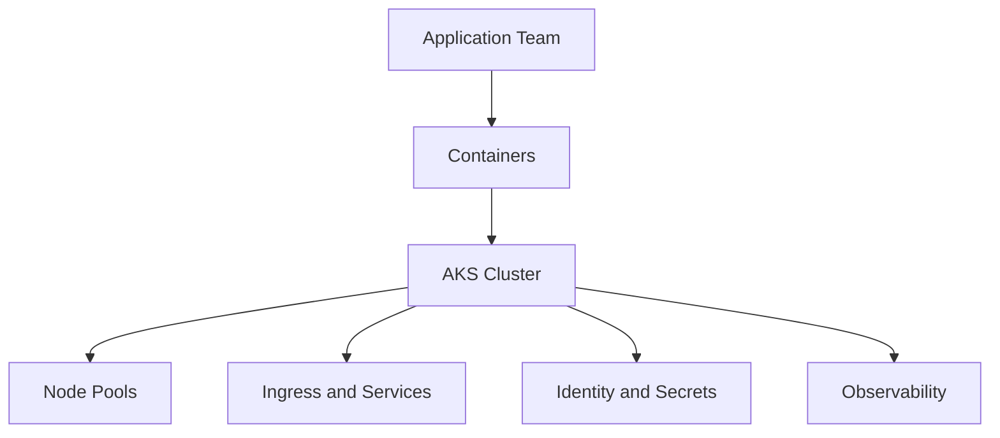

---
content_sources:
  diagrams:
  - id: start-here-overview
    type: graph
    source: mslearn-adapted
    mslearn_url: https://learn.microsoft.com/en-us/azure/aks/
    based_on:
    - https://learn.microsoft.com/en-us/azure/aks/
    - https://learn.microsoft.com/en-us/azure/aks/intro-kubernetes
---

# AKS Overview

Azure Kubernetes Service (AKS) is Azure's managed Kubernetes offering for teams that need Kubernetes APIs, multi-service orchestration, and control over cluster-level behavior.

<!-- diagram-id: start-here-overview -->

## Main Content

### What AKS gives you

- Managed Kubernetes control plane operated by Azure.
- Integration with Azure networking, identity, storage, and monitoring.
- Support for multiple node pools, Linux and Windows worker nodes, and autoscaling.
- A consistent Kubernetes API surface for GitOps, Helm, and standard cloud-native tooling.

### What AKS does not remove

- You still own workload design, namespace strategy, RBAC, quotas, network policy, and release safety.
- You still need to plan upgrades, observability, incident response, and capacity.
- Kubernetes complexity does not disappear just because the control plane is managed.

### When AKS is a strong fit

- You operate multiple services that need Kubernetes-native primitives.
- You need daemonsets, operators, service meshes, or custom admission control.
- You want standardized deployment patterns across multiple teams.
- You need tighter control of networking and cluster topology than App Service or Container Apps typically exposes.

### When AKS is the wrong first choice

- Your workload is a single web app with minimal platform customization.
- Your team does not want to own cluster operations.
- Your traffic pattern is simple and event-driven enough for a higher-level platform.

## See Also

- [Start Here](index.md)
- [Learning Path](learning-path.md)
- [AKS vs Other Compute](aks-vs-other-compute.md)
- [Cluster Architecture](../platform/cluster-architecture.md)
- [Production Baseline](../best-practices/production-baseline.md)

## Sources

- [Azure Kubernetes Service (AKS) documentation](https://learn.microsoft.com/azure/aks/)
- [What is Azure Kubernetes Service (AKS)?](https://learn.microsoft.com/azure/aks/intro-kubernetes)
