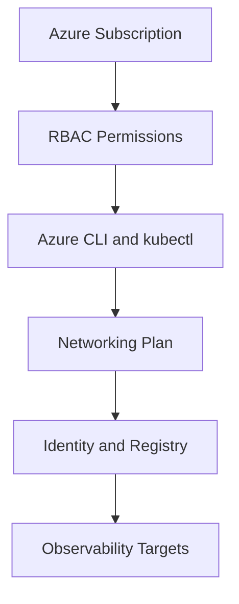

# Prerequisites

Before you create or operate AKS, confirm that your Azure subscription, networking plan, identity model, and workstation tools are ready.

## Prerequisites




### Azure access

- Contributor or equivalent access for the resource group during setup.
- Permission to create managed identities, virtual networks, and load balancers when required.
- Subscription quota for the VM families and regions you plan to use.

### Workstation tools

```bash
az version
az extension add --name aks-preview
kubectl version --client
kubelogin --version
helm version
```

### Baseline Kubernetes knowledge

- Pods, deployments, services, ingress, and namespaces.
- Resource requests and limits.
- Rolling updates, probes, and configuration with ConfigMaps and Secrets.

### Environment inputs to define early

- `$RG`, `$CLUSTER_NAME`, `$LOCATION`
- VNet/subnet design and IP capacity
- Container registry location and image pull model
- Log Analytics workspace and alerting destination

## See Also

- [Overview](overview.md)
- [Cluster Creation](../operations/cluster-creation.md)
- [Networking Models](../platform/networking-models.md)
- [Reference: CLI Cheatsheet](../reference/cli-cheatsheet.md)

## Sources

- [Azure Kubernetes Service (AKS) documentation](https://learn.microsoft.com/azure/aks/)
- [What is Azure Kubernetes Service (AKS)?](https://learn.microsoft.com/azure/aks/intro-kubernetes)
- [AKS quotas, virtual machine sizes, and regional availability](https://learn.microsoft.com/azure/aks/quotas-skus-regions)
- [Azure subscription and service limits, quotas, and constraints](https://learn.microsoft.com/azure/azure-resource-manager/management/azure-subscription-service-limits)
