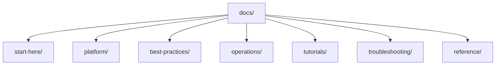

---
content_sources:
  diagrams:
    - id: repository-map
      type: flowchart
      source: self-generated
      justification: "Repository map diagram created for this guide, grounded in Microsoft Learn AKS documentation and cluster architecture concepts."
      based_on:
        - https://learn.microsoft.com/en-us/azure/aks/
        - https://learn.microsoft.com/en-us/azure/aks/intro-kubernetes
        - https://learn.microsoft.com/en-us/azure/aks/concepts-clusters-workloads
---

# Repository Map

The Azure Kubernetes Service Practical Guide is organized to mirror the workflow of deploying, operating, and troubleshooting AKS — from cluster architecture to production diagnosis. This page explains the structure and purpose of each section so you can jump directly to what you need.

<!-- diagram-id: repository-map -->

## Directory Structure

- `docs/start-here/`
    - `overview.md`: Introduction to Azure Kubernetes Service and this guide.
    - `learning-paths.md`: Role-based reading paths for architects, operators, and troubleshooters.
    - `repository-map.md`: This file — a map of major sections and when to use them.
    - `prerequisites.md`: Required Azure, Kubernetes, networking, and tooling readiness.
    - `aks-vs-other-compute.md`: Positioning AKS against App Service and Azure Container Apps.
- `docs/platform/`
    - Core concepts: cluster architecture, node pools, networking models, ingress and load balancing, identity and secrets, storage options, and scaling.
- `docs/best-practices/`
    - Production patterns: production baseline, security, networking, resource governance, reliability, cost optimization, and common anti-patterns.
- `docs/operations/`
    - Day-2 execution: cluster creation, node pool operations, upgrades, scaling operations, monitoring and logging, maintenance windows, and credential rotation.
- `docs/tutorials/`
    - Hands-on lab guides: AKS cluster deployment, Application Gateway ingress, Azure Key Vault CSI driver, Azure Policy for AKS, and disaster recovery.
- `docs/troubleshooting/`
    - Diagnosis-first content: architecture overview, decision tree, evidence map, mental model, quick diagnosis cards, first-10-minutes runbooks, and playbooks for pod, node, connectivity, and operations scenarios.
- `docs/reference/`
    - Quick-lookup material: CLI cheatsheet, diagnostic commands, limits and quotas, version support, and glossary.

## When to Use Each Section

| If you want to... | Go to |
|---|---|
| Understand AKS concepts | [Platform](../platform/index.md) |
| Design a production cluster architecture | [Best Practices](../best-practices/index.md) |
| Operate a cluster in production | [Operations](../operations/index.md) |
| Practice with a hands-on lab | [Tutorials](../tutorials/lab-guides/lab-01-aks-cluster-deployment.md) |
| Diagnose a live incident | [Troubleshooting](../troubleshooting/index.md) |
| Look up a command or limit | [Reference](../reference/index.md) |

## See Also

- [Overview](overview.md)
- [Learning Paths](learning-paths.md)
- [Scenario Router](scenario-router.md) — situation-to-destination index across the four lifecycle phases
- [Prerequisites](prerequisites.md)
- [AKS vs Other Compute](aks-vs-other-compute.md)

## Sources

- [Azure Kubernetes Service (AKS) documentation](https://learn.microsoft.com/en-us/azure/aks/)
- [What is Azure Kubernetes Service (AKS)?](https://learn.microsoft.com/en-us/azure/aks/intro-kubernetes)
- [Kubernetes core concepts for AKS](https://learn.microsoft.com/en-us/azure/aks/concepts-clusters-workloads)
