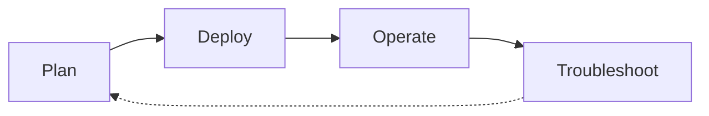

# Scenario Router

Use this page when you have a specific situation and want to jump straight to the page that answers it. This is a breadth-first index across four lifecycle phases — Plan, Deploy, Operate, Troubleshoot — that complements the depth-first [Learning Paths](learning-paths.md) and the symptom-first [Decision Tree](../troubleshooting/decision-tree.md).

!!! tip "Start with Learning Paths if you're new to AKS"
    This page assumes you already know what you're trying to do. If you're still deciding what to learn first, start with [Learning Paths](learning-paths.md) — it sequences a role-based tour of the guide. Use this Scenario Router when you have a specific question and want to jump to the exact page that answers it.

## How to Use This Router

- Pick the table for the lifecycle phase you're in — Plan, Deploy, Operate, or Troubleshoot.
- Scan the left column for the situation that matches yours; open the destination on the right.
- If two rows fit, prefer the row from the phase you're actually in — the same platform concept often appears in more than one phase.
- If your situation spans two phases (a cluster design choice today that will become a scheduling or scaling failure later), check [Cross-Phase Scenarios](#cross-phase-scenarios) first.
- Every destination is a real page in this guide, not an external link and not an aspirational page.
- Rows are intentionally short. Follow the link for the depth; this table is a switchboard, not a summary.
- If your situation is missing, [open an issue](https://github.com/yeongseon/azure-kubernetes-service-practical-guide/issues) — the router is meant to grow.

## Lifecycle Overview

<!-- diagram-id: aks-scenario-router-lifecycle -->

## I'm Planning

| Situation | Where to go |
|---|---|
| I'm choosing which learning path to follow | [Learning Paths](learning-paths.md) — role-based reading paths |
| I'm deciding between AKS, App Service, and Container Apps | [AKS vs Other Compute](aks-vs-other-compute.md) — compute selection |
| I want to understand AKS cluster architecture | [Cluster Architecture](../platform/cluster-architecture.md) — control plane and worker topology |
| I'm choosing a CNI model (Azure CNI, kubenet, Overlay) | [Networking Models](../platform/networking-models.md) — CNI comparison and workload fit |
| I'm designing node pools (system vs user, spot vs on-demand) | [Node Pools](../platform/node-pools.md) — pool strategy and SKU sizing |
| I'm designing identity and secrets (Workload Identity, Key Vault CSI) | [Identity and Secrets](../platform/identity-and-secrets.md) — identity model and secret flow |
| I'm designing persistent storage (Disk, Files, Blob) | [Storage Options](../platform/storage-options.md) — storage class comparison |
| I'm designing the production baseline (security, upgrades, monitoring) | [Production Baseline](../best-practices/production-baseline.md) — hardening checklist |
| I want to avoid common AKS anti-patterns | [Common Anti-Patterns](../best-practices/common-anti-patterns.md) — what to not do and why |

## I'm Deploying

| Situation | Where to go |
|---|---|
| I'm confirming my Azure, tooling, and permissions are ready | [Prerequisites](prerequisites.md) — Azure, kubectl, and permissions checklist |
| I'm creating my first AKS cluster | [Cluster Creation](../operations/cluster-creation.md) — CLI and IaC flows |
| I want a hands-on tutorial to deploy AKS end-to-end | [Tutorial 01: AKS Cluster Deployment](../tutorials/lab-guides/lab-01-aks-cluster-deployment.md) — full guided deployment |
| I'm configuring or adding node pools | [Node Pool Operations](../operations/node-pool-operations.md) — add, resize, and upgrade pools |
| I'm designing ingress and load balancing | [Ingress and Load Balancing](../platform/ingress-load-balancing.md) — ingress patterns |
| I want a hands-on tutorial for Application Gateway Ingress | [Tutorial 02: Application Gateway Ingress](../tutorials/lab-guides/lab-02-application-gateway-ingress.md) — AGIC end-to-end |
| I want a hands-on tutorial for Azure Key Vault CSI driver | [Tutorial 03: Azure Key Vault CSI Driver](../tutorials/lab-guides/lab-03-azure-key-vault-csi-driver.md) — secret injection |

## I'm Operating in Production

| Situation | Where to go |
|---|---|
| I need day-2 operational procedures | [Operations Hub](../operations/index.md) — production runbooks |
| I want to follow production best practices | [Best Practices Hub](../best-practices/index.md) — hardening and design guidance |
| I need to upgrade Kubernetes or node image versions | [Upgrades](../operations/upgrades.md) — cluster and node pool upgrades |
| I need to scale a cluster or node pool | [Scaling Operations](../operations/scaling-operations.md) — manual and autoscale operations |
| I need to wire monitoring, logs, and alerts | [Monitoring and Logging](../operations/monitoring-logging.md) — Container Insights and Log Analytics |
| I need to configure a maintenance window | [Maintenance Windows](../operations/maintenance-windows.md) — planned-maintenance configuration |
| I need to rotate cluster credentials and certificates | [Credential Rotation](../operations/credential-rotation.md) — kubeconfig, service principal, and cert rotation |
| I need to control cost across a portfolio | [Cost Optimization](../best-practices/cost-optimization.md) — spot pools, right-sizing, and scale-to-zero |
| I need to enforce workload governance (quotas, policy) | [Resource Governance](../best-practices/resource-governance.md) — namespace quotas and Azure Policy |

## I'm Troubleshooting

| Situation | Where to go |
|---|---|
| I need to systematically diagnose an issue | [Decision Tree](../troubleshooting/decision-tree.md) — hypothesis-driven triage flow |
| I need to know what evidence to collect | [Evidence Map](../troubleshooting/evidence-map.md) — question → kubectl + KQL artifact index |
| I want quick pattern-match cards for common symptoms | [Quick Diagnosis Cards](../troubleshooting/quick-diagnosis-cards.md) — one-page symptom cards |
| I need the failure-boundary architecture of AKS | [Architecture Overview](../troubleshooting/architecture-overview.md) — control plane, node, and workload boundaries |
| An incident just started and I have 10 minutes | [First 10 Minutes Hub](../troubleshooting/first-10-minutes/index.md) — ordered triage checklists |
| My pods are failing (pending, crashing, evicted) | [First 10 Minutes: Pod Failures](../troubleshooting/first-10-minutes/pod-failures.md) — pod-level triage |
| I'm losing service or ingress connectivity | [First 10 Minutes: Connectivity](../troubleshooting/first-10-minutes/connectivity.md) — service and ingress triage |
| My workload has performance or latency regressions | [First 10 Minutes: Performance](../troubleshooting/first-10-minutes/performance.md) — CPU, memory, and scheduling triage |
| A pod is stuck in CrashLoopBackOff | [Pod CrashLoop](../troubleshooting/playbooks/pod-issues/crashloop.md) — restart-loop diagnosis |
| The cluster autoscaler is not adding or removing nodes | [Cluster Autoscaler Issues](../troubleshooting/playbooks/cluster-autoscaler-issues.md) — autoscaler diagnosis |

## Cross-Phase Scenarios

Some situations straddle two phases — the cluster design choice you make while planning determines the failure mode you eventually debug. These rows link the two together so you can see the pattern *and* the drill in one place. If you're only in one phase today, still skim this table: it's the cheapest way to preview which decisions will hurt later.

| Situation | Where to go |
|---|---|
| I'm designing node pools and want to preview the node-not-ready failure mode | [Node Pools](../platform/node-pools.md) then [Node Not Ready](../troubleshooting/playbooks/node-issues/node-not-ready.md) — plan + incident |
| I'm choosing a CNI model and want to see the IP-exhaustion failure mode | [Networking Models](../platform/networking-models.md) then [CNI IP Exhaustion](../troubleshooting/playbooks/node-issues/cni-ip-exhaustion.md) — plan + drill |
| I'm designing ingress and want to see the ingress-failure mode | [Ingress and Load Balancing](../platform/ingress-load-balancing.md) then [Ingress Failure](../troubleshooting/playbooks/connectivity/ingress-failure.md) — plan + drill |
| I'm planning autoscale and want to see the scaling-failure mode | [Scaling Operations](../operations/scaling-operations.md) then [Scaling Failure](../troubleshooting/playbooks/operations/scaling-failure.md) — plan + incident |

## When This Router Isn't the Right Entry Point

- You're brand new to AKS → start with [Learning Paths](learning-paths.md) instead.
- You already have a symptom (pod crash, node not ready, ingress 502, autoscaler stuck) and don't know which lifecycle phase you're in → jump to [Decision Tree](../troubleshooting/decision-tree.md) or [Quick Diagnosis Cards](../troubleshooting/quick-diagnosis-cards.md).
- You're picking between AKS, App Service, and Container Apps for a brand-new workload → use [AKS vs Other Compute](aks-vs-other-compute.md).

## See Also

- [Learning Paths](learning-paths.md) — depth-first, role-based reading order
- [Overview](overview.md) — what AKS is and who this guide is for
- [Prerequisites](prerequisites.md) — Azure, kubectl, and permissions checklist
- [Repository Map](repository-map.md) — full section map
- [AKS vs Other Compute](aks-vs-other-compute.md) — compute selection
- [Decision Tree](../troubleshooting/decision-tree.md) — symptom-first troubleshooting router
- [Evidence Map](../troubleshooting/evidence-map.md) — evidence-collection index
