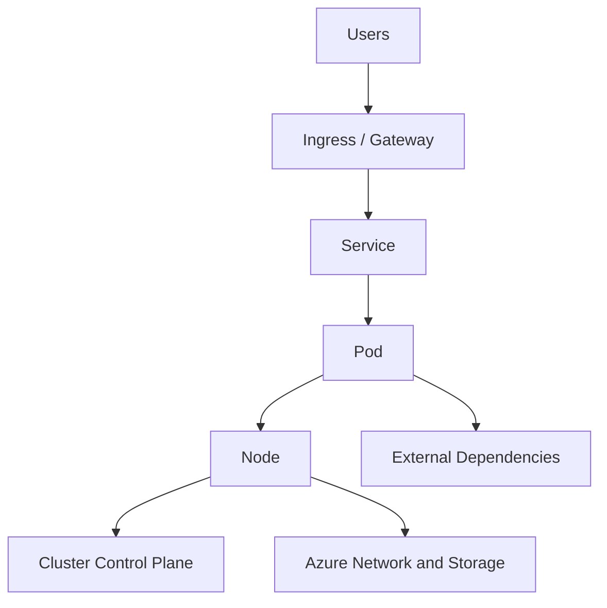

# Architecture Overview

Good AKS troubleshooting starts by locating the failure layer: Kubernetes object, node, cluster integration, or Azure dependency.

## Main Content

### Failure layers

- **Pod layer**: image pulls, crashes, readiness, configuration.
- **Service/Ingress layer**: selector mismatch, endpoints missing, TLS or routing issues.
- **Node layer**: NotReady status, pressure, daemonset failure, IP exhaustion.
- **Azure integration layer**: load balancer, managed disk, identity, registry, or DNS issues.

### Why this matters

Symptoms often appear at one layer and originate in another. A 502 at ingress might be a pod readiness issue, a service selector issue, or a node networking issue.

## See Also

- [Decision Tree](decision-tree.md)
- [Evidence Map](evidence-map.md)
- [Mental Model](mental-model.md)
- [Platform: Cluster Architecture](../platform/cluster-architecture.md)

## Sources

- [Troubleshoot AKS clusters](https://learn.microsoft.com/troubleshoot/azure/azure-kubernetes/welcome-azure-kubernetes)
- [AKS troubleshooting articles](https://learn.microsoft.com/troubleshoot/azure/azure-kubernetes/)
- [AKS core concepts for Kubernetes and workloads](https://learn.microsoft.com/azure/aks/concepts-clusters-workloads)
- [Azure Kubernetes Service (AKS) architecture](https://learn.microsoft.com/azure/architecture/reference-architectures/containers/aks/secure-baseline-aks)
