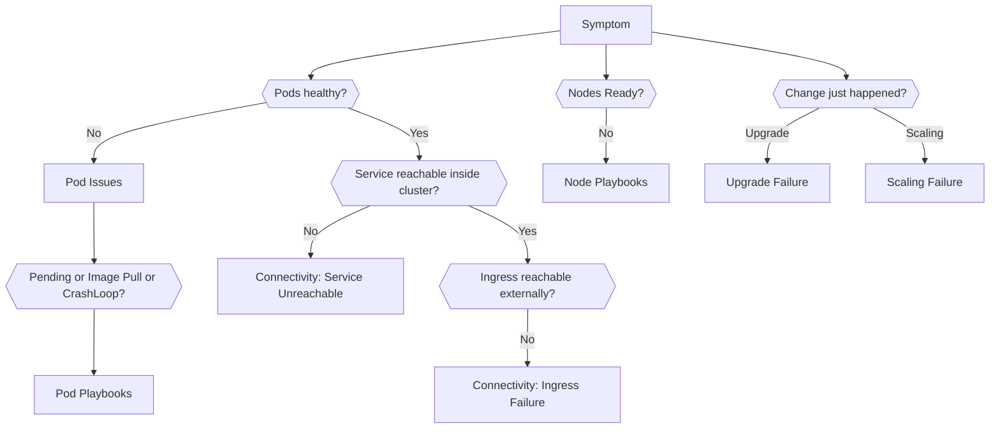

---
content_sources:
  diagrams:
  - id: troubleshooting-decision-tree
    type: flowchart
    source: self-generated
    justification: Diagnostic flow synthesized from Microsoft Learn troubleshooting
      guidance linked in this page.
    based_on:
    - https://learn.microsoft.com/en-us/troubleshoot/azure/azure-kubernetes/welcome-azure-kubernetes
    - https://learn.microsoft.com/en-us/troubleshoot/azure/azure-kubernetes/
---

# Decision Tree

Use this decision tree when time matters more than completeness. Its job is to route you to the most likely evidence path, not to prove root cause by itself.

## Main Content

<!-- diagram-id: troubleshooting-decision-tree -->

## How to Use

1. Classify the symptom in under one minute.
2. Pick the playbook that matches the first broken layer.
3. Gather evidence before changing configuration.
4. Re-route if the evidence disproves your first hypothesis.

## See Also

- [Quick Diagnosis Cards](quick-diagnosis-cards.md)
- [First 10 Minutes](first-10-minutes/index.md)
- [Playbooks](playbooks/index.md)

## Sources

- [Troubleshoot AKS clusters](https://learn.microsoft.com/troubleshoot/azure/azure-kubernetes/welcome-azure-kubernetes)
- [AKS troubleshooting articles](https://learn.microsoft.com/troubleshoot/azure/azure-kubernetes/)
