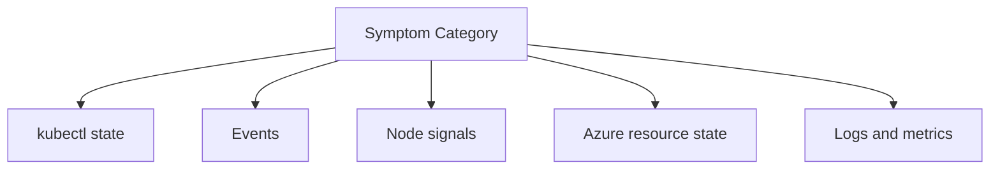

---
content_sources:
  diagrams:
  - id: troubleshooting-evidence-map
    type: flowchart
    source: self-generated
    justification: Diagnostic flow synthesized from Microsoft Learn troubleshooting
      guidance linked in this page.
    based_on:
    - https://learn.microsoft.com/en-us/troubleshoot/azure/azure-kubernetes/welcome-azure-kubernetes
    - https://learn.microsoft.com/en-us/troubleshoot/azure/azure-kubernetes/
content_validation:
  status: verified
  last_reviewed: 2026-07-18
  reviewer: agent
  core_claims:
    - claim: "The KubeEvents table in Azure Monitor Logs stores Kubernetes events."
      source: https://learn.microsoft.com/en-us/azure/azure-monitor/reference/tables/kubeevents
      verified: true
    - claim: "The KubePodInventory table stores Kubernetes pod and container information."
      source: https://learn.microsoft.com/en-us/azure/azure-monitor/reference/tables/kubepodinventory
      verified: true
    - claim: "Container insights log data is stored in a Log Analytics workspace and is available for log queries in Azure Monitor."
      source: https://learn.microsoft.com/en-us/azure/azure-monitor/containers/container-insights-log-query
      verified: true
---


# Evidence Map

Use this page to decide which commands and signals matter for each AKS symptom category. Better evidence collection prevents random corrective changes.

## Main Content

<!-- diagram-id: troubleshooting-evidence-map -->



| Symptom | First Evidence | Follow-up Evidence |
|---|---|---|
| Pod not starting | `kubectl get pods`, `kubectl describe pod` | container logs, image pull secret, node conditions |
| Service unreachable | `kubectl get svc`, `kubectl get endpoints` | selector labels, NetworkPolicy, DNS lookup |
| Ingress broken | `kubectl get ingress`, controller logs | load balancer state, backend endpoints, cert/TLS |
| Node unhealthy | `kubectl get nodes`, `kubectl describe node` | daemonsets, CNI state, quota, subnet IPs |
| Upgrade issue | cluster version, events | controller compatibility, PDBs, node image rollout |

### High-value command groups

```bash
kubectl get events -A --sort-by=.lastTimestamp
kubectl get pods -A -o wide
kubectl get nodes -o wide
az aks show --resource-group $RG --name $CLUSTER_NAME --output json
```

| Command | Purpose |
| --- | --- |
| `kubectl get events` | List Kubernetes events sorted by time. |
| `kubectl get pods` | List pods across namespaces. |
| `kubectl get nodes` | List cluster nodes. |
| `az aks show` | Show the cluster's full properties. |
| `--resource-group` | Resource group that contains the AKS cluster. |
| `--name` | Name of the AKS cluster. |
| `--output` | Output format for the result. |

## See Also

- [Mental Model](mental-model.md)
- [Reference: Diagnostic Commands](../reference/diagnostic-commands.md)
- [First 10 Minutes](first-10-minutes/index.md)

## Sources

- [Troubleshoot AKS clusters](https://learn.microsoft.com/troubleshoot/azure/azure-kubernetes/welcome-azure-kubernetes)
- [AKS troubleshooting articles](https://learn.microsoft.com/troubleshoot/azure/azure-kubernetes/)
