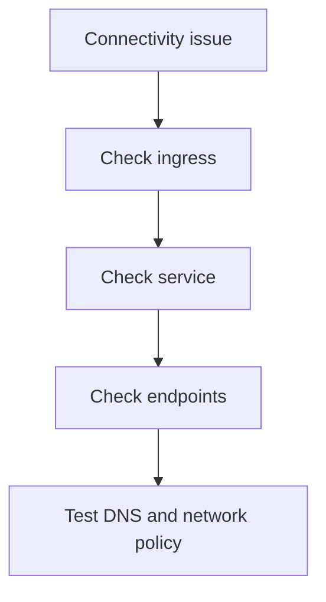

---
content_sources:
  diagrams:
  - id: troubleshooting-first-10-minutes-connectivity
    type: flowchart
    source: self-generated
    justification: Diagnostic flow synthesized from Microsoft Learn troubleshooting
      guidance linked in this page.
    based_on:
    - https://learn.microsoft.com/en-us/troubleshoot/azure/azure-kubernetes/welcome-azure-kubernetes
    - https://learn.microsoft.com/en-us/troubleshoot/azure/azure-kubernetes/
content_validation:
  status: pending_review
  last_reviewed: null
  reviewer: agent
  core_claims: []
---

# Connectivity

Use this checklist when traffic fails somewhere between ingress and pod.

## Main Content

<!-- diagram-id: troubleshooting-first-10-minutes-connectivity -->



```bash
kubectl get ingress -A
kubectl get svc -A
kubectl get endpoints -A
kubectl describe ingress <ingress-name> -n <namespace>
kubectl exec -it <pod-name> -n <namespace> -- nslookup <service-name>
```

## Review Matrix

| Review area | Page-specific check |
|---|---|
| Scope | Confirm the guidance applies to Connectivity. |
| Source basis | Validate the recommendation against the Microsoft Learn sources in this page. |
| Evidence | Capture command output, portal state, metrics, logs, or screenshots before treating the result as proven. |

## See Also

- [Ingress Failure](../playbooks/connectivity/ingress-failure.md)
- [Service Unreachable](../playbooks/connectivity/service-unreachable.md)
- [Diagnostic Commands](../../reference/diagnostic-commands.md)

## Sources

- [Troubleshoot AKS clusters](https://learn.microsoft.com/troubleshoot/azure/azure-kubernetes/welcome-azure-kubernetes)
- [AKS troubleshooting articles](https://learn.microsoft.com/troubleshoot/azure/azure-kubernetes/)
