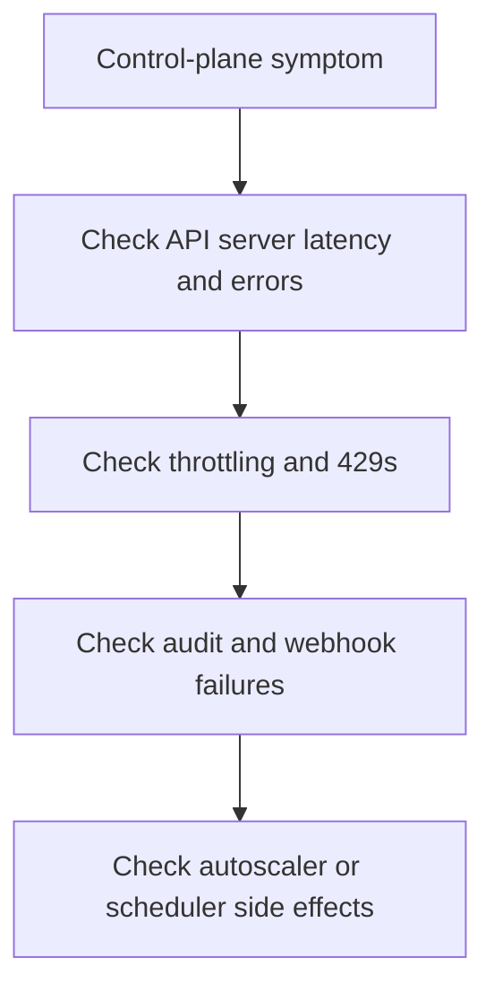

---
content_sources:
  diagrams:
  - id: troubleshooting-first-10-minutes-control-plane
    type: flowchart
    source: self-generated
    justification: Diagnostic flow synthesized from Microsoft Learn AKS monitoring guidance for API server logs, audit evidence, and control-plane observability.
    based_on:
    - https://learn.microsoft.com/en-us/azure/aks/monitor-aks
    - https://learn.microsoft.com/en-us/azure/aks/monitor-aks-reference
    - https://learn.microsoft.com/en-us/azure/azure-monitor/containers/container-insights-log-query
---


# Control Plane

Use this checklist when `kubectl`, controllers, or admission webhooks feel unhealthy even though workloads and nodes do not immediately explain the symptom.

## Main Content

<!-- diagram-id: troubleshooting-first-10-minutes-control-plane -->



1. Confirm that the incident is cluster-management-path related, not just one failing workload.
2. Query API server latency and error rates first.
3. Check for request throttling or webhook failures before blaming node capacity.
4. Use audit evidence if the incident involves denied changes or suspicious write activity.

```bash
kubectl get --raw=/readyz?verbose
kubectl get events --all-namespaces --sort-by=.lastTimestamp
kubectl auth can-i create deployments --namespace <namespace>
az monitor metrics list --resource "$CLUSTER_ID" --metric apiserver_cpu_usage_percentage --interval PT5M
```

| Command | Purpose |
| --- | --- |
| `kubectl get --raw` | Query the API server readiness endpoint. |
| `kubectl get events` | List Kubernetes events for troubleshooting. |
| `kubectl auth can-i` | Check whether the caller can perform an action. |
| `az monitor metrics list` | List API server CPU metrics for the cluster. |
| `--resource` | Resource ID of the AKS cluster. |
| `--metric` | Metric to retrieve. |
| `--interval` | Aggregation interval for the metric. |

## See Also

- [API Server Health and Latency](../kql/control-plane/api-server-health-latency.md)
- [Audit Log Analysis](../kql/control-plane/audit-log-analysis.md)
- [Cluster Autoscaler Decisions](../kql/control-plane/cluster-autoscaler-decisions.md)
- [Diagnostic Settings](../../operations/diagnostic-settings.md)

## Sources

- [Monitor AKS](https://learn.microsoft.com/en-us/azure/aks/monitor-aks)
- [AKS monitoring data reference](https://learn.microsoft.com/en-us/azure/aks/monitor-aks-reference)
- [Query container logs in Azure Monitor](https://learn.microsoft.com/en-us/azure/azure-monitor/containers/container-insights-log-query)
