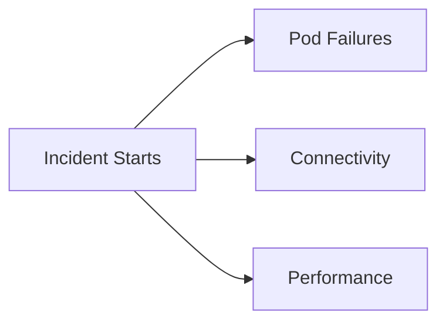

---
hide:
  - toc
---

# First 10 Minutes

These checklists prioritize speed over completeness. Use them to stabilize your investigation before you dive into a detailed playbook.

## Main Content

| Checklist | Use When |
|---|---|
| [Pod Failures](pod-failures.md) | Pods are Pending, CrashLooping, or failing image pulls |
| [Connectivity](connectivity.md) | Service or ingress traffic is failing |
| [Performance](performance.md) | Requests are slow, throttled, or timing out |

## See Also

- [Troubleshooting](../index.md)
- [Decision Tree](../decision-tree.md)
- [Evidence Map](../evidence-map.md)

## Sources

- [Troubleshoot AKS clusters](https://learn.microsoft.com/troubleshoot/azure/azure-kubernetes/welcome-azure-kubernetes)
- [AKS troubleshooting articles](https://learn.microsoft.com/troubleshoot/azure/azure-kubernetes/)
