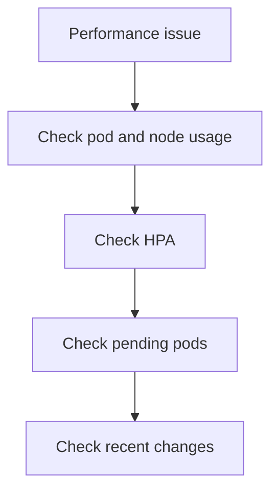

# Performance

Use this checklist when the cluster is responding but latency, throttling, or timeout symptoms are growing.

## Main Content




```bash
kubectl top nodes
kubectl top pods -A
kubectl get hpa -A
kubectl get pods -A --field-selector=status.phase=Pending
kubectl get events -A --sort-by=.lastTimestamp
```

## See Also

- [Scaling Failure](../playbooks/operations/scaling-failure.md)
- [Scaling](../../platform/scaling.md)
- [Monitoring and Logging](../../operations/monitoring-logging.md)

## Sources

- [Troubleshoot AKS clusters](https://learn.microsoft.com/troubleshoot/azure/azure-kubernetes/welcome-azure-kubernetes)
- [AKS troubleshooting articles](https://learn.microsoft.com/troubleshoot/azure/azure-kubernetes/)
- [Monitor AKS with Container insights](https://learn.microsoft.com/azure/azure-monitor/containers/container-insights-overview)
- [Use managed Prometheus with AKS](https://learn.microsoft.com/azure/azure-monitor/containers/container-insights-data-collection-configure)
