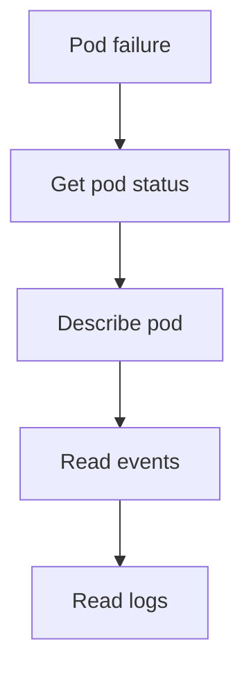

---
hide:
  - toc
---

# Pod Failures

Use this checklist when pods are not reaching `Running` and `Ready` quickly enough for service recovery.

## Main Content




1. List failing pods.
2. Describe one representative pod.
3. Look for image, scheduling, or probe failures.
4. Check whether the failure is isolated to one node or namespace.

```bash
kubectl get pods -A
kubectl describe pod <pod-name> -n <namespace>
kubectl logs <pod-name> -n <namespace> --previous
kubectl get events -A --sort-by=.lastTimestamp
```

## See Also

- [Image Pull Failure](../playbooks/pod-issues/image-pull-failure.md)
- [CrashLoop](../playbooks/pod-issues/crashloop.md)
- [Pending Pods](../playbooks/pod-issues/pending-pods.md)

## Sources

- [Troubleshoot AKS clusters](https://learn.microsoft.com/troubleshoot/azure/azure-kubernetes/welcome-azure-kubernetes)
- [AKS troubleshooting articles](https://learn.microsoft.com/troubleshoot/azure/azure-kubernetes/)
