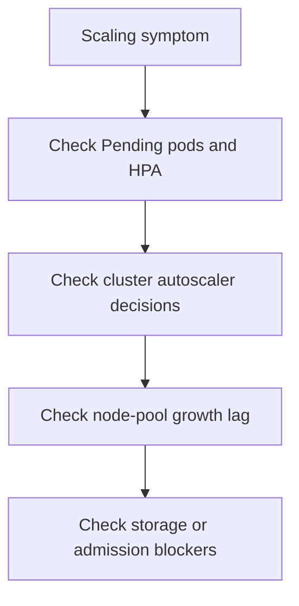

---
content_sources:
  diagrams:
  - id: troubleshooting-first-10-minutes-scaling
    type: flowchart
    source: self-generated
    justification: Diagnostic flow synthesized from Microsoft Learn AKS monitoring and autoscaling guidance linked in this page.
    based_on:
    - https://learn.microsoft.com/en-us/azure/aks/monitor-aks
    - https://learn.microsoft.com/en-us/azure/aks/monitor-aks-reference
    - https://learn.microsoft.com/en-us/azure/azure-monitor/containers/container-insights-log-query
---


# Scaling

Use this checklist when demand is rising but replicas, nodes, or scheduling capacity are not catching up fast enough.

## Main Content

<!-- diagram-id: troubleshooting-first-10-minutes-scaling -->



1. Confirm whether the pressure is **replica-level**, **node-level**, or both.
2. Check for unschedulable pods before changing autoscaler limits.
3. Query cluster-autoscaler logs to see whether AKS refused to grow or never saw a valid scale-up path.
4. If pods are pending because of PVCs or webhooks, treat those blockers first.

```bash
kubectl get hpa --all-namespaces
kubectl get pods --all-namespaces --field-selector=status.phase=Pending
kubectl describe hpa <hpa-name> --namespace <namespace>
kubectl get events --all-namespaces --sort-by=.lastTimestamp
az aks show --resource-group "$RG" --name "$CLUSTER_NAME" --query "agentPoolProfiles[].{name:name,count:count,min:minCount,max:maxCount}" --output table
```

| Command | Purpose |
| --- | --- |
| `kubectl get hpa` | List HorizontalPodAutoscalers across namespaces. |
| `kubectl get pods` | List pending pods awaiting scheduling. |
| `kubectl describe hpa` | Show HorizontalPodAutoscaler status and events. |
| `kubectl get events` | List Kubernetes events for troubleshooting. |
| `az aks show` | Show autoscaler bounds per node pool. |
| `--resource-group` | Resource group that contains the AKS cluster. |
| `--name` | Name of the AKS cluster. |
| `--query` | Selects per-pool count, min, and max. |
| `--output` | Output format for the result. |

## See Also

- [Cluster Autoscaler Decisions](../kql/control-plane/cluster-autoscaler-decisions.md)
- [Pending Pods](../kql/workloads/pending-pods.md)
- [PVC Binding Latency](../kql/storage/pvc-binding-latency.md)
- [Scaling Failure](../playbooks/operations/scaling-failure.md)

## Sources

- [Monitor AKS](https://learn.microsoft.com/en-us/azure/aks/monitor-aks)
- [AKS monitoring data reference](https://learn.microsoft.com/en-us/azure/aks/monitor-aks-reference)
- [Query container logs in Azure Monitor](https://learn.microsoft.com/en-us/azure/azure-monitor/containers/container-insights-log-query)
