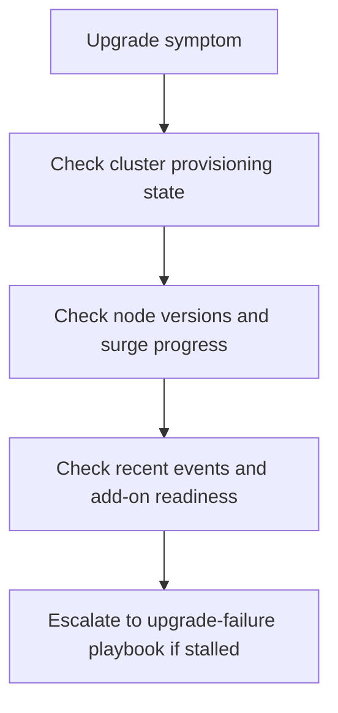

---
content_sources:
  diagrams:
  - id: troubleshooting-first-10-minutes-upgrade
    type: flowchart
    source: self-generated
    justification: Diagnostic flow synthesized from Microsoft Learn AKS monitoring and upgrade guidance linked in this page.
    based_on:
    - https://learn.microsoft.com/en-us/azure/aks/monitor-aks
    - https://learn.microsoft.com/en-us/azure/aks/monitor-aks-reference
    - https://learn.microsoft.com/en-us/azure/azure-monitor/containers/container-insights-log-query
---


# Upgrade

Use this checklist when an AKS control-plane or node-pool upgrade might still be progressing, or might have stalled after it started.

## Main Content

<!-- diagram-id: troubleshooting-first-10-minutes-upgrade -->



1. Confirm whether the cluster is actively upgrading or already back in `Succeeded` with broken workloads.
2. Compare control-plane version, node versions, and node count for partial completion.
3. Look for stalled drains, add-on failures, or persistent unschedulable workloads.
4. Route to the upgrade playbook only after you know whether the upgrade is still moving.

```bash
az aks show --resource-group "$RG" --name "$CLUSTER_NAME" --query "{provisioningState:provisioningState,kubernetesVersion:currentKubernetesVersion,powerState:powerState.code}" --output yaml
az aks nodepool list --resource-group "$RG" --cluster-name "$CLUSTER_NAME" --output table
kubectl get nodes
kubectl get pods --all-namespaces
kubectl get events --all-namespaces --sort-by=.lastTimestamp
```

| Command | Purpose |
| --- | --- |
| `az aks show` | Show provisioning state, version, and power state. |
| `--resource-group` | Resource group that contains the AKS cluster. |
| `--name` | Name of the AKS cluster. |
| `--query` | Selects provisioning state, version, and power state. |
| `--output` | Output format for the result. |
| `az aks nodepool list` | List the node pools in the cluster. |
| `--resource-group` | Resource group that contains the AKS cluster. |
| `--cluster-name` | Name of the AKS cluster. |
| `--output` | Output format for the result. |
| `kubectl get nodes` | List cluster nodes. |
| `kubectl get pods` | List pods across namespaces. |
| `kubectl get events` | List Kubernetes events for troubleshooting. |

## See Also

- [Upgrades](../../operations/upgrades.md)
- [Upgrade Failure](../playbooks/operations/upgrade-failure.md)
- [Upgrade Blocked by Pod Disruption Budget](../playbooks/operations/upgrade-blocked-pdb.md)
- [Recent Cluster Changes](../kql/correlation/recent-cluster-changes.md)

## Sources

- [Monitor AKS](https://learn.microsoft.com/en-us/azure/aks/monitor-aks)
- [AKS monitoring data reference](https://learn.microsoft.com/en-us/azure/aks/monitor-aks-reference)
- [Query container logs in Azure Monitor](https://learn.microsoft.com/en-us/azure/azure-monitor/containers/container-insights-log-query)
