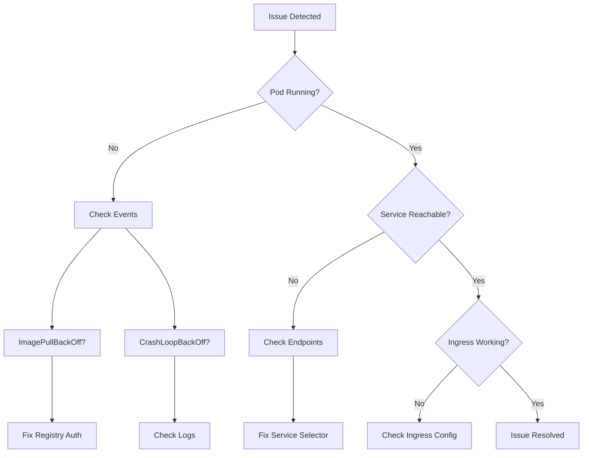

# Troubleshooting

Diagnose and resolve common issues in Azure Kubernetes Service.



## Common Issues

### Pod Not Starting

```bash
# Check pod status
kubectl get pods

# Check events
kubectl describe pod <pod-name>

# Check logs
kubectl logs <pod-name>
```

### Service Not Reachable

```bash
# Check service
kubectl get svc

# Check endpoints
kubectl get endpoints <service-name>

# Test from within cluster
kubectl run test --rm -it --image=busybox -- wget -qO- <service-name>
```

### Node Issues

```bash
# Check node status
kubectl get nodes

# Check node conditions
kubectl describe node <node-name>

# Check node resource usage
kubectl top nodes
```

## See Also

- [Operations](../operations/index.md)
- [Best Practices](../best-practices/index.md)

## Sources

- [Troubleshoot AKS clusters](https://learn.microsoft.com/en-us/azure/aks/troubleshooting)
