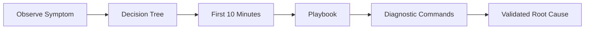

---
hide:
  - toc
content_sources:
  diagrams:
  - id: troubleshooting-index
    type: flowchart
    source: self-generated
    justification: Navigation flow synthesized from the linked AKS topics and workflows
      on this page.
    based_on:
    - https://learn.microsoft.com/en-us/troubleshoot/azure/azure-kubernetes/welcome-azure-kubernetes
    - https://learn.microsoft.com/en-us/troubleshoot/azure/azure-kubernetes/
---

# Troubleshooting

This section is a hypothesis-driven AKS troubleshooting hub. Use it to move from symptom to evidence, then to a focused playbook.

## Main Content

<!-- diagram-id: troubleshooting-index -->

| Need | Start Here |
|---|---|
| Understand AKS failure surfaces | [Architecture Overview](architecture-overview.md) |
| Route a symptom quickly | [Decision Tree](decision-tree.md) |
| Know what evidence to gather | [Evidence Map](evidence-map.md) |
| Apply a mental framework | [Mental Model](mental-model.md) |
| Jump to symptom cards | [Quick Diagnosis Cards](quick-diagnosis-cards.md) |
| Respond in the first minutes | [First 10 Minutes](first-10-minutes/index.md) |
| Execute detailed runbooks | [Playbooks](playbooks/index.md) |

## Quick Routing Areas

- **Pods**: image pulls, crashes, scheduling failures.
- **Connectivity**: ingress routing, Services, DNS, and egress.
- **Nodes**: readiness, pressure, and IP exhaustion.
- **Operations**: upgrade failures, scaling failures, and maintenance side effects.

## See Also

- [Architecture Overview](architecture-overview.md)
- [Decision Tree](decision-tree.md)
- [First 10 Minutes](first-10-minutes/index.md)
- [Playbooks](playbooks/index.md)
- [Reference: Diagnostic Commands](../reference/diagnostic-commands.md)

## Sources

- [Troubleshoot AKS clusters](https://learn.microsoft.com/troubleshoot/azure/azure-kubernetes/welcome-azure-kubernetes)
- [AKS troubleshooting articles](https://learn.microsoft.com/troubleshoot/azure/azure-kubernetes/)
