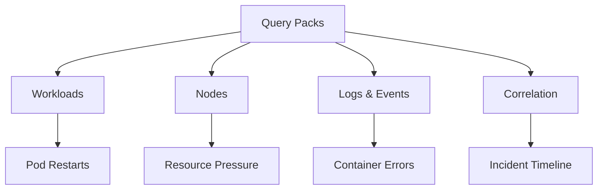

---
content_sources:
  diagrams:
    - id: troubleshooting-kql-index-tree
      type: flowchart
      source: self-generated
      justification: "Classification of Kusto Query Language packs for Azure Kubernetes Service troubleshooting."
      based_on:
        - https://learn.microsoft.com/en-us/azure/azure-monitor/containers/container-insights-log-query
---

# KQL Query Packs

Accelerate your investigations with reusable Kusto Query Language (KQL) patterns. These query packs provide a starting point for gathering evidence across your Azure Kubernetes Service clusters before you move into deep playbook analysis.

<!-- diagram-id: troubleshooting-kql-index-tree -->


## Categories

| Category | Focus | Index |
| :--- | :--- | :--- |
| Workloads | Pod restarts, CrashLoopBackOff, pending pods | [Workloads](workloads/index.md) |
| Nodes | Node readiness, CPU/memory pressure, pod density | [Nodes](nodes/index.md) |
| Logs & Events | Container errors, OOMKilled, warning events | [Logs & Events](logs-events/index.md) |
| Correlation | Incident timelines, cross-signal views | [Correlation](correlation/index.md) |

## Prerequisites

Before using these queries, ensure your cluster has the following configured:

*   **Container insights**: Enabled via the portal, Azure CLI, or Terraform.
*   **Log Analytics Workspace**: The destination for cluster logs and metrics.
*   **Permissions**: You need at least the `Log Analytics Reader` role on the workspace.

You can run these queries directly in the Azure Portal's **Logs** blade or via the Azure CLI using:

```bash
az monitor log-analytics query --workspace <workspace-id> --analytics-query "KubePodInventory | take 10"
```

## Usage Notes

*   **Time Windows**: Most queries use `ago(1h)` by default. Adjust this window based on when your incident occurred.
*   **Table Availability**: If a query returns no results, confirm that the relevant table (like `ContainerLogV2`) is enabled in your data collection settings.
*   **Case Sensitivity**: KQL is case-sensitive for string comparisons. Use `contains` for case-insensitive matches if you're unsure.
*   **Projecting Columns**: These queries use `project` to keep results clean. Remove the `project` line if you need to see all available data fields.

## See Also

*   [Troubleshooting Methodology](../methodology/index.md)
*   [Decision Tree](../decision-tree.md)
*   [Playbooks](../playbooks/index.md)
*   [Troubleshooting Index](../index.md)

## Sources

*   [Container insights overview](https://learn.microsoft.com/en-us/azure/azure-monitor/containers/container-insights-overview)
*   [Query logs from Container insights](https://learn.microsoft.com/en-us/azure/azure-monitor/containers/container-insights-log-query)
*   [Kusto Query Language (KQL) overview](https://learn.microsoft.com/en-us/kusto/query/)
