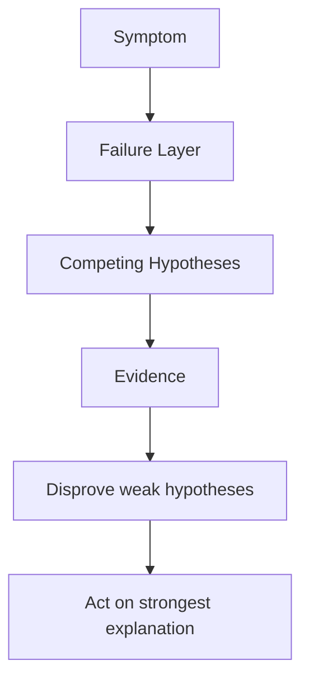

---
hide:
  - toc
content_sources:
  diagrams:
  - id: troubleshooting-mental-model
    type: flowchart
    source: self-generated
    justification: Diagnostic flow synthesized from Microsoft Learn troubleshooting
      guidance linked in this page.
    based_on:
    - https://learn.microsoft.com/en-us/troubleshoot/azure/azure-kubernetes/welcome-azure-kubernetes
    - https://learn.microsoft.com/en-us/troubleshoot/azure/azure-kubernetes/
---

# Mental Model

Think in competing hypotheses, not in favorite fixes. AKS troubleshooting improves when you separate symptom, failure layer, and likely cause.

## Main Content

<!-- diagram-id: troubleshooting-mental-model -->

### Practical model

1. Name the symptom precisely.
2. Identify the first broken layer.
3. Write at least two plausible hypotheses.
4. Collect evidence that can disprove each hypothesis.
5. Change only one thing at a time when possible.

### Example

If ingress returns 502:

- Hypothesis A: backend pods are not Ready.
- Hypothesis B: Service selector does not match pods.
- Hypothesis C: ingress controller cannot reach endpoints due to network policy.

## See Also

- [Evidence Map](evidence-map.md)
- [Decision Tree](decision-tree.md)
- [Quick Diagnosis Cards](quick-diagnosis-cards.md)

## Sources

- [Troubleshoot AKS clusters](https://learn.microsoft.com/troubleshoot/azure/azure-kubernetes/welcome-azure-kubernetes)
- [AKS troubleshooting articles](https://learn.microsoft.com/troubleshoot/azure/azure-kubernetes/)
