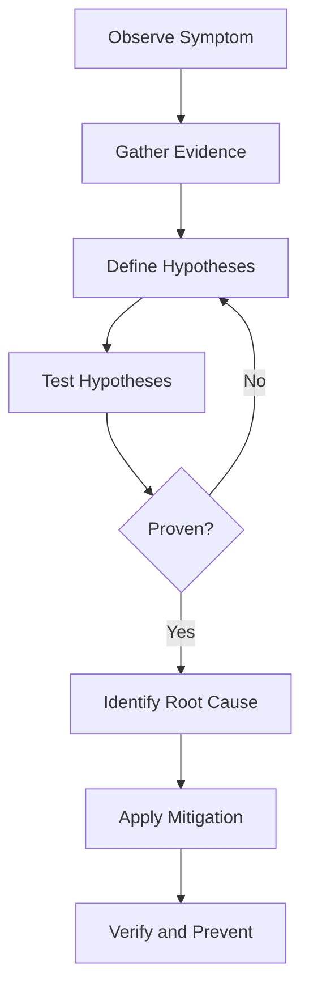

---
content_validation:
  status: verified
  last_reviewed: "2026-07-17"
  reviewer: agent
  core_claims:
    - claim: "Azure Monitor Container insights provides specialized tables like KubePodInventory and ContainerLogV2 for Kubernetes troubleshooting."
      source: "https://learn.microsoft.com/en-us/azure/azure-monitor/containers/container-insights-overview"
      verified: true
    - claim: "The AKS 'Diagnose and solve problems' blade uses automated detectors to identify common configuration issues and health bottlenecks."
      source: "https://learn.microsoft.com/en-us/azure/aks/aks-diagnostics"
      verified: true
    - claim: "Direct cluster interaction via kubectl logs and describe commands provides real-time state evidence for workload failures."
      source: "https://learn.microsoft.com/en-us/azure/aks/monitor-aks"
      verified: true
content_sources:
  diagrams:
    - id: troubleshooting-methodology-method-loop
      type: flowchart
      source: self-generated
      justification: "Hypothesis-driven troubleshooting loop synthesized from Microsoft Learn AKS monitoring and diagnostics guidance."
      based_on:
        - https://learn.microsoft.com/en-us/azure/aks/monitor-aks
        - https://learn.microsoft.com/en-us/azure/azure-monitor/containers/container-insights-overview
---

# Troubleshooting Method

Don't guess when things break. Following a structured methodology ensures you spend your time on the right evidence instead of chasing ghosts. This guide adapts the classic hypothesis-driven approach specifically for the complexities of Azure Kubernetes Service.

## Why Hypothesis-Driven Troubleshooting?

Randomly changing configurations hoping for a fix often introduces new problems. A hypothesis-driven approach forces you to prove what is wrong before you try to fix it. This method keeps investigations focused and makes it easier to hand off work between team members.

## The Method Step-by-Step

### 1. Observe the Symptom

Start by defining exactly what is happening. Use the portal "Diagnose and solve problems" blade for a high-level view.

*   What is the specific error message?
*   When did it start?
*   Is it affecting the whole cluster or just one namespace?

### 2. Gather Evidence

Collect logs and metrics from across the stack. Don't interpret yet, just gather.

*   **Platform**: Check Azure Resource Health and AKS control plane logs.
*   **Infrastructure**: Look at `KubeNodeInventory` and `Perf` tables.
*   **Workload**: Run `kubectl describe pod` and `kubectl logs`.

### 3. Define Hypotheses

Brainstorm possible causes based on the evidence.

*   "The pod is OOMKilled because of a memory leak."
*   "The Node is NotReady because of disk pressure."
*   "The service cannot connect because of a Network Policy."

### 4. Test Hypotheses

Pick the most likely hypothesis and try to prove or disprove it.

*   Check `InsightsMetrics` to see memory trends for the OOMKilled hypothesis.
*   Inspect `KubeEvents` to confirm disk pressure messages for the node hypothesis.

### 5. Identify Root Cause

Once you've proven a hypothesis, dig one level deeper to find the "why." If the pod OOMKilled, why did the memory spike? Was it a traffic surge or a code bug?

### 6. Apply Mitigation

Implement a fix based on your findings.

*   Update resource limits in the deployment manifest.
*   Fix the application code.
*   Scale the node pool.

### 7. Verify and Prevent

Confirm the fix works and put guardrails in place.

*   Watch the `KubePodInventory` to ensure pods remain "Running."
*   Add an Azure Monitor alert to catch this condition earlier next time.

## Methodology Flowchart

<!-- diagram-id: troubleshooting-methodology-method-loop -->

## Common Anti-Patterns

*   **Restarting blindly**: It clears the logs you need and rarely fixes the underlying issue.
*   **Skipping the evidence**: Jumping to a fix without data leads to "it works on my machine" syndrome.
*   **Testing multiple things at once**: You won't know which change actually fixed the problem.

## Evidence Hierarchy

When investigating, trust your data sources in this order:

1.  **Live State**: `kubectl get/describe` (current reality).
2.  **Recent History**: `KubeEvents` and `ContainerLogV2` (what just happened).
3.  **Trends**: Azure Monitor metrics and `Perf` tables (long-term patterns).
4.  **Static Config**: Manifest files and Azure Portal settings (what should be).

## Key Container Insights Tables

| Table | Key Columns | Best For |
| :--- | :--- | :--- |
| `KubePodInventory` | Name, Namespace, PodStatus | Current pod state and restart counts |
| `KubeNodeInventory` | Name, Status, CpuCapacity | Node health and resource availability |
| `KubeEvents` | Message, Reason, Source | Cluster-level events and warnings |
| `ContainerLogV2` | LogMessage, ContainerName | Application stdout/stderr logs |
| `InsightsMetrics` | Name, Val, Origin | Kubernetes-specific metrics (memory/CPU) |
| `Perf` | CounterName, CounterValue | Node-level performance metrics |

## Worked Example

**Scenario**: Pods in the `prod` namespace are intermittently showing `CrashLoopBackOff`.

1.  **Observe**: Users report 500 errors. `kubectl get pods` shows restarts on 3 of 5 replicas.
2.  **Gather**:
    *   `KubeEvents` shows `Back-off restarting failed container`.
    *   `ContainerLogV2` shows `Connection refused to redis-master`.
3.  **Hypothesis**: The application cannot reach the Redis dependency.
4.  **Test**: `kubectl get pods -n prod` shows the Redis pod is in a `Pending` state.
5.  **Root Cause**: The Redis pod is `Pending` because the node pool is out of CPU.
6.  **Mitigation**: Scale the node pool via `az aks nodepool scale --resource-group $RG --cluster-name $CLUSTER_NAME --name $NODEPOOL_NAME --node-count 5` (or `az aks scale --resource-group $RG --name $CLUSTER_NAME --node-count 5` for the default node pool).
7.  **Verify**: Redis starts, then the application pods stop crashing.

## See Also

*   [Decision Tree](../decision-tree.md)
*   [Evidence Map](../evidence-map.md)
*   [KQL Query Packs](../kql/index.md)
*   [Troubleshooting Index](../index.md)

## Sources

*   [Monitor AKS with Azure Monitor](https://learn.microsoft.com/en-us/azure/aks/monitor-aks)
*   [Container insights overview](https://learn.microsoft.com/en-us/azure/azure-monitor/containers/container-insights-overview)
*   [AKS diagnostics overview](https://learn.microsoft.com/en-us/azure/aks/aks-diagnostics)
