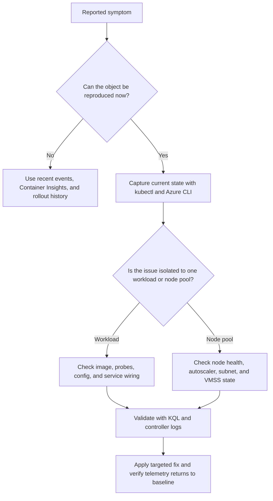

---
content_sources:
  diagrams:
  - id: troubleshooting-playbooks-cluster-autoscaler-issues
    type: flowchart
    source: self-generated
    justification: Diagnostic flow synthesized from Microsoft Learn troubleshooting
      guidance linked in this page.
    based_on:
    - https://learn.microsoft.com/en-us/troubleshoot/azure/azure-kubernetes/welcome-azure-kubernetes
    - https://learn.microsoft.com/en-us/azure/aks/cluster-autoscaler
    - https://learn.microsoft.com/en-us/azure/azure-monitor/containers/container-insights-overview
    - https://learn.microsoft.com/en-us/azure/aks/concepts-network
content_validation:
  status: verified
  last_reviewed: 2026-07-18
  reviewer: agent
  core_claims:
    - claim: "The cluster autoscaler watches for pods that can't be scheduled because of resource constraints and scales up the node pool when needed."
      source: https://learn.microsoft.com/en-us/azure/aks/cluster-autoscaler
      verified: true
    - claim: "The cluster autoscaler regularly checks nodes for a lack of running pods and scales down the number of nodes as needed."
      source: https://learn.microsoft.com/en-us/azure/aks/cluster-autoscaler
      verified: true
    - claim: "AKS manages the cluster autoscaler in the managed control plane."
      source: https://learn.microsoft.com/en-us/azure/aks/cluster-autoscaler
      verified: true
    - claim: "You can enable control plane logging to see cluster autoscaler logs and operations."
      source: https://learn.microsoft.com/en-us/azure/aks/cluster-autoscaler
      verified: true
    - claim: "The cluster autoscaler writes health status to a ConfigMap named cluster-autoscaler-status in the kube-system namespace."
      source: https://learn.microsoft.com/en-us/azure/aks/cluster-autoscaler
      verified: true
---


# Cluster Autoscaler Issues

## 1. Summary

Use this playbook when pending pods do not trigger scale-out, empty nodes do not scale in, or autoscaler events show repeated failures. In AKS, the most common causes are tight node pool min and max limits, unsupported scheduling constraints, exhausted subnet or quota limits, or incorrect expectations about daemonsets and disruption budgets.

**Typical incident window**: 10-20 minutes to establish whether the issue is workload-specific, node-specific, or cluster-wide.
**Time to resolution**: 30 minutes to several hours depending on whether the fix is manifest-level, node-level, or Azure control-plane level.

### Symptoms

- Pods remain `Pending` with scheduling messages even though autoscaler is enabled.
- `kubectl describe pod` shows CPU, memory, or node affinity constraints that no current node satisfies.
- AKS activity or autoscaler logs mention scale-up rejection, quota issues, or subnet capacity exhaustion.
- Scale-in never happens because PDBs, local storage, or daemonset overhead keep nodes non-empty.

### Diagnostic flowchart

<!-- diagram-id: troubleshooting-playbooks-cluster-autoscaler-issues -->


## 2. Common Misreadings

| Observation | Often Misread As | Actually Means |
|---|---|---|
| Symptom appears in one namespace | Entire cluster outage | The issue may still be isolated to one rollout, one pool, or one ingress class. |
| Azure portal shows cluster healthy | Workload path is healthy | Control plane health does not prove pod, node, or ingress behavior. |
| Restart or reschedule seems to help briefly | Root cause is fixed | Many AKS issues recur until the underlying manifest, node, or network condition is corrected. |
| Monitoring has partial data | Monitoring is the problem | Partial Container Insights data is itself useful evidence about scope and timing. |

## 3. Competing Hypotheses

| Hypothesis | Likelihood | Key Discriminator |
|---|---|---|
| Node pool limits or autoscaler profile settings prevent scale-out | High | Node pool max count, surge headroom, or profile settings block new nodes. |
| Pod constraints cannot be satisfied by any node pool | High | Node selectors, taints, zones, or resource requests mismatch the available pools. |
| Azure quota or subnet capacity prevents new nodes | Medium | Azure CLI shows VMSS, vCPU, or subnet address space limits reached. |
| Scale-in blocked by workload protections | Medium | PDBs, local storage, or daemonsets keep nodes from becoming removable. |

## 4. What to Check First

1. **Confirm the current object state from Kubernetes**

    ```bash
    kubectl get pods \
        --all-namespaces \
        --output wide
    ```

2. **Describe the affected object to capture recent events**

    ```bash
    kubectl describe pod <pod-name> \
        --namespace <namespace>
    ```

3. **Check AKS cluster and node pool configuration from Azure**

    ```bash
    az aks show \
        --resource-group "$RG" \
        --name "$CLUSTER_NAME" \
        --query "{name:name,provisioningState:provisioningState,kubernetesVersion:kubernetesVersion,nodeResourceGroup:nodeResourceGroup}" \
        --output json
    ```

    | Command | Purpose |
    | --- | --- |
    | `az aks show` | Show core cluster properties. |
    | `--resource-group` | Resource group that contains the AKS cluster. |
    | `--name` | Name of the AKS cluster. |
    | `--query` | Selects name, provisioning state, version, and node resource group. |
    | `--output` | Output format for the result. |

4. **List node pools and autoscaler settings**

    ```bash
    az aks nodepool list \
        --resource-group "$RG" \
        --cluster-name "$CLUSTER_NAME" \
        --output table
    ```

    | Command | Purpose |
    | --- | --- |
    | `az aks nodepool list` | List the node pools in the cluster. |
    | `--resource-group` | Resource group that contains the AKS cluster. |
    | `--cluster-name` | Name of the AKS cluster. |
    | `--output` | Output format for the result. |

5. **Run a fast Container Insights control query**

    ```bash
    az monitor log-analytics query \
        --workspace "$WORKSPACE_ID" \
        --analytics-query "KubePodInventory | where TimeGenerated > ago(15m) | summarize Restarts=sum(ContainerRestartCount) by Namespace | order by Restarts desc" \
        --timespan "PT15M"
    ```

    | Command | Purpose |
    | --- | --- |
    | `az monitor log-analytics query` | Query per-namespace container restarts. |
    | `--workspace` | Log Analytics workspace to query. |
    | `--analytics-query` | KQL query text to execute. |
    | `--timespan` | Time range for the query. |

## 5. Evidence to Collect

### 5.1 KQL Queries

```kusto
KubePodInventory
| where TimeGenerated > ago(30m)
| summarize Restarts=max(ContainerRestartCount), LastSeen=max(TimeGenerated) by ClusterName, Namespace, PodName, ContainerName
| order by Restarts desc
```

| Column | Example value | Interpretation |
|---|---|---|
| `Restarts` | `14` | Confirms the issue is current and identifies which container is unstable. |
| `LastSeen` | `2026-04-07 09:41:00` | Shows how fresh the inventory signal is. |
| `Namespace` | `payments` | Helps isolate whether blast radius is limited. |

!!! tip "How to Read This"
    Start by proving scope. If restart or state anomalies are limited to one namespace or one pool, avoid cluster-wide changes first.

```kusto
ContainerLogV2
| where TimeGenerated > ago(30m)
| summarize LogLines=count(), LastSeen=max(TimeGenerated) by Namespace, PodName
| order by LastSeen desc
```

| Column | Example value | Interpretation |
|---|---|---|
| `LogLines` | `152` | Confirms whether the pod is emitting logs during failure. |
| `LastSeen` | `recent timestamp` | Stale logs can indicate the container never reaches full runtime. |

!!! tip "How to Read This"
    Pair this query with `kubectl logs --previous` so you do not confuse current healthy logs with the failing previous container instance.

```kusto
KubeEvents
| where TimeGenerated > ago(30m)
| where Reason in ("Failed", "BackOff", "Unhealthy", "NodeNotReady", "FailedScheduling")
| project TimeGenerated, Namespace, Name, Reason, Message
| order by TimeGenerated desc
```

| Column | Example value | Interpretation |
|---|---|---|
| `Reason` | `BackOff` | Indicates repeated restart attempts or scheduling failures depending on the object. |
| `Message` | `Back-off restarting failed container` | Often provides the shortest path to the likely hypothesis. |

!!! tip "How to Read This"
    Events often age out faster than logs. Capture them early in the incident before recreating pods or nodes.

### 5.2 CLI Investigation

```bash
kubectl logs <pod-name> \
    --namespace <namespace> \
    --previous
```

Interpretation: previous logs are usually more valuable than current logs during restart loops because they contain the container exit path.

```bash
kubectl get events \
    --all-namespaces \
    --sort-by=.lastTimestamp
```

Interpretation: look for probe failures, image pull errors, `FailedScheduling`, `NodeNotReady`, or backend controller warnings near the incident start time.

```bash
az vmss list-instances \
    --resource-group "$NODE_RESOURCE_GROUP" \
    --name "$VMSS_NAME" \
    --query "[].{instanceId:instanceId,provisioningState:provisioningState,latestModelApplied:latestModelApplied}" \
    --output table
```

| Command | Purpose |
| --- | --- |
| `az vmss list-instances` | List scale set instances backing a node pool. |
| `--resource-group` | Node resource group that contains the scale set. |
| `--name` | Name of the virtual machine scale set. |
| `--query` | Selects instance ID, state, and model status. |
| `--output` | Output format for the result. |

Interpretation: when the problem is node- or ingress-related, VMSS state and model drift provide important Azure-side evidence.

## 6. Validation and Disproof by Hypothesis

### Node pool limits or autoscaler profile settings prevent scale-out

**Proves if**: Kubernetes events, previous logs, and Azure-side state all align around this hypothesis.

**Disproves if**: Another signal explains the timing more directly or the expected discriminator is missing.

```bash
kubectl describe pod <pod-name> \
    --namespace <namespace>
```

### Pod constraints cannot be satisfied by any node pool

**Proves if**: Kubernetes events, previous logs, and Azure-side state all align around this hypothesis.

**Disproves if**: Another signal explains the timing more directly or the expected discriminator is missing.

```bash
kubectl describe pod <pod-name> \
    --namespace <namespace>
```

### Azure quota or subnet capacity prevents new nodes

**Proves if**: Kubernetes events, previous logs, and Azure-side state all align around this hypothesis.

**Disproves if**: Another signal explains the timing more directly or the expected discriminator is missing.

```bash
kubectl describe pod <pod-name> \
    --namespace <namespace>
```

### Scale-in blocked by workload protections

**Proves if**: Kubernetes events, previous logs, and Azure-side state all align around this hypothesis.

**Disproves if**: Another signal explains the timing more directly or the expected discriminator is missing.

```bash
kubectl describe pod <pod-name> \
    --namespace <namespace>
```

## 7. Likely Root Cause Patterns

| Pattern | Evidence | Resolution |
|---|---|---|
| Manifest drift after a rollout | New revision correlates with events, logs, or controller errors | Revert or patch the manifest and validate against staging first |
| Pool-level capacity mismatch | Pending pods, high utilization, or `NotReady` nodes align to one pool | Tune requests, autoscaler limits, or node pool shape |
| Network or DNS drift | Ingress, image pull, or dependency lookups fail while pods otherwise look normal | Correct DNS, NSG, route, or ingress controller configuration |
| Operational blind spot | Teams deleted or recreated resources before collecting evidence | Add a first-response checklist and automation for evidence capture |

## 8. Immediate Mitigations and Step-by-Step Resolution

1. Inspect pending pod events and the target node pool autoscaler settings together.
2. Increase max counts or add a suitable pool only after proving that workload constraints are legitimate.
3. Resolve quota or subnet exhaustion before retrying scale actions.
4. Tune PDBs, requests, and daemonset placement so scale-in can happen safely.
5. Review cost and reliability implications after every autoscaler policy change.

If the incident pattern keeps recurring because workload shapes no longer fit a fixed-pool model, stop treating it as a one-off autoscaler tuning issue and evaluate [Node Autoprovisioning](../../platform/node-autoprovisioning.md).

Example resolution commands:

```bash
kubectl rollout restart deployment/<deployment-name> \
    --namespace <namespace>
```

```bash
az aks nodepool update \
    --resource-group "$RG" \
    --cluster-name "$CLUSTER_NAME" \
    --name "$NODEPOOL_NAME" \
    --max-count 10
```

| Command | Purpose |
| --- | --- |
| `az aks nodepool update` | Raise a node pool's autoscaler maximum. |
| `--resource-group` | Resource group that contains the AKS cluster. |
| `--cluster-name` | Name of the AKS cluster. |
| `--name` | Name of the node pool to update. |
| `--max-count` | New maximum node count for autoscaling. |

## 9. Prevention Checklist

- [ ] Create saved Container Insights queries for the symptom family and link them in the team runbook.
- [ ] Require long-flag CLI examples and standardized evidence capture in incident response docs.
- [ ] Review ingress, autoscaler, probes, and node pool settings during every production readiness review.
- [ ] Alert on restart spikes, `NotReady` nodes, and `FailedScheduling` events before customers report impact.
- [ ] Document which changes require platform-team approval, especially around networking, ingress, and security policy.

## See Also

- [Scaling Failure](operations/scaling-failure.md)
- [Node Autoprovisioning](../../platform/node-autoprovisioning.md)
- [Best Practices: Autoscaling](../../best-practices/autoscaling.md)
- [Cost Optimization](../../best-practices/cost-optimization.md)
- [Tutorial 05: AKS Disaster Recovery](../../tutorials/lab-guides/lab-05-aks-disaster-recovery.md)

## Sources

- [Troubleshoot / Azure / Azure Kubernetes / Welcome Azure Kubernetes](https://learn.microsoft.com/en-us/troubleshoot/azure/azure-kubernetes/welcome-azure-kubernetes)
- [Azure / Aks / Cluster Autoscaler](https://learn.microsoft.com/en-us/azure/aks/cluster-autoscaler)
- [Azure / Azure Monitor / Containers / Container Insights Overview](https://learn.microsoft.com/en-us/azure/azure-monitor/containers/container-insights-overview)
- [Azure / Aks / Concepts Network](https://learn.microsoft.com/en-us/azure/aks/concepts-network)
