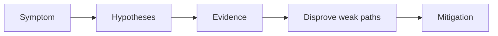

# Ingress Failure

## 1. Summary

Ingress failures appear as 404, 502, TLS errors, or connection timeouts at the cluster edge. The broken layer may be the controller, Service, endpoints, or external Azure load balancer path.



## 2. Common Misreadings

- The first visible symptom is the root cause.
- Restarting the pod proves the issue is fixed.
- If one namespace is affected, the cluster is healthy.

## 3. Competing Hypotheses

- H1: Ingress rules or class do not match the intended controller.
- H2: Backend service or endpoints are wrong.
- H3: TLS secret or certificate path is broken.
- H4: External IP or load balancer state is incomplete.

## 4. What to Check First

```bash
kubectl get ingress -A
kubectl describe ingress <ingress-name> -n <namespace>
kubectl get svc -A
```

## 5. Evidence to Collect

- Ingress class and annotations.
- Controller pod logs.
- Backend service selectors and endpoints.
- External IP allocation and DNS record state.

## 6. Validation and Disproof by Hypothesis

- If endpoints are empty, focus on service/backend, not controller config.
- If controller logs reject the ingress class, disprove backend issues first.
- If DNS points to the wrong IP, cluster internals may be healthy.

## 7. Likely Root Cause Patterns

- Wrong ingress class or annotation set.
- Service selector mismatch.
- Missing TLS secret.
- External IP not provisioned or DNS drift.

## 8. Immediate Mitigations

- Restore the correct ingress class and host/path rules.
- Fix service selectors and endpoint health.
- Rebind TLS secrets and validate controller reload.
- Update DNS only after the correct external IP is confirmed.

## 9. Prevention

- Standardize one ingress pattern per environment.
- Validate ingress and service linkage in CI.
- Monitor edge health separately from application health.

## See Also

- [Service Unreachable](service-unreachable.md)
- [Ingress and Load Balancing](../../../platform/ingress-load-balancing.md)
- [Connectivity Checklist](../../first-10-minutes/connectivity.md)

## Sources

- [Troubleshoot AKS clusters](https://learn.microsoft.com/troubleshoot/azure/azure-kubernetes/welcome-azure-kubernetes)
- [AKS troubleshooting articles](https://learn.microsoft.com/troubleshoot/azure/azure-kubernetes/)
