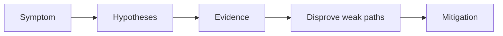

---
hide:
  - toc
---

# Service Unreachable

## 1. Summary

A Service exists but cannot be reached by clients or peers. The usual problem is selector mismatch, endpoint absence, DNS confusion, or network policy.



## 2. Common Misreadings

- The first visible symptom is the root cause.
- Restarting the pod proves the issue is fixed.
- If one namespace is affected, the cluster is healthy.

## 3. Competing Hypotheses

- H1: Service selectors do not match healthy pods.
- H2: Pods are not Ready, so endpoints are empty.
- H3: DNS resolution is wrong inside the cluster.
- H4: NetworkPolicy blocks traffic.

## 4. What to Check First

```bash
kubectl get svc <service-name> -n <namespace>
kubectl get endpoints <service-name> -n <namespace>
kubectl exec -it <pod-name> -n <namespace> -- nslookup <service-name>
```

## 5. Evidence to Collect

- Service YAML and selectors.
- Endpoint objects.
- Pod readiness state.
- NetworkPolicy resources affecting source and destination namespaces.

## 6. Validation and Disproof by Hypothesis

- Empty endpoints disprove many DNS-only theories.
- Successful DNS plus failed connection suggests endpoint or network policy issues.
- If direct pod IP works but Service IP fails, inspect kube-proxy/CNI and service definition.

## 7. Likely Root Cause Patterns

- Label mismatch after deployment.
- Readiness failures removing endpoints.
- Cross-namespace policy deny rules.
- Wrong port mapping in Service spec.

## 8. Immediate Mitigations

- Correct selectors and target ports.
- Fix readiness problems on backend pods.
- Adjust network policies with least privilege.
- Retest from an in-cluster debug pod.

## 9. Prevention

- Validate Service-to-pod label contracts in CI/CD.
- Keep network policy diagrams current.
- Use synthetic service checks for critical dependencies.

## See Also

- [Ingress Failure](ingress-failure.md)
- [Networking Models](../../../platform/networking-models.md)
- [Connectivity Checklist](../../first-10-minutes/connectivity.md)

## Sources

- [Troubleshoot AKS clusters](https://learn.microsoft.com/troubleshoot/azure/azure-kubernetes/welcome-azure-kubernetes)
- [AKS troubleshooting articles](https://learn.microsoft.com/troubleshoot/azure/azure-kubernetes/)
