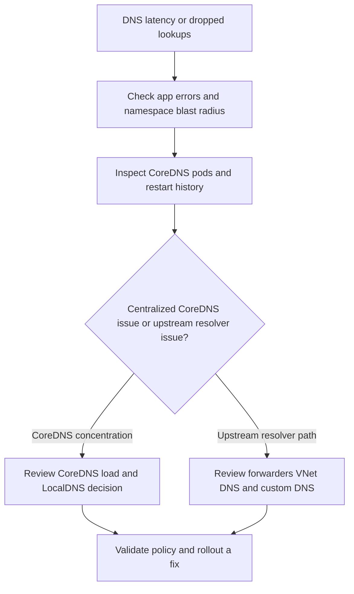

---
content_sources:
  diagrams:
    - id: troubleshooting-dns-coredns-query-latency-drops
      type: flowchart
      source: self-generated
      justification: CoreDNS latency and query-drop diagnostic flow synthesized from Microsoft Learn DNS, CoreDNS customization, LocalDNS, and container network observability guidance.
      based_on:
        - https://learn.microsoft.com/en-us/azure/aks/coredns-custom
        - https://learn.microsoft.com/en-us/azure/aks/dns-concepts
        - https://learn.microsoft.com/en-us/azure/aks/localdns-custom
        - https://learn.microsoft.com/en-us/azure/aks/container-network-observability-how-to
content_validation:
  status: verified
  last_reviewed: 2026-07-18
  reviewer: agent
  core_claims:
    - claim: "CoreDNS is the default DNS service in AKS and runs as pods in the kube-system namespace."
      source: https://learn.microsoft.com/en-us/azure/aks/dns-concepts
      verified: true
    - claim: "LocalDNS reduces DNS query latency and lowers conntrack pressure by handling DNS queries locally on each node."
      source: https://learn.microsoft.com/en-us/azure/aks/dns-concepts
      verified: true
    - claim: "Container Network Observability provides DNS dashboards, including DNS (Cluster) and DNS (Workload), for AKS network troubleshooting."
      source: https://learn.microsoft.com/en-us/azure/aks/container-network-observability-how-to
      verified: true
---

# CoreDNS Query Latency or Drops

## Symptom

Pods intermittently time out on DNS lookups, application logs show repeated resolver latency or missing responses, or cluster-wide DNS dashboards show growing failure or retry patterns.

Typical application signatures include:

- `i/o timeout`
- `no such host` after intermittent success
- `Temporary failure in name resolution`
- HTTP or gRPC client errors that disappear when retried

## Possible Causes

- CoreDNS pods are CPU-, memory-, or node-pressure bound.
- A recent `coredns-custom` override introduced a slow or broken forward path.
- Upstream VNet DNS or custom DNS servers are slow.
- The cluster has enough DNS volume that centralized CoreDNS is now a bottleneck.
- Network policy blocks DNS traffic to CoreDNS or LocalDNS.

## Diagnosis Steps

<!-- diagram-id: troubleshooting-dns-coredns-query-latency-drops -->


1. Confirm whether the issue is namespace-specific or cluster-wide.

    ```bash
    kubectl get pods \
        --all-namespaces \
        --output wide
    ```

2. Inspect CoreDNS pod health, restarts, and scheduling location.

    ```bash
    kubectl get pods \
        --namespace kube-system \
        --selector k8s-app=kube-dns \
        --output wide
    ```

3. Describe a CoreDNS pod to inspect events.

    ```bash
    kubectl describe pod <coredns-pod-name> \
        --namespace kube-system
    ```

4. Review current CoreDNS and custom configuration.

    ```bash
    kubectl get configmaps \
        --namespace kube-system \
        coredns coredns-custom \
        --output yaml
    ```

5. If ACNS observability is enabled, check the DNS dashboards called out by Microsoft Learn.

    - **DNS (Cluster)** for node or cluster concentration.
    - **DNS (Workload)** for whether the failing workload is only one deployment or a platform-wide issue.

6. If the cluster does not use LocalDNS, ask whether the symptoms match centralized DNS concentration rather than a broken record or broken upstream resolver.

## Resolution

- Roll back or correct a bad `coredns-custom` forwarder or rewrite.
- If the issue is upstream, fix the VNet DNS or custom DNS resolver rather than only restarting CoreDNS.
- If CoreDNS itself is the concentration point, add headroom and evaluate LocalDNS.
- If policy blocks DNS traffic, add the required allow rules for CoreDNS or LocalDNS destinations.

## Prevention

- Treat every CoreDNS customization as a production change with rollback notes.
- Baseline CoreDNS pod health and restart rate before incidents.
- Prefer LocalDNS when high query volume or conntrack pressure is a recurring pattern.
- Keep explicit DNS allow rules in namespace default-deny policies.

## See Also

- [CoreDNS on AKS](../../../platform/coredns-on-aks.md)
- [LocalDNS on AKS](../../../platform/node-local-dns-cache.md)
- [Best Practices: Networking](../../../best-practices/networking.md)
- [External Hostname Resolution Failure](external-hostname-resolution-failure.md)

## Sources

- [Customize CoreDNS for AKS](https://learn.microsoft.com/en-us/azure/aks/coredns-custom)
- [DNS in AKS](https://learn.microsoft.com/en-us/azure/aks/dns-concepts)
- [Configure LocalDNS in AKS](https://learn.microsoft.com/en-us/azure/aks/localdns-custom)
- [Set up Container Network Observability for AKS](https://learn.microsoft.com/en-us/azure/aks/container-network-observability-how-to)
