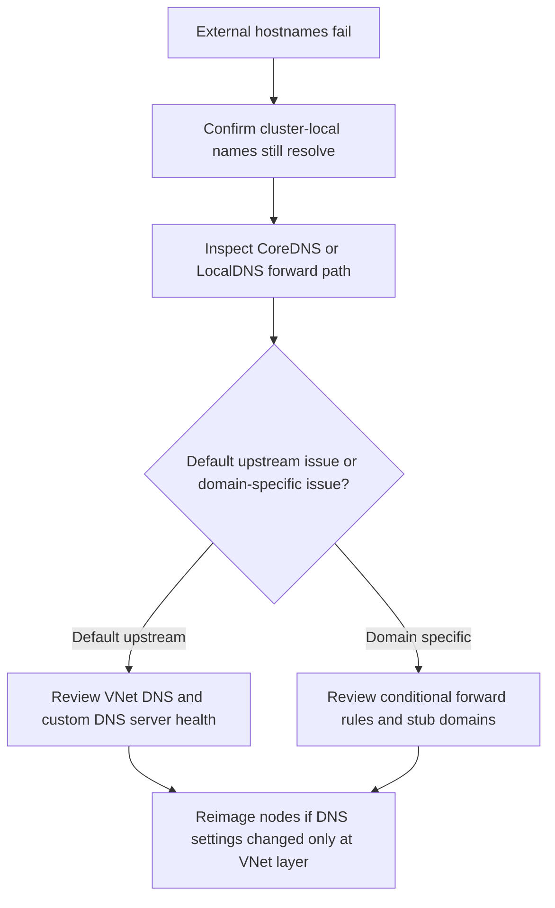

---
content_sources:
  diagrams:
    - id: troubleshooting-dns-external-hostname-resolution-failure
      type: flowchart
      source: self-generated
      justification: External-hostname DNS failure flow synthesized from Microsoft Learn DNS concepts, CoreDNS customization, and LocalDNS guidance.
      based_on:
        - https://learn.microsoft.com/en-us/azure/aks/dns-concepts
        - https://learn.microsoft.com/en-us/azure/aks/coredns-custom
        - https://learn.microsoft.com/en-us/azure/aks/localdns-custom
content_validation:
  status: verified
  last_reviewed: 2026-07-18
  reviewer: agent
  core_claims:
    - claim: "CoreDNS forwards external DNS queries to upstream DNS servers for external domains."
      source: https://learn.microsoft.com/en-us/azure/aks/dns-concepts
      verified: true
    - claim: "CoreDNS custom server blocks in AKS can forward selected domains to specific DNS servers."
      source: https://learn.microsoft.com/en-us/azure/aks/coredns-custom
      verified: true
    - claim: "When custom DNS servers change at the VNet level, AKS nodes do not automatically pick up the new settings until the node pool is reimaged through AKS."
      source: https://learn.microsoft.com/en-us/azure/aks/localdns-custom
      verified: true
---

# DNS Resolution Failures for External Hostnames

## Symptom

Pods can resolve `cluster.local` service names but fail to resolve external hostnames such as `microsoft.com`, private corporate domains, or partner-managed suffixes.

## Possible Causes

- VNet DNS points to the wrong upstream resolver.
- A custom DNS server is unavailable or cannot resolve the requested domain.
- A CoreDNS conditional forwarder points the suffix at the wrong target.
- Node-local DNS settings were changed in the VNet but never applied to AKS nodes.
- Network policy blocks DNS egress.

## Diagnosis Steps

<!-- diagram-id: troubleshooting-dns-external-hostname-resolution-failure -->


1. Confirm internal cluster DNS still works.

    ```bash
    kubectl exec <pod-name> \
        --namespace "$NAMESPACE" \
        -- nslookup kubernetes.default
    ```

2. Test the failing external hostname from the same pod.

    ```bash
    kubectl exec <pod-name> \
        --namespace "$NAMESPACE" \
        -- nslookup example.com
    ```

3. Inspect current CoreDNS customizations.

    ```bash
    kubectl get configmaps \
        --namespace kube-system \
        coredns-custom \
        --output yaml
    ```

4. If LocalDNS is enabled, review the applied node-pool configuration and whether the suffix is expected to use `VnetDNS` or `ClusterCoreDNS`.

5. Ask whether VNet DNS servers were changed recently in Azure. If yes, verify whether the node pool was reimaged afterward.

## Resolution

- Correct bad CoreDNS conditional forwarders or stub-domain rules.
- Restore availability on the upstream custom DNS resolver.
- Reimage the AKS node pool when VNet DNS server settings changed outside the AKS resource provider path.
- Add explicit DNS egress allow rules if namespace policy is blocking the resolver path.

## Prevention

- Document which domains resolve through default VNet DNS and which use conditional forwarding.
- Treat VNet DNS changes as AKS changes that require node-pool rollout planning.
- Keep test queries for both `cluster.local` and external domains in post-change validation.

## See Also

- [CoreDNS on AKS](../../../platform/coredns-on-aks.md)
- [LocalDNS on AKS](../../../platform/node-local-dns-cache.md)
- [CoreDNS Query Latency or Drops](coredns-query-latency-drops.md)

## Sources

- [DNS in AKS](https://learn.microsoft.com/en-us/azure/aks/dns-concepts)
- [Customize CoreDNS for AKS](https://learn.microsoft.com/en-us/azure/aks/coredns-custom)
- [Configure LocalDNS in AKS](https://learn.microsoft.com/en-us/azure/aks/localdns-custom)
