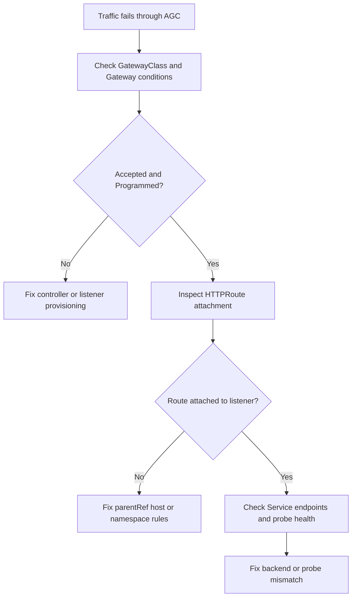

# AGC Traffic Not Flowing

## Symptom

Traffic reaches the expected Application Gateway for Containers frontend or Gateway address, but requests time out, return 404 or 503, or never reach the backend pods.

## Possible Causes

- The `GatewayClass`, `Gateway`, or `HTTPRoute` was never accepted.
- The route attached to the wrong listener or never attached at all.
- Hostname, path, or namespace attachment rules do not match the request.
- Backend services or endpoints are unhealthy.
- Health probes are failing even though pods appear running.

## Diagnosis Steps

<!-- diagram-id: troubleshooting-extensions-agc-traffic-not-flowing -->


1. Verify the ALB controller is running.

    ```bash
    kubectl get pods \
        --namespace kube-system
    ```

2. Inspect the GatewayClass.

    ```bash
    kubectl get gatewayclass azure-alb-external \
        --output yaml
    ```

3. Inspect the Gateway status.

    ```bash
    kubectl get gateways.gateway.networking.k8s.io <gateway-name> \
        --namespace <namespace> \
        --output yaml
    ```

    Look for conditions such as `Accepted` and `Programmed`.

4. Inspect the `HTTPRoute`.

    ```bash
    kubectl get httproutes.gateway.networking.k8s.io <route-name> \
        --namespace <namespace> \
        --output yaml
    ```

    Confirm:

    - `parentRefs` point at the expected `Gateway`,
    - hostnames match the incoming request,
    - listener namespace policy allows the route.

5. Inspect the Kubernetes backend service and endpoints.

    ```bash
    kubectl get service <service-name> \
        --namespace <namespace> \
        --output yaml

    kubectl get endpoints <service-name> \
        --namespace <namespace> \
        --output yaml
    ```

6. If the route and service look correct, investigate probe behavior from the AGC side and compare the probe path and port with the app's real readiness behavior.

## Resolution

- Fix `Gateway` listener configuration if the object was never accepted or programmed.
- Fix `HTTPRoute` `parentRefs`, hostname matching, or cross-namespace attachment rules.
- Correct service selectors or backend port mapping if endpoints are empty or wrong.
- Align health probes with the app's actual ready endpoint.
- Remove stale route objects that still bind the same host or path unexpectedly.

## Prevention

- Standardize one Gateway API pattern for host, namespace, and listener ownership.
- Require health-probe review during ingress changes.
- Validate `Gateway` and `HTTPRoute` conditions in CI smoke tests after deployment.
- Keep a simple curl-based canary that proves end-to-end path health through AGC.

## See Also

- [Application Gateway for Containers](../../../platform/application-gateway-for-containers.md)
- [Ingress and Load Balancing](../../../platform/ingress-load-balancing.md)
- [Best Practices: Platform Extensions](../../../best-practices/platform-extensions.md)

## Sources

- [What is Application Gateway for Containers?](https://learn.microsoft.com/en-us/azure/application-gateway/for-containers/overview)
- [Quickstart: Deploy Application Gateway for Containers ALB Controller using AKS Add-on](https://learn.microsoft.com/en-us/azure/application-gateway/for-containers/quickstart-deploy-application-gateway-for-containers-alb-controller-addon)
