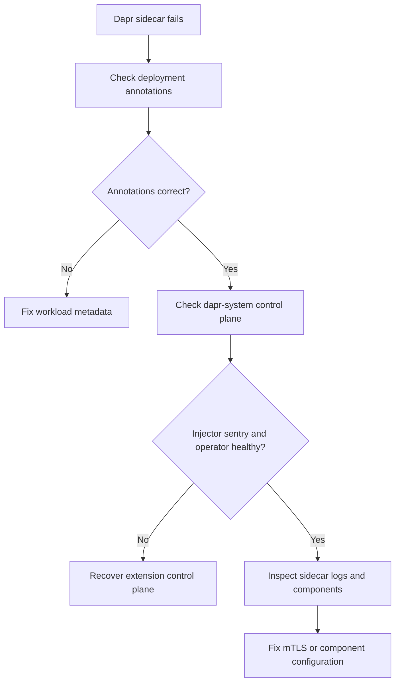

# Dapr Sidecar Fails to Start

## Symptom

A Dapr-enabled workload starts with CrashLooping sidecars, never receives a sidecar, or logs indicate initialization failures before the app becomes ready.

## Possible Causes

- The deployment annotations are missing or drifted from the intended Dapr settings.
- The injector or other control-plane services in `dapr-system` are unhealthy.
- mTLS certificate or control-plane communication is failing.
- A Dapr component definition is invalid or references the wrong backend resource.
- The workload mixes AKS extension management with Dapr CLI or another install path.

## Diagnosis Steps

<!-- diagram-id: troubleshooting-extensions-dapr-sidecar-fails-to-start -->


1. Inspect the workload annotations.

    ```bash
    kubectl get deployment <deployment-name> \
        --namespace <namespace> \
        --output yaml
    ```

2. Inspect Dapr control-plane pods.

    ```bash
    kubectl get pods \
        --namespace dapr-system
    ```

3. Inspect the failing pod.

    ```bash
    kubectl describe pod <pod-name> \
        --namespace <namespace>
    ```

4. Review Dapr sidecar logs.

    ```bash
    kubectl logs <pod-name> \
        --container daprd \
        --namespace <namespace>
    ```

5. Inspect Dapr component definitions if the sidecar starts but fails while loading state, pub/sub, secrets, or bindings.

    ```bash
    kubectl get components.dapr.io \
        --all-namespaces

    kubectl describe components.dapr.io <component-name> \
        --namespace <namespace>
    ```

## Resolution

- Restore the expected Dapr workload annotations.
- Recover `dapr-sidecar-injector`, `dapr-sentry`, or `dapr-operator` if control-plane services are degraded.
- Fix certificate or connectivity faults that break Dapr mTLS establishment.
- Correct invalid component metadata, secret references, or backend configuration.
- Use one management path for Dapr on the cluster and avoid mixing extension lifecycle with Dapr CLI management.

## Prevention

- Standardize one Dapr annotation template per workload type.
- Validate component YAML before merge.
- Monitor `dapr-system` control-plane health alongside application namespaces.
- Keep Dapr extension version ownership and upgrade policy documented.

## See Also

- [Dapr Extension](../../../platform/dapr-extension.md)
- [Key Vault CSI](../../../platform/key-vault-csi.md)
- [Best Practices: Platform Extensions](../../../best-practices/platform-extensions.md)

## Sources

- [Install Dapr Extension for AKS](https://learn.microsoft.com/en-us/azure/aks/dapr)
- [Dapr Extension for AKS and Arc-enabled Kubernetes](https://learn.microsoft.com/en-us/azure/aks/dapr-overview)
