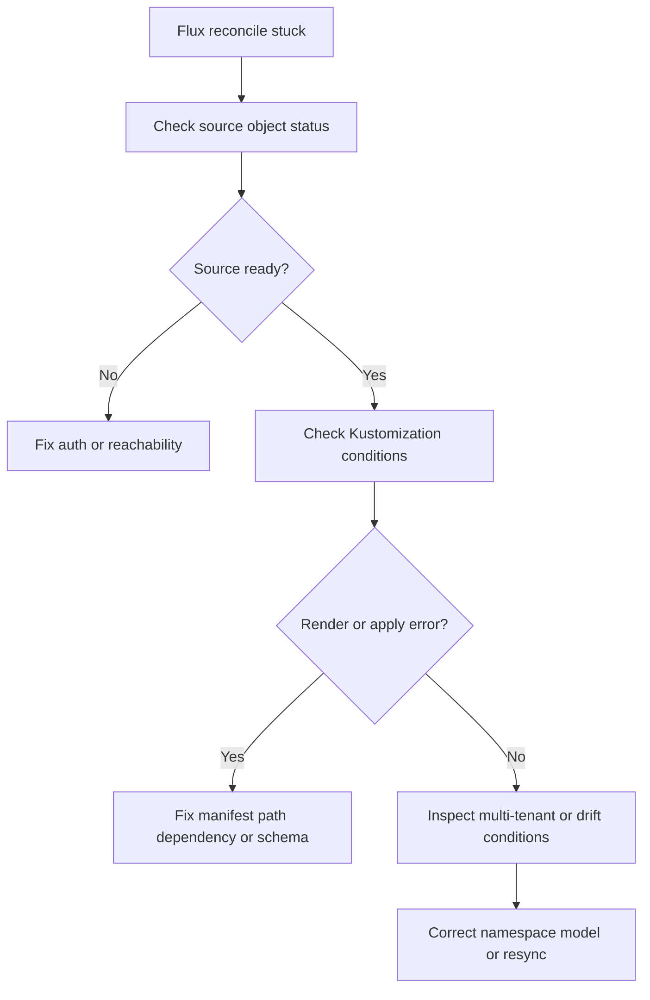

# Flux Reconciliation Stuck

## Symptom

Flux objects remain in a not-ready state, changes in Git never appear in the cluster, or resources partially apply and then stall.

## Possible Causes

- The source cannot authenticate to Git, Helm, Bucket, or Blob storage.
- The source syncs but the Kustomization render fails.
- A dependency cycle or ordering mistake blocks downstream Kustomizations.
- Multi-tenant namespace boundaries block cross-namespace references.
- Azure-side configuration changed but the agent did not reconnect cleanly.

## Diagnosis Steps

<!-- diagram-id: troubleshooting-extensions-flux-reconciliation-stuck -->


1. Inspect the Flux extension pods.

    ```bash
    kubectl get pods \
        --namespace flux-system
    ```

2. Inspect source objects.

    ```bash
    kubectl get gitrepositories.source.toolkit.fluxcd.io \
        --all-namespaces

    kubectl describe gitrepository <name> \
        --namespace <namespace>
    ```

3. Inspect the Kustomization state.

    ```bash
    kubectl get kustomizations.kustomize.toolkit.fluxcd.io \
        --all-namespaces

    kubectl describe kustomization <name> \
        --namespace <namespace>
    ```

4. If Helm is part of the flow, inspect Helm repository or release objects in the same namespace model.

5. Review whether the failing objects use cross-namespace source references that violate the multi-tenant pattern.

6. Compare Azure-side `fluxConfigurations` settings with the in-cluster source path and namespace expectations.

## Resolution

- Fix source credentials or network reachability for the upstream repository.
- Correct invalid Kustomize paths, render errors, or unsupported manifest changes.
- Break dependency cycles so foundational objects reconcile before dependents.
- Move source and release references into the same namespace model when multi-tenancy requires it.
- Reapply or update the Azure `fluxConfigurations` resource if Azure and cluster state drifted.

## Prevention

- Keep Git sources and Kustomizations namespace-local in shared clusters.
- Validate Kustomize render output in CI before merge.
- Model environment promotion as separate overlays instead of ad hoc path edits.
- Keep repo authentication ownership and secret rotation procedures documented.

## See Also

- [Flux GitOps Extension](../../../platform/flux-gitops-extension.md)
- [Best Practices: Platform Extensions](../../../best-practices/platform-extensions.md)
- [Resource Governance](../../../best-practices/resource-governance.md)

## Sources

- [Application deployments with GitOps (Flux v2)](https://learn.microsoft.com/en-us/azure/azure-arc/kubernetes/conceptual-gitops-flux2)
