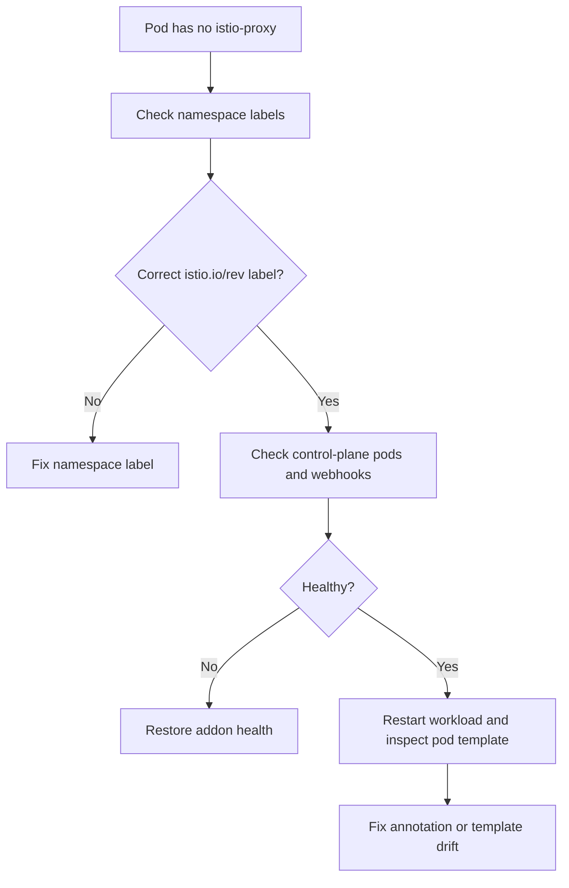

# Istio Sidecar Injection Failure

## Symptom

A workload that should join the mesh starts without an `istio-proxy` container, or only some pods in the namespace receive the sidecar.

## Possible Causes

- The namespace uses `istio-injection=enabled` instead of the required revision label.
- The namespace label points to the wrong or old Istio revision.
- Workloads were never restarted after labeling the namespace.
- Admission webhook or control-plane health is degraded.
- Pod template metadata drift disables or interferes with injection.

## Diagnosis Steps

<!-- diagram-id: troubleshooting-extensions-istio-sidecar-injection-failure -->


1. Inspect the namespace labels.

    ```bash
    kubectl get namespace <namespace> \
        --show-labels
    ```

    Confirm the namespace uses `istio.io/rev=asm-X-Y`.

2. Check installed revisions.

    ```bash
    az aks show \
        --resource-group "$RG" \
        --name "$CLUSTER_NAME" \
        --query "serviceMeshProfile.istio.revisions" \
        --output json
    ```

    | Command | Purpose |
    | --- | --- |
    | `az aks show` | Show the installed Istio revisions. |
    | `--resource-group` | Resource group that contains the AKS cluster. |
    | `--name` | Name of the AKS cluster. |
    | `--query` | Selects the Istio mesh revisions. |
    | `--output` | Output format for the result. |

3. Inspect Istio control-plane pods.

    ```bash
    kubectl get pods \
        --namespace aks-istio-system
    ```

4. Restart the workload if the namespace was labeled after the deployment already existed.

    ```bash
    kubectl rollout restart deployment/<deployment-name> \
        --namespace <namespace>
    ```

5. Inspect a newly created pod.

    ```bash
    kubectl describe pod <pod-name> \
        --namespace <namespace>
    ```

6. Compare the deployment template with known-good workloads if only one app misses injection.

## Resolution

- Replace `istio-injection=enabled` with the correct `istio.io/rev` namespace label.
- Use a supported installed revision value.
- Restart workloads after namespace onboarding.
- Recover add-on control-plane health if `istiod` or admission components are failing.
- Remove conflicting pod-template settings if application manifests introduced injection drift.

## Prevention

- Standardize namespace onboarding with explicit revision labels.
- Include sidecar-presence checks in post-deploy validation.
- Keep one documented process for minor revision upgrades and namespace relabeling.
- Treat sidecar injection as a platform contract that app teams should not override casually.

## See Also

- [Istio Managed Add-on](../../../platform/istio-managed-addon.md)
- [Best Practices: Platform Extensions](../../../best-practices/platform-extensions.md)
- [Reliability](../../../best-practices/reliability.md)

## Sources

- [Deploy Istio-based service mesh add-on for AKS](https://learn.microsoft.com/en-us/azure/aks/istio-deploy-addon)
- [Istio-based service mesh add-on for AKS](https://learn.microsoft.com/en-us/azure/aks/istio-about)
