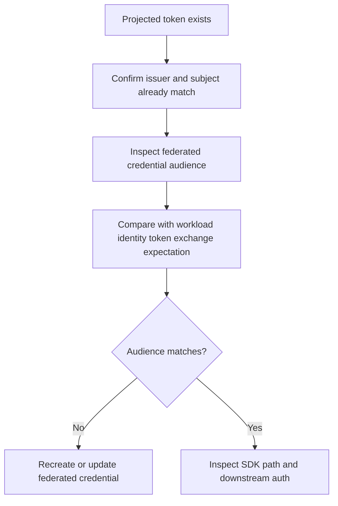

---
content_sources:
  diagrams:
    - id: troubleshooting-identity-audience-mismatch
      type: flowchart
      source: self-generated
      justification: Diagnostic flow synthesized from Microsoft Learn AKS workload identity overview and deployment guidance.
      based_on:
        - https://learn.microsoft.com/en-us/azure/aks/workload-identity-overview
        - https://learn.microsoft.com/en-us/azure/aks/workload-identity-deploy-cluster
content_validation:
  status: verified
  last_reviewed: 2026-07-18
  reviewer: agent
  core_claims:
    - claim: "A federated identity credential match includes the token audience in addition to issuer and subject."
      source: https://learn.microsoft.com/en-us/azure/aks/workload-identity-overview
      verified: true
    - claim: "AKS workload identity uses Microsoft Entra token exchange for pod authentication to Azure resources."
      source: https://learn.microsoft.com/en-us/azure/aks/workload-identity-overview
      verified: true
---

# Audience Mismatch

## Symptom

The pod has a projected service account token and the issuer looks correct, but Microsoft Entra rejects token exchange or the application reports invalid audience errors.

## Possible Causes

- The federated identity credential was created with the wrong audience value.
- Automation built a credential template for a different token exchange pattern.
- The application or SDK is not using the intended workload identity flow.
- Operators fixed the issuer and subject but never validated audience alignment.

## Diagnosis Steps

<!-- diagram-id: troubleshooting-identity-audience-mismatch -->


1. Confirm the workload identity basics are already correct before isolating audience.

    ```bash
    az aks show \
        --resource-group "$RG" \
        --name "$CLUSTER_NAME" \
        --query "oidcIssuerProfile.issuerUrl" \
        --output tsv

    kubectl get serviceaccount "$SERVICE_ACCOUNT_NAME" \
        --namespace "$NAMESPACE" \
        --output yaml
    ```

2. Inspect the federated identity credential definition.

    ```bash
    az identity federated-credential show \
        --resource-group "$RG" \
        --identity-name "$USER_ASSIGNED_IDENTITY_NAME" \
        --federated-credential-name "$FEDERATED_CREDENTIAL_NAME" \
        --output json
    ```

3. Correlate application logs with token exchange attempts.

    ```bash
    kubectl logs "$POD_NAME" \
        --namespace "$NAMESPACE" \
        --since=30m
    ```

4. If the workload reaches Azure but still fails, continue with downstream authorization checks.

    ```bash
    az role assignment list \
        --assignee "<object-id>" \
        --scope "$RESOURCE_ID" \
        --output table
    ```

## Resolution

- Recreate or update the federated identity credential so the audience matches the workload identity token exchange expectation.
- Roll a canary pod and verify fresh token exchange before changing production deployments.
- If the credential matches and failures persist, shift to downstream authorization or SDK-path debugging.

## Prevention

- Template federated identity credentials from validated automation, not from ad hoc portal entry.
- Validate issuer, subject, and audience together during every workload identity rollout.
- Keep a known-good example for each namespace and service account pattern you standardize.

## See Also

- [Microsoft Entra Workload Identity](../../../platform/workload-identity.md)
- [OIDC Issuer Mismatch](oidc-issuer-mismatch.md)
- [Token Exchange Failure](token-exchange-failure.md)
- [RBAC Success but Key Vault Still Fails](rbac-success-key-vault-fail.md)

## Sources

- [Microsoft Entra Workload ID overview](https://learn.microsoft.com/en-us/azure/aks/workload-identity-overview)
- [Deploy and configure workload identity on AKS](https://learn.microsoft.com/en-us/azure/aks/workload-identity-deploy-cluster)
