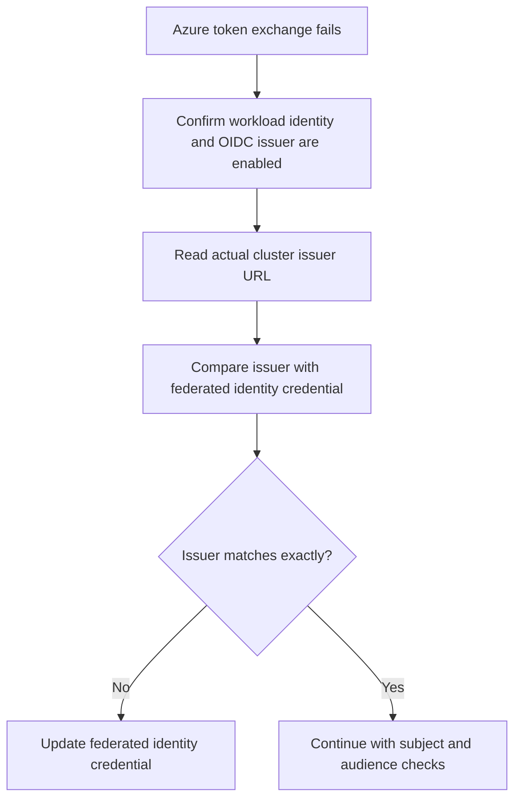

---
content_sources:
  diagrams:
    - id: troubleshooting-identity-oidc-issuer-mismatch
      type: flowchart
      source: self-generated
      justification: Diagnostic flow synthesized from Microsoft Learn AKS workload identity overview and deployment guidance.
      based_on:
        - https://learn.microsoft.com/en-us/azure/aks/workload-identity-overview
        - https://learn.microsoft.com/en-us/azure/aks/workload-identity-deploy-cluster
content_validation:
  status: verified
  last_reviewed: 2026-07-18
  reviewer: agent
  core_claims:
    - claim: "AKS workload identity depends on the cluster OIDC issuer and federated identity credentials trusting that issuer."
      source: https://learn.microsoft.com/en-us/azure/aks/workload-identity-deploy-cluster
      verified: true
    - claim: "Workload identity token exchange uses service account token projection with OIDC federation in Microsoft Entra ID."
      source: https://learn.microsoft.com/en-us/azure/aks/workload-identity-overview
      verified: true
---

# OIDC Issuer Mismatch

## Symptom

Pods have the expected service account and projected token, but Azure token exchange fails and workloads cannot access Azure resources such as Key Vault or Storage.

## Possible Causes

- The federated identity credential trusts an old or wrong AKS OIDC issuer URL.
- Workloads were moved to a different cluster and the new cluster has a different issuer URL.
- The cluster never had OIDC issuer or workload identity enabled.
- A copied automation template reused the wrong issuer value across environments.

## Diagnosis Steps

<!-- diagram-id: troubleshooting-identity-oidc-issuer-mismatch -->


1. Confirm the cluster has workload identity and an OIDC issuer.

    ```bash
    az aks show \
        --resource-group "$RG" \
        --name "$CLUSTER_NAME" \
        --query "{issuer:oidcIssuerProfile.issuerUrl,workloadIdentity:securityProfile.workloadIdentity}" \
        --output yaml
    ```

2. Confirm the workload runs as the intended service account.

    ```bash
    kubectl get deployment "$DEPLOYMENT_NAME" \
        --namespace "$NAMESPACE" \
        --output yaml

    kubectl get serviceaccount "$SERVICE_ACCOUNT_NAME" \
        --namespace "$NAMESPACE" \
        --output yaml
    ```

3. Compare the cluster issuer URL with the issuer trusted by the federated identity credential.

    ```bash
    az identity federated-credential list \
        --resource-group "$RG" \
        --identity-name "$USER_ASSIGNED_IDENTITY_NAME" \
        --output table
    ```

4. Inspect pod logs for token exchange failures while keeping the issuer comparison as the primary hypothesis.

    ```bash
    kubectl logs "$POD_NAME" \
        --namespace "$NAMESPACE" \
        --since=30m
    ```

## Resolution

- Update or recreate the federated identity credential with the exact AKS OIDC issuer URL reported by the cluster.
- If the workload was moved across clusters, create the new federated credential before cutting traffic to the new cluster.
- Verify subject and audience after fixing the issuer so you do not stop at the first corrected mismatch.

## Prevention

- Always source the issuer URL from `az aks show` instead of copying it manually between environments.
- Treat cluster migration as an issuer trust migration event.
- Validate token exchange with a canary pod before removing an older federated identity credential.

## See Also

- [Microsoft Entra Workload Identity](../../../platform/workload-identity.md)
- [Identity Model Comparison](../../../platform/identity-model-comparison.md)
- [Audience Mismatch](audience-mismatch.md)
- [Token Exchange Failure](token-exchange-failure.md)

## Sources

- [Microsoft Entra Workload ID overview](https://learn.microsoft.com/en-us/azure/aks/workload-identity-overview)
- [Deploy and configure workload identity on AKS](https://learn.microsoft.com/en-us/azure/aks/workload-identity-deploy-cluster)
