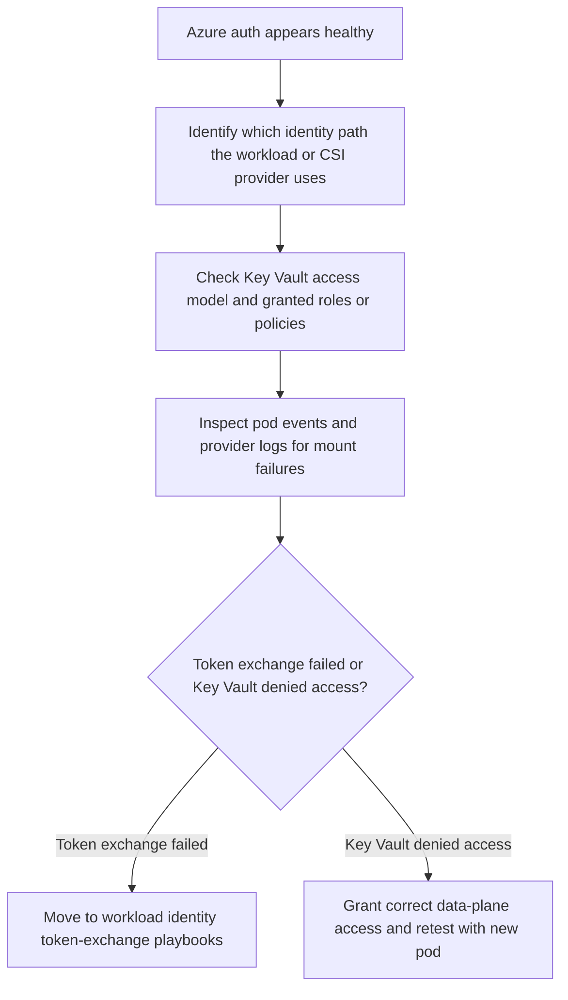

---
content_sources:
  diagrams:
    - id: troubleshooting-identity-rbac-success-key-vault-fail
      type: flowchart
      source: self-generated
      justification: Diagnostic flow synthesized from Microsoft Learn AKS Key Vault CSI driver, identity access, and workload identity guidance.
      based_on:
        - https://learn.microsoft.com/en-us/azure/aks/csi-secrets-store-driver
        - https://learn.microsoft.com/en-us/azure/aks/csi-secrets-store-identity-access
        - https://learn.microsoft.com/en-us/azure/aks/workload-identity-overview
content_validation:
  status: verified
  last_reviewed: 2026-07-18
  reviewer: agent
  core_claims:
    - claim: "The Azure Key Vault provider for Secrets Store CSI Driver requires an authorized identity path to access Key Vault."
      source: https://learn.microsoft.com/en-us/azure/aks/csi-secrets-store-identity-access
      verified: true
    - claim: "The CSI add-on can mount Key Vault objects into pods and optionally sync them to Kubernetes Secrets."
      source: https://learn.microsoft.com/en-us/azure/aks/csi-secrets-store-driver
      verified: true
---

# RBAC Success but Key Vault Still Fails

## Symptom

The workload obtains an Azure token or Azure RBAC role assignments look correct, but the Key Vault CSI mount or application secret read still fails.

## Possible Causes

- The wrong identity has Key Vault access.
- Key Vault is using a different access model than the operator assumed.
- Token exchange succeeds, but the Key Vault data-plane role or access policy is missing.
- The CSI mount path is failing independently of the synced Kubernetes secret expectation.
- A recent revoke or access-model migration removed rights before refresh validation was complete.

## Diagnosis Steps

<!-- diagram-id: troubleshooting-identity-rbac-success-key-vault-fail -->


1. Confirm which identity the workload or CSI mount path is actually using.

    ```bash
    az aks show \
        --resource-group "$RG" \
        --name "$CLUSTER_NAME" \
        --query "{oidcIssuer:oidcIssuerProfile.issuerUrl,kubeletIdentity:identityProfile.kubeletidentity,addon:addonProfiles.azureKeyvaultSecretsProvider}" \
        --output yaml

    kubectl get secretproviderclass \
        --namespace "$NAMESPACE" \
        --output yaml
    ```

    | Command | Purpose |
    | --- | --- |
    | `az aks show` | Show OIDC issuer, kubelet identity, and Key Vault add-on. |
    | `--resource-group` | Resource group that contains the AKS cluster. |
    | `--name` | Name of the AKS cluster. |
    | `--query` | Selects issuer, kubelet identity, and add-on fields. |
    | `--output` | Output format for the result. |
    | `kubectl get secretproviderclass` | Show SecretProviderClass resources in the namespace. |

2. Inspect pod events and mount-related symptoms.

    ```bash
    kubectl describe pod "$POD_NAME" \
        --namespace "$NAMESPACE"

    kubectl get events \
        --namespace "$NAMESPACE" \
        --sort-by=.lastTimestamp
    ```

3. Check Key Vault access assignments on the actual identity object.

    ```bash
    az role assignment list \
        --assignee "<object-id>" \
        --scope "$KEY_VAULT_RESOURCE_ID" \
        --output table
    ```

    | Command | Purpose |
    | --- | --- |
    | `az role assignment list` | List role assignments on the Key Vault scope. |
    | `--assignee` | Object ID of the identity to inspect. |
    | `--scope` | Key Vault resource scope to filter assignments. |
    | `--output` | Output format for the result. |

4. If sync-to-Kubernetes-Secret is expected, verify whether the synced secret was ever refreshed.

    ```bash
    kubectl get secret "$SECRET_NAME" \
        --namespace "$NAMESPACE" \
        --output yaml
    ```

## Resolution

- Grant the correct Key Vault data-plane rights to the identity actually used by the workload or CSI provider.
- During RBAC or access-policy migration, grant the replacement model first and validate a fresh pod mount before revoking the old model.
- If the issue is token exchange rather than Key Vault authorization, pivot to the workload identity federation playbooks.

## Prevention

- Standardize whether each workload uses direct workload identity access, CSI mount access, or both.
- Record the Key Vault access model in runbooks before migration windows.
- Validate secret refresh with both mounted files and any synced Kubernetes secret consumers.

## See Also

- [Azure Key Vault CSI Driver](../../../platform/key-vault-csi.md)
- [Microsoft Entra Workload Identity](../../../platform/workload-identity.md)
- [Audience Mismatch](audience-mismatch.md)
- [Token Exchange Failure](token-exchange-failure.md)

## Sources

- [Use the Azure Key Vault provider for Secrets Store CSI Driver in AKS](https://learn.microsoft.com/en-us/azure/aks/csi-secrets-store-driver)
- [Configure access to Azure Key Vault provider for Secrets Store CSI Driver in AKS](https://learn.microsoft.com/en-us/azure/aks/csi-secrets-store-identity-access)
