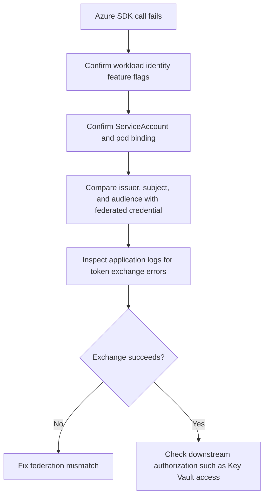

---
content_sources:
  diagrams:
    - id: troubleshooting-identity-token-exchange-failure
      type: flowchart
      source: self-generated
      justification: Diagnostic flow synthesized from Microsoft Learn AKS workload identity overview, deployment guidance, and Key Vault CSI identity access guidance.
      based_on:
        - https://learn.microsoft.com/en-us/azure/aks/workload-identity-overview
        - https://learn.microsoft.com/en-us/azure/aks/workload-identity-deploy-cluster
        - https://learn.microsoft.com/en-us/azure/aks/csi-secrets-store-identity-access
content_validation:
  status: verified
  last_reviewed: 2026-07-18
  reviewer: agent
  core_claims:
    - claim: "Workload identity depends on a matching issuer, subject, and audience for successful Microsoft Entra token exchange."
      source: https://learn.microsoft.com/en-us/azure/aks/workload-identity-overview
      verified: true
    - claim: "You can enable workload identity and the OIDC issuer on an existing AKS cluster."
      source: https://learn.microsoft.com/en-us/azure/aks/workload-identity-deploy-cluster
      verified: true
---

# Token Exchange Failure

## Symptom

Pods start, Kubernetes service account configuration looks plausible, but Azure SDK calls fail because Microsoft Entra never returns a usable access token.

## Possible Causes

- OIDC issuer mismatch.
- Subject or audience mismatch in the federated identity credential.
- The wrong managed identity or app registration is bound to the workload.
- The cluster feature flags for OIDC issuer or workload identity are not enabled.
- The application is not actually using the workload identity authentication path.

## Diagnosis Steps

<!-- diagram-id: troubleshooting-identity-token-exchange-failure -->


1. Confirm the cluster features are enabled.

    ```bash
    az aks show \
        --resource-group "$RG" \
        --name "$CLUSTER_NAME" \
        --query "{issuer:oidcIssuerProfile.issuerUrl,workloadIdentity:securityProfile.workloadIdentity}" \
        --output yaml
    ```

    | Command | Purpose |
    | --- | --- |
    | `az aks show` | Show the OIDC issuer and workload identity state. |
    | `--resource-group` | Resource group that contains the AKS cluster. |
    | `--name` | Name of the AKS cluster. |
    | `--query` | Selects the issuer URL and workload identity profile. |
    | `--output` | Output format for the result. |

2. Confirm the deployment and pod are bound to the expected service account.

    ```bash
    kubectl get deployment "$DEPLOYMENT_NAME" \
        --namespace "$NAMESPACE" \
        --output yaml

    kubectl describe pod "$POD_NAME" \
        --namespace "$NAMESPACE"
    ```

3. Inspect the federated identity credential definition.

    ```bash
    az identity federated-credential show \
        --resource-group "$RG" \
        --identity-name "$USER_ASSIGNED_IDENTITY_NAME" \
        --federated-credential-name "$FEDERATED_CREDENTIAL_NAME" \
        --output json
    ```

    | Command | Purpose |
    | --- | --- |
    | `az identity federated-credential show` | Show a federated credential on the identity. |
    | `--resource-group` | Resource group that contains the identity. |
    | `--identity-name` | Managed identity that owns the credential. |
    | `--federated-credential-name` | Name of the federated credential. |
    | `--output` | Output format for the result. |

4. Review application logs to confirm whether the failure is token exchange or downstream authorization.

    ```bash
    kubectl logs "$POD_NAME" \
        --namespace "$NAMESPACE" \
        --since=30m
    ```

## Resolution

- Correct the issuer, subject, or audience mismatch on the federated identity credential.
- Verify the workload is using the intended service account and identity target.
- If exchange succeeds after correction, continue with downstream service authorization validation such as Key Vault roles or access policies.

## Prevention

- Treat workload identity rollout as a four-part contract: cluster issuer, service account subject, audience, and downstream authorization.
- Keep identity changes reversible by adding replacement federated credentials before removing old ones.
- Use a canary deployment to validate fresh token exchange during rotations and cluster migrations.

## See Also

- [Microsoft Entra Workload Identity](../../../platform/workload-identity.md)
- [OIDC Issuer Mismatch](oidc-issuer-mismatch.md)
- [Audience Mismatch](audience-mismatch.md)
- [RBAC Success but Key Vault Still Fails](rbac-success-key-vault-fail.md)

## Sources

- [Microsoft Entra Workload ID overview](https://learn.microsoft.com/en-us/azure/aks/workload-identity-overview)
- [Deploy and configure workload identity on AKS](https://learn.microsoft.com/en-us/azure/aks/workload-identity-deploy-cluster)
