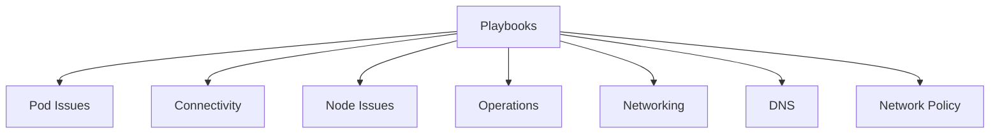

---
content_sources:
  diagrams:
  - id: troubleshooting-playbooks-index
    type: flowchart
    source: self-generated
    justification: Navigation flow synthesized from the linked AKS topics and workflows
      on this page.
    based_on:
    - https://learn.microsoft.com/en-us/troubleshoot/azure/azure-kubernetes/welcome-azure-kubernetes
    - https://learn.microsoft.com/en-us/troubleshoot/azure/azure-kubernetes/
---

# Playbooks

Use these playbooks once you have identified the symptom family. Each playbook is structured around competing hypotheses and evidence collection.

## Main Content

<!-- diagram-id: troubleshooting-playbooks-index -->

| Category | Documents |
|---|---|
| High-Signal Root Playbooks | [Pod CrashLoopBackOff](pod-crashloopbackoff.md), [Node Not Ready](node-not-ready.md), [Ingress Not Working](ingress-not-working.md), [Cluster Autoscaler Issues](cluster-autoscaler-issues.md) |
| Pod Issues | [Image Pull Failure](pod-issues/image-pull-failure.md), [CrashLoop](pod-issues/crashloop.md), [Pending Pods](pod-issues/pending-pods.md) |
| Connectivity | [Ingress Failure](connectivity/ingress-failure.md), [Service Unreachable](connectivity/service-unreachable.md) |
| DNS | [CoreDNS Query Latency or Drops](dns/coredns-query-latency-drops.md), [External Hostname Resolution Failure](dns/external-hostname-resolution-failure.md) |
| Node Issues | [Node Not Ready](node-issues/node-not-ready.md), [CNI IP Exhaustion](node-issues/cni-ip-exhaustion.md) |
| Network Policy | [NetworkPolicy Denies Legitimate Traffic](network-policy/networkpolicy-denies-legitimate-traffic.md), [NetworkPolicy Not Blocking Traffic](network-policy/networkpolicy-not-blocking-traffic.md), [Cilium Dataplane Migration Issues](network-policy/cilium-dataplane-migration-issues.md) |
| Operations | [Upgrade Failure](operations/upgrade-failure.md), [Upgrade Blocked by Pod Disruption Budget](operations/upgrade-blocked-pdb.md), [Upgrade Blocked by Deprecated API](operations/upgrade-blocked-deprecated-api.md), [Node Image Upgrade Stuck](operations/node-image-upgrade-stuck.md), [Surge Upgrade IP Exhaustion](operations/surge-upgrade-ip-exhaustion.md), [Scaling Failure](operations/scaling-failure.md) |
| Security | [Azure Policy Denies Workload](security/azure-policy-denies-workload.md), [Defender Alert False Positive](security/defender-alert-false-positive.md), [PSS Enforcement Breaks Deployment](security/pss-enforcement-breaks-deployment.md), [Image Signature Verification Failure](security/image-signature-verification-failure.md) |
| Scaling | [KEDA Scaler Not Triggering](scaling/keda-scaler-not-triggering.md), [NAP Fails to Provision](scaling/nap-fails-to-provision.md), [HPA Flapping](scaling/hpa-flapping.md), [Spot Eviction Storm](scaling/spot-eviction-storm.md) |
| Storage | [PVC Stuck in Pending](storage/pvc-stuck-pending.md), [Volume Attach Failure](storage/volume-attach-failure.md), [Volume Mount Failure](storage/volume-mount-failure.md), [Volume Expansion Failure](storage/volume-expansion-failure.md), [StatefulSet Stuck During Rolling Update](storage/statefulset-stuck-rolling-update.md) |
| Networking | [API Server / kubectl Unreachable](networking/api-server-kubectl-unreachable.md), [Image Pull Fails in Restricted Egress](networking/image-pull-restricted-egress.md), [Webhook / Control-Plane Calls Blocked](networking/webhook-control-plane-blocked.md), [SNAT Port Exhaustion](networking/snat-port-exhaustion.md) |

## See Also

- [Troubleshooting](../index.md)
- [Decision Tree](../decision-tree.md)
- [First 10 Minutes](../first-10-minutes/index.md)

## Sources

- [Troubleshoot AKS clusters](https://learn.microsoft.com/en-us/troubleshoot/azure/azure-kubernetes/welcome-azure-kubernetes)
- [AKS troubleshooting articles](https://learn.microsoft.com/en-us/troubleshoot/azure/azure-kubernetes/)
