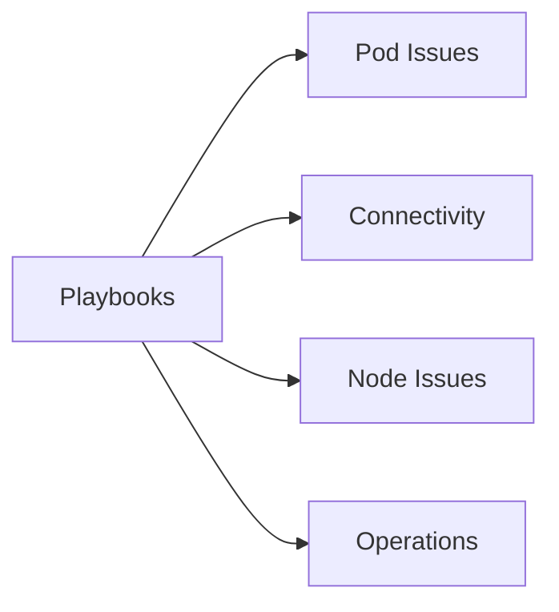

# Playbooks

Use these playbooks once you have identified the symptom family. Each playbook is structured around competing hypotheses and evidence collection.

## Main Content

| Category | Documents |
|---|---|
| High-Signal Root Playbooks | [Pod CrashLoopBackOff](pod-crashloopbackoff.md), [Node Not Ready](node-not-ready.md), [Ingress Not Working](ingress-not-working.md), [Cluster Autoscaler Issues](cluster-autoscaler-issues.md) |
| Pod Issues | [Image Pull Failure](pod-issues/image-pull-failure.md), [CrashLoop](pod-issues/crashloop.md), [Pending Pods](pod-issues/pending-pods.md) |
| Connectivity | [Ingress Failure](connectivity/ingress-failure.md), [Service Unreachable](connectivity/service-unreachable.md) |
| Node Issues | [Node Not Ready](node-issues/node-not-ready.md), [CNI IP Exhaustion](node-issues/cni-ip-exhaustion.md) |
| Operations | [Upgrade Failure](operations/upgrade-failure.md), [Scaling Failure](operations/scaling-failure.md) |

## See Also

- [Troubleshooting](../index.md)
- [Decision Tree](../decision-tree.md)
- [First 10 Minutes](../first-10-minutes/index.md)

## Sources

- [Troubleshoot AKS clusters](https://learn.microsoft.com/troubleshoot/azure/azure-kubernetes/welcome-azure-kubernetes)
- [AKS troubleshooting articles](https://learn.microsoft.com/troubleshoot/azure/azure-kubernetes/)
