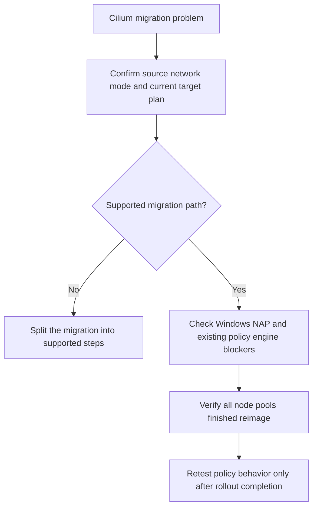

---
content_sources:
  diagrams:
    - id: troubleshooting-network-policy-cilium-dataplane-migration-issues
      type: flowchart
      source: self-generated
      justification: Cilium dataplane migration diagnostic flow synthesized from Microsoft Learn Azure CNI update, network policy, and Cilium guidance.
      based_on:
        - https://learn.microsoft.com/en-us/azure/aks/update-azure-cni
        - https://learn.microsoft.com/en-us/azure/aks/azure-cni-powered-by-cilium
        - https://learn.microsoft.com/en-us/azure/aks/use-network-policies
content_validation:
  status: verified
  last_reviewed: 2026-07-18
  reviewer: agent
  core_claims:
    - claim: "Updating the dataplane to Azure CNI Powered by Cilium is supported from Azure CNI node-subnet, pod-subnet, and overlay IPAM modes."
      source: https://learn.microsoft.com/en-us/azure/aks/update-azure-cni
      verified: true
    - claim: "The IPAM mode and dataplane cannot be updated in a single operation when migrating to Azure CNI Powered by Cilium."
      source: https://learn.microsoft.com/en-us/azure/aks/update-azure-cni
      verified: true
    - claim: "Updating to Azure CNI Powered by Cilium triggers simultaneous node-pool reimage operations."
      source: https://learn.microsoft.com/en-us/azure/aks/update-azure-cni
      verified: true
    - claim: "Cilium begins enforcing network policies only after all nodes are reimaged."
      source: https://learn.microsoft.com/en-us/azure/aks/update-azure-cni
      verified: true
    - claim: "Kubenet clusters must migrate to Azure CNI Overlay before adopting Azure CNI Powered by Cilium."
      source: https://learn.microsoft.com/en-us/azure/aks/update-azure-cni
      verified: true
---

# Cilium Dataplane Migration Issues

## Symptom

An AKS cluster migration to Azure CNI Powered by Cilium stalls, partially completes, or finishes with unexpected policy or connectivity behavior.

## Possible Causes

- The cluster attempted an unsupported path such as kubenet directly to Cilium.
- The team tried to change IPAM mode and dataplane in one operation.
- Windows node pools or node auto-provisioning block the migration.
- Existing Azure NPM or Calico policy semantics were not revalidated for Cilium.
- The rollout was validated before all node pools finished reimaging.

## Diagnosis Steps

<!-- diagram-id: troubleshooting-network-policy-cilium-dataplane-migration-issues -->


1. Inspect the cluster network profile.

    ```bash
    az aks show \
        --resource-group "$RG" \
        --name "$CLUSTER_NAME" \
        --query "networkProfile" \
        --output yaml
    ```

    | Command | Purpose |
    | --- | --- |
    | `az aks show` | Show the cluster network profile. |
    | `--resource-group` | Resource group that contains the AKS cluster. |
    | `--name` | Name of the AKS cluster. |
    | `--query` | Selects the network profile. |
    | `--output` | Output format for the result. |

2. Determine whether the cluster is coming from:

    - Azure CNI node subnet,
    - Azure CNI pod subnet,
    - Azure CNI overlay,
    - or kubenet.

3. Confirm whether the migration plan is doing one operation or two.

    - **Correct**: update IPAM mode separately from dataplane.
    - **Incorrect**: attempt to switch both in one change.

4. Check for known blockers such as Windows node pools, NAP, or old policy-engine assumptions.

## Resolution

- Rebuild the migration plan into supported steps.
- For kubenet, migrate to Azure CNI Overlay first, then migrate the dataplane to Cilium.
- Remove or address blockers such as Windows node pools and NAP before retrying.
- Revalidate NetworkPolicy behavior after the full node reimage completes.

## Prevention

- Use blue/green replacement when policy risk or rollback certainty is more important than in-place simplicity.
- Separate “IPAM mode migration” from “dataplane migration” in change tickets and runbooks.
- Capture pre-migration policy tests and compare them after the rollout.

## See Also

- [Azure CNI Powered by Cilium](../../../platform/azure-cni-powered-by-cilium.md)
- [Networking Models](../../../platform/networking-models.md)
- [Best Practices: Networking](../../../best-practices/networking.md)
- [NetworkPolicy Not Blocking Traffic](networkpolicy-not-blocking-traffic.md)

## Sources

- [Update Azure CNI IPAM mode and data plane for AKS clusters](https://learn.microsoft.com/en-us/azure/aks/update-azure-cni)
- [Configure Azure CNI Powered by Cilium in AKS](https://learn.microsoft.com/en-us/azure/aks/azure-cni-powered-by-cilium)
- [Secure pod traffic with network policies in AKS](https://learn.microsoft.com/en-us/azure/aks/use-network-policies)
