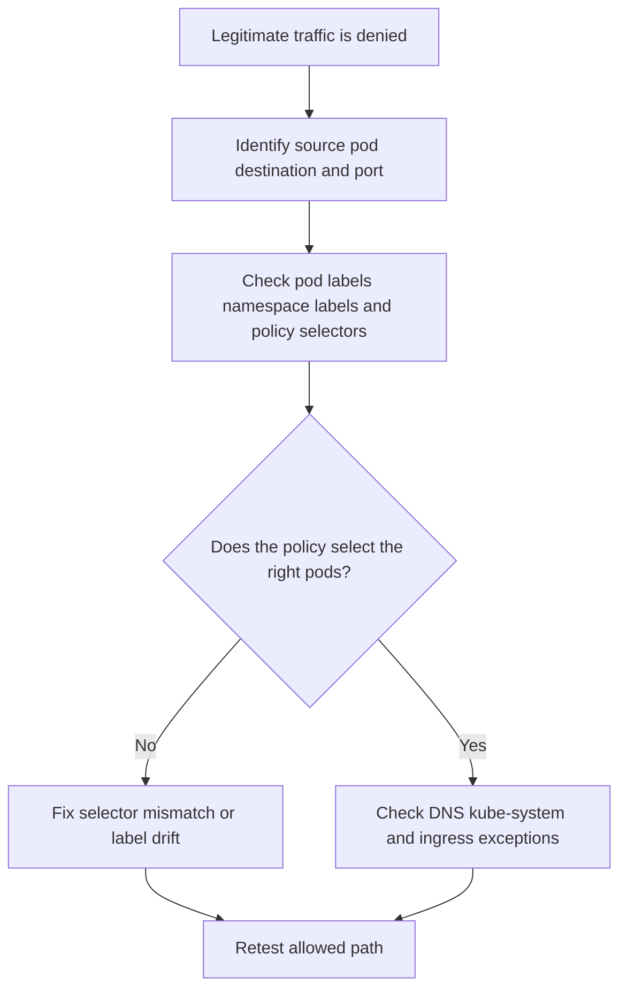

---
content_sources:
  diagrams:
    - id: troubleshooting-network-policy-denies-legitimate-traffic
      type: flowchart
      source: self-generated
      justification: NetworkPolicy false-deny diagnostic flow synthesized from Microsoft Learn network policy, Cilium, and LocalDNS guidance.
      based_on:
        - https://learn.microsoft.com/en-us/azure/aks/use-network-policies
        - https://learn.microsoft.com/en-us/azure/aks/azure-cni-powered-by-cilium
        - https://learn.microsoft.com/en-us/azure/aks/localdns-custom
content_validation:
  status: verified
  last_reviewed: 2026-07-18
  reviewer: agent
  core_claims:
    - claim: "By default, all pods in an AKS cluster can send and receive traffic without limitations until network policies are applied."
      source: https://learn.microsoft.com/en-us/azure/aks/use-network-policies
      verified: true
    - claim: "Cilium enforces network policies directly so clusters using Azure CNI Powered by Cilium do not need a separate network policy engine such as Azure NPM or Calico."
      source: https://learn.microsoft.com/en-us/azure/aks/azure-cni-powered-by-cilium
      verified: true
    - claim: "When using LocalDNS with Cilium, pod egress to LocalDNS must be explicitly allowed."
      source: https://learn.microsoft.com/en-us/azure/aks/localdns-custom
      verified: true
---

# NetworkPolicy Denies Legitimate Traffic

## Symptom

Application traffic that used to work begins timing out or failing immediately after a `NetworkPolicy`, `CiliumNetworkPolicy`, or cluster policy migration.

## Possible Causes

- Pod or namespace selectors do not match the intended workloads.
- Namespace labels drifted, so policy intent no longer matches live label state.
- DNS traffic to CoreDNS or LocalDNS is blocked.
- Ingress-controller or kube-system exceptions were never added.
- The policy was written for one engine assumption but enforced by another.

## Diagnosis Steps

<!-- diagram-id: troubleshooting-network-policy-denies-legitimate-traffic -->


1. List all policies in the affected namespace.

    ```bash
    kubectl get networkpolicy \
        --namespace "$NAMESPACE" \
        --output wide
    ```

2. Inspect the live labels on both the source and destination sides.

    ```bash
    kubectl get pods \
        --namespace "$NAMESPACE" \
        --show-labels
    ```

    ```bash
    kubectl get namespaces \
        --show-labels
    ```

3. Describe the policy and compare selectors to the live labels.

    ```bash
    kubectl describe networkpolicy <policy-name> \
        --namespace "$NAMESPACE"
    ```

4. If the cluster uses LocalDNS or CoreDNS and the failure looks like name resolution, confirm the policy allows DNS egress.

5. If the blocked path is ingress traffic, confirm the policy explicitly allows the ingress-controller namespace or pod labels used by the chosen controller.

## Resolution

- Fix selector mismatches and namespace-label drift.
- Add explicit allow rules for DNS, ingress controllers, and required kube-system dependencies.
- If the cluster recently migrated to Cilium, review policy assumptions that depended on the previous engine.

## Prevention

- Use stable namespace and workload labels as policy inputs.
- Keep a standard exception set for DNS, ingress, monitoring, and kube-system dependencies.
- Test default-deny rollouts in preproduction before applying them cluster-wide.

## See Also

- [Best Practices: Networking](../../../best-practices/networking.md)
- [Best Practices: Security](../../../best-practices/security.md)
- [LocalDNS on AKS](../../../platform/node-local-dns-cache.md)
- [NetworkPolicy Not Blocking Traffic](networkpolicy-not-blocking-traffic.md)

## Sources

- [Secure pod traffic with network policies in AKS](https://learn.microsoft.com/en-us/azure/aks/use-network-policies)
- [Configure Azure CNI Powered by Cilium in AKS](https://learn.microsoft.com/en-us/azure/aks/azure-cni-powered-by-cilium)
- [Configure LocalDNS in AKS](https://learn.microsoft.com/en-us/azure/aks/localdns-custom)
