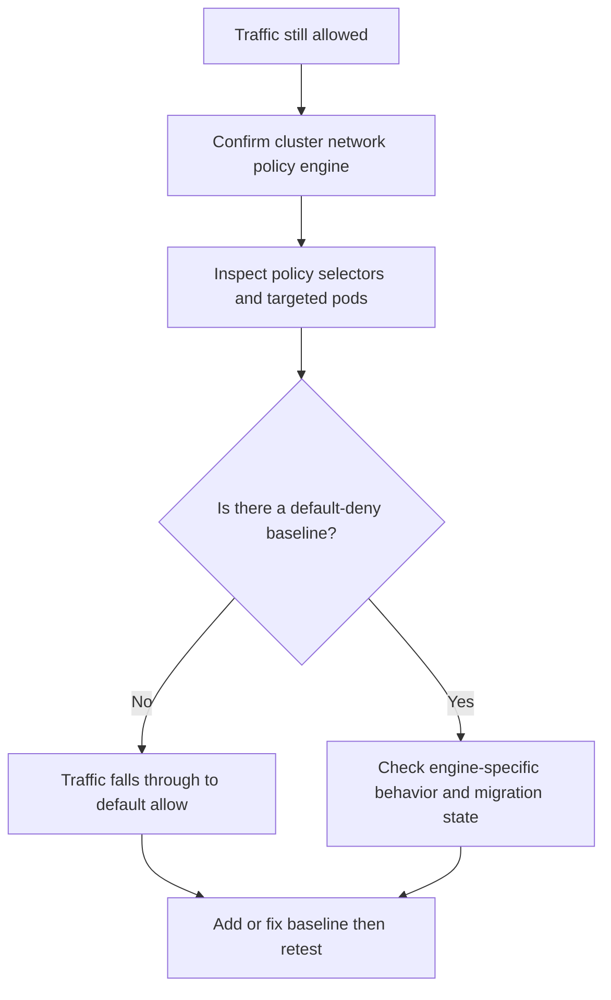

---
content_sources:
  diagrams:
    - id: troubleshooting-network-policy-not-blocking-traffic
      type: flowchart
      source: self-generated
      justification: NetworkPolicy not-enforced diagnostic flow synthesized from Microsoft Learn network policy and Azure CNI update guidance.
      based_on:
        - https://learn.microsoft.com/en-us/azure/aks/use-network-policies
        - https://learn.microsoft.com/en-us/azure/aks/azure-cni-powered-by-cilium
        - https://learn.microsoft.com/en-us/azure/aks/update-azure-cni
content_validation:
  status: verified
  last_reviewed: 2026-07-18
  reviewer: agent
  core_claims:
    - claim: "AKS provides three network policy engines: Cilium, Azure Network Policy Manager, and Calico."
      source: https://learn.microsoft.com/en-us/azure/aks/use-network-policies
      verified: true
    - claim: "When enabling Cilium on a cluster that uses Azure NPM or Calico, the existing engine is uninstalled and replaced by Cilium."
      source: https://learn.microsoft.com/en-us/azure/aks/update-azure-cni
      verified: true
    - claim: "Kubenet clusters cannot migrate directly to the Cilium dataplane and must migrate to Azure CNI Overlay first."
      source: https://learn.microsoft.com/en-us/azure/aks/update-azure-cni
      verified: true
---

# NetworkPolicy Does Not Block Traffic When Expected

## Symptom

Traffic continues to flow even though the team expected a `NetworkPolicy` or Cilium policy to deny it.

## Possible Causes

- The cluster is using a different policy engine than the author assumed.
- The policy does not select the intended pods.
- No namespace default-deny baseline exists, so traffic still falls through to default allow.
- The test path is not the path the policy actually governs.
- A migration is incomplete and old assumptions about enforcement timing still apply.

## Diagnosis Steps

<!-- diagram-id: troubleshooting-network-policy-not-blocking-traffic -->


1. Confirm the cluster dataplane and network-policy engine.

    ```bash
    az aks show \
        --resource-group "$RG" \
        --name "$CLUSTER_NAME" \
        --query "networkProfile.{dataplane:networkDataplane,policy:networkPolicy,plugin:networkPlugin,mode:networkPluginMode}" \
        --output yaml
    ```

2. Inspect the policy and verify that the selected pods are the ones you intended.

    ```bash
    kubectl get networkpolicy \
        --namespace "$NAMESPACE" \
        --output yaml
    ```

3. Check whether a namespace default-deny exists. If not, Kubernetes default behavior remains allow unless a matching policy says otherwise.

4. If the cluster recently moved to Cilium, confirm the migration finished and all nodes were reimaged before declaring the policy nonfunctional.

## Resolution

- Correct the engine assumption first.
- Add namespace default-deny baselines where the security model depends on deny-by-default.
- Fix selectors so the policy actually targets the pods under test.
- For migrations, wait until the Cilium rollout is complete before validating final enforcement.

## Prevention

- Record the cluster’s current dataplane and policy engine in every troubleshooting ticket.
- Standardize policy tests so they verify both “should allow” and “should deny” paths.
- Treat policy migration validation as a staged rollout, not a single command outcome.

## See Also

- [Best Practices: Networking](../../../best-practices/networking.md)
- [Azure CNI Powered by Cilium](../../../platform/azure-cni-powered-by-cilium.md)
- [NetworkPolicy Denies Legitimate Traffic](networkpolicy-denies-legitimate-traffic.md)
- [Cilium Dataplane Migration Issues](cilium-dataplane-migration-issues.md)

## Sources

- [Secure pod traffic with network policies in AKS](https://learn.microsoft.com/en-us/azure/aks/use-network-policies)
- [Configure Azure CNI Powered by Cilium in AKS](https://learn.microsoft.com/en-us/azure/aks/azure-cni-powered-by-cilium)
- [Update Azure CNI IPAM mode and data plane for AKS clusters](https://learn.microsoft.com/en-us/azure/aks/update-azure-cni)
